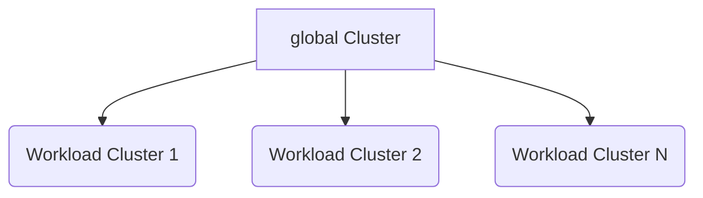

# Architecture

The Alauda Container Platform (<Term name="productShort" />) architecture is designed to provide a robust, scalable, and flexible cloud-native infrastructure solution. This document outlines the core architectural principles, cluster types, and design considerations that form the foundation of our platform.

## Architectural Concepts

### `global` Cluster

The `global` cluster is the central nervous system of the Alauda Container Platform. It serves as the primary management and control plane for the entire platform, responsible for:

- Platform-wide cluster management
- Tenant management and access control
- Global scheduling and orchestration
- Platform-level configuration and policy enforcement
- Monitoring and observability of the ecosystem

Key characteristics of the `global` cluster include:
- Dedicated physical resources
- Isolation from workload processing
- Centralized management capabilities
- High availability and security configuration

### Workload Clusters

**Workload clusters** are the execution environments designed to host and run actual applications and services. These clusters are:

- Dedicated to running application workloads
- Capable of horizontal scaling
- Flexible across different infrastructure types
- Managed and orchestrated by the `global` cluster

## Architectural Design Principles

### 1. Control Plane Isolation

The architecture mandates a strict separation between the `global` cluster and workload clusters:
- The `global` cluster uses dedicated physical resources
- Prevents resource contention and performance degradation
- Ensures stable and secure platform management

### 2. Operational Flexibility

<Term name="productShort" /> supports multiple operational scenarios:
- Fully separated `global` and workload clusters (Recommended for production)
- Co-located configurations for development and resource-constrained environments
- Hybrid cloud and multi-cloud architectures

### 3. Cluster Access and Management

Two primary methods for workload cluster integration:

a) **Create New Workload Clusters**
- Recommended approach
- Fully managed by the `global` cluster
- Consistent configuration and compliance
- Simplified lifecycle management

b) **Attach Existing Clusters**
- Support for connecting pre-existing Kubernetes clusters
- Version and compatibility checks required
- Standardized access and management protocols

## Architecture Visualization

## Key Benefits of This Architecture

- **Enhanced Security**: Isolated control and execution planes
- **Scalability**: Easy addition of new workload clusters
- **Flexibility**: Support for diverse infrastructure environments
- **Efficiency**: Centralized management with distributed processing
- **Compliance**: Consistent policy enforcement across clusters

## Architectural Considerations

When planning <Term name="productShort" /> architecture, consider:
- Infrastructure diversity
- Scalability requirements
- Compliance and security needs
- Application workload characteristics
