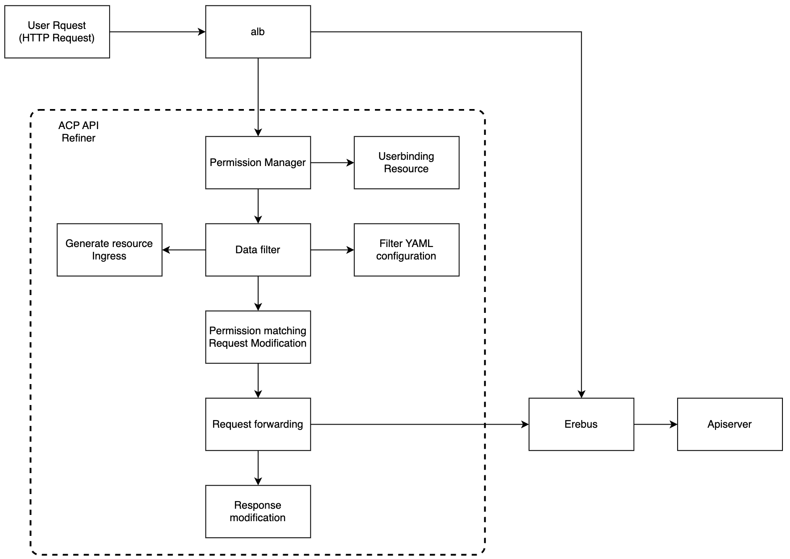

# Architecture

## System Architecture

## Components Description

The ACP API Refiner architecture consists of the following key components:

### ACP API Refiner Components

1. **Permission Manager**
   - Validates user identity through JWT token analysis
   - Interacts with Userbinding Resource to determine user permissions
   - Defines user access boundaries based on project, cluster, and namespace

2. **Data Filter**
   - Core filtering component
   - Processes requests based on YAML configuration
   - Manages resource filtering rules
   - Handles field-level data filtering and desensitization

3. **Filter YAML Config**
   - Stores filtering rules and configurations
   - Defines resource types and their corresponding filtering rules
   - Specifies field exclusion, inclusion, and desensitization rules

4. **Generate Resource Ingress**
   - Dynamically creates Ingress rules for resources
   - Routes specific resource requests to the filtering service

## Data Flow

1. **Request Initiation**
   - User sends HTTP request to the platform
   - Request is received by ALB

2. **Request Processing**
   - ALB routes request to Data Filter Plugin based on configuration
   - Permission Manager validates user identity and permissions
   - Data Filter applies filtering rules based on:
     - User permissions
     - Resource type
     - YAML configuration

3. **Request Modification**
   - Adds appropriate label selectors for list requests
   - Modifies request parameters based on user permissions
   - Applies field-level filtering rules

4. **Response Processing**
   - Filters response data according to configured rules
   - Applies field desensitization where required
   - Ensures only authorized data is returned to user

