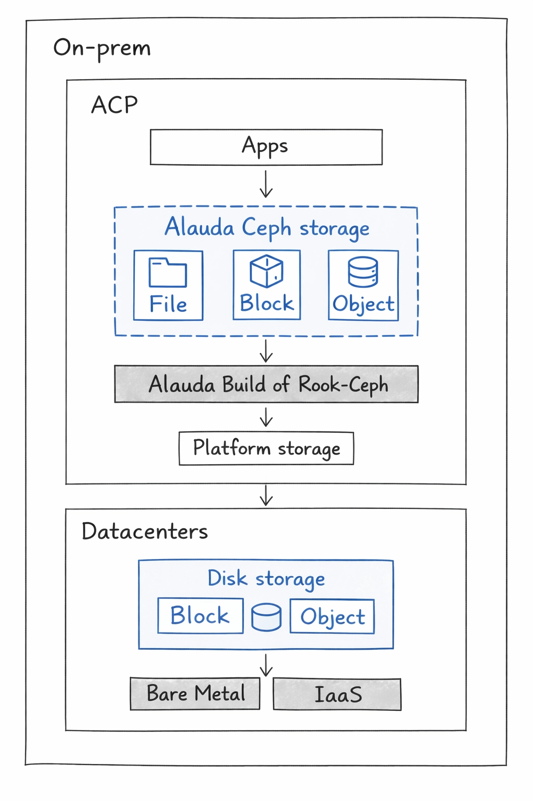
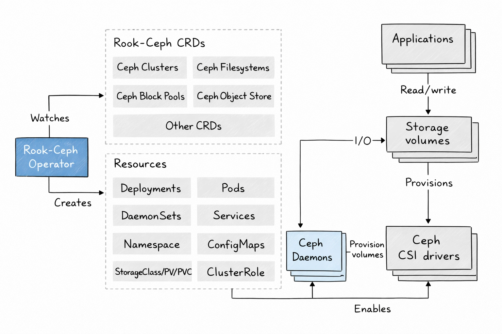

# Architecture

## Chapter 1: Introduction

**Alauda Build of Rook-Ceph** is the cloud-native storage layer for Alauda Container Platform (ACP). It runs as a Kubernetes-native system and provides persistent storage services through operators, custom resources, and CSI drivers.

From an application perspective, the platform provides three primary storage types:

- File storage: Shared file system semantics for workloads that need concurrent read/write access from multiple pods (for example, RWX scenarios).
- Block storage: Low-level block devices for latency-sensitive or database-style workloads that require dedicated volumes.
- Object storage: S3-compatible object access for unstructured data, backup artifacts, and data platform integrations.

**Alauda Build of Rook-Ceph** integrates the following core open source projects:

- Ceph: Distributed storage engine that provides block, file, and object capabilities.
- Rook: Kubernetes operator framework used to deploy and manage Ceph clusters.
- Ceph CSI Operator: Operator that manages Ceph CSI driver components and their lifecycle.
- Ceph CSI: CSI implementation used by Kubernetes for dynamic provisioning, attach/mount, and lifecycle operations of Ceph-backed volumes.

## Chapter 2: Architecture Overview

At a high level, **Alauda Build of Rook-Ceph** runs fully inside **Alauda Container Platform**.

**Alauda Build of Rook-Ceph architecture**

**Alauda Build of Rook-Ceph** uses failure domain configuration to determine how data replicas are
distributed across the cluster. A failure domain represents a physical boundary, such as a host, rack, or
availability zone within which replicas of the data are spread to ensure high availability. **Alauda Build of Rook-Ceph** automatically identifies these failure domains based on the labels assigned to the storage
nodes.

## Chapter 3: Operators

**Alauda Build of Rook-Ceph** is comprised of the following two Operator Lifecycle Manager
(OLM) operator bundles, deploying operators which codify administrative tasks and custom
resources so that task and resource characteristics can be easily automated:
- acp-storage-operator
- rook-ceph-operator

Administrators define the desired end state of the cluster, and the operators ensure the cluster is either in that state or approaching that state, with minimal administrator
intervention.

### Rook-Ceph operator

`rook-ceph-operator` is the operator for Ceph in **Alauda Build of Rook-Ceph**. It enables Ceph storage systems to run on **Alauda Container Platform** as Kubernetes-managed services.

The `rook-ceph-operator` container automatically bootstraps storage clusters and monitors storage daemons to maintain cluster health.

#### Components

The `rook-ceph-operator` manages these Ceph daemon components:

- Mons: Ceph monitors (`mons`) maintain cluster metadata and quorum.
- OSDs: Object Storage Daemons (`OSDs`) store and replicate data.
- Mgr: The Ceph manager (`mgr`) provides metrics and internal management capabilities.
- RGW: RADOS Gateway (`RGW`) provides object storage access through S3-compatible APIs.
- MDS: Metadata Server (`MDS`) provides metadata services for CephFS shared filesystems.

#### Design diagram

The design diagram shows how `rook-ceph-operator` integrates Ceph with ACP.

Applications can use this storage layer by mounting block devices and shared filesystems, or by consuming object storage APIs.

#### Responsibilities

`rook-ceph-operator` bootstraps and monitors the storage cluster with these responsibilities:

- Automates configuration of storage components.
- Starts, monitors, and manages Ceph monitor pods and Ceph OSD daemons for the RADOS cluster.
- Initializes pods and artifacts used to manage:
  - Custom resources for pools
  - Object stores (S3)
  - Filesystems
- Monitors Ceph monitors and OSD daemons to keep storage available and healthy.
- Deploys and manages monitor placement and updates monitor configuration as cluster size changes.
- Watches for desired-state changes requested through the API service and applies those changes.
- Initializes the Ceph-CSI drivers.
- Automatically configures Ceph-CSI to mount Ceph storage to application pods.

The `rook-ceph-operator` image includes the tools required for lifecycle management. It does not modify the data path. It also does not expose all low-level Ceph configurations; advanced Ceph constructs such as placement groups and CRUSH maps remain abstracted for a simpler operational model.

#### Resources

The operator adds owner references to the resources it creates in the `rook-ceph` namespace. During uninstall, these references ensure associated resources are also removed, including `ConfigMaps`, `Secrets`, `Services`, `Deployments`, and `DaemonSets`.

The operator watches and reconciles these custom resources:

- `CephCluster`
- `CephObjectStore`
- `CephFilesystem`
- `CephBlockPool`

#### Lifecycle

The operator manages the lifecycle of these Ceph and CSI pods:

- Rook operator:
  - One operator pod.
- RBD CSI Driver:
  - Two provisioner pods managed by one deployment.
  - One plugin pod per node managed by a DaemonSet.
- CephFS CSI Driver:
  - Two provisioner pods managed by one deployment.
  - One plugin pod per node managed by a DaemonSet.
- Monitors (`mons`):
  - Three monitor pods, each with its own deployment.
  - In stretch clusters, five monitor pods: one in the arbiter zone and two in each data zone.
- Manager (`mgr`):
  - Two manager pods in standard deployments.
- Object Storage Daemons (`OSDs`):
  - At least three OSDs are created initially.
  - More OSDs are added as cluster capacity expands.
- Metadata Server (`MDS`):
  - Two metadata server pods.
- RADOS Gateway (`RGW`):
  - At least two gateway pods.

### ACP storage operator

`acp-storage-operator` is an ACP-specific operator that reconciles `CephCluster` resources and manages built-in ACP storage integrations around operations, monitoring, and troubleshooting.

:::note
It applies only to internal mode deployments.
:::

#### Components

`acp-storage-operator` manages the following built-in integration components:

- Ceph reconciliation controller for `CephCluster`.
- Two `MutatingWebhookConfiguration` entries:
  - one for `CephCluster`
  - one for `CephFilesystem`

#### Design diagram

`acp-storage-operator` runs as a control-plane operator in ACP and extends the Ceph cluster lifecycle with ACP-native monitoring and operations resources.

#### Responsibilities

`acp-storage-operator` performs the following responsibilities:

- Watches and reconciles `CephCluster` resources.
- Mutates `CephCluster` and `CephFilesystem` objects at creation time through mutating webhooks.
- Initializes ACP-specific defaults during mutation, including `resources`, `placement`, and related runtime settings.
- Creates the built-in `.mgr` pool for ACP-required Ceph manager functionality.
- Creates and maintains ACP built-in `AlertRule` resources.
- Creates and maintains ACP built-in `MonitorDashboard` resources.
- Automatically enables and maintains the `rook-ceph-tools` pod.

#### Resources

`acp-storage-operator` creates and manages these resources for each reconciled `CephCluster`:

- Built-in Ceph `.mgr` pool.
- ACP built-in `AlertRule` objects.
- ACP built-in `MonitorDashboard` objects.
- `rook-ceph-tools` pod and its related runtime resources.

#### Lifecycle

`acp-storage-operator` follows this lifecycle in internal mode:

1. Bootstrap phase: The operator deployment starts and registers controllers and mutating admission webhooks for `CephCluster` and `CephFilesystem`.
2. Admission phase: On create requests, the webhooks inject ACP defaults (for example `resources` and `placement`) before objects are persisted.
3. Reconcile phase: After `CephCluster` becomes available, the operator continuously reconciles ACP built-in resources, including the `.mgr` pool, `AlertRule`, `MonitorDashboard`, and `rook-ceph-tools` pod.
4. Cleanup phase: When `CephCluster` is deleted, the operator removes all ACP-managed resources that it created for that cluster.

## Chapter 4: Installation Overview

This chapter describes installation flow in internal mode and external mode.

### Operator installation

- OLM installs `acp-storage-operator` for ACP built-in storage integrations.
- OLM installs the rook-ceph-operator from its package and creates the operator deployment.
- The deployment includes the control components required to reconcile `CephCluster` and Ceph-related resources.
- `acp-storage-operator` registers mutating admission webhooks for `CephCluster` and `CephFilesystem` objects.
- After startup, the operator begins watching CRDs and preparing CSI components required for storage consumption.

### Ceph cluster creation overview

- An administrator creates a `CephCluster` custom resource.
- The operator uses that declaration to orchestrate Ceph-related resources and CSI services.
- In internal mode, `acp-storage-operator` also reconciles ACP built-in storage resources around the same `CephCluster`.
- The concrete reconciliation path differs by deployment mode: internal mode or external mode.

### CephCluster creation

#### Internal mode

In internal mode, storage daemons run inside the ACP cluster where the `CephCluster` is created.

1. The operator receives the `CephCluster` in the storage namespace.
2. `acp-storage-operator` mutating webhooks initialize ACP defaults (for example `resources` and `placement`) for `CephCluster` and `CephFilesystem` resources.
3. `rook-ceph-operator` bootstraps monitor quorum and creates manager daemons.
4. OSD prepare jobs discover configured devices and then create OSD deployments.
5. Ceph CSI provisioner and node plugin pods are deployed for RBD and CephFS.
6. `acp-storage-operator` reconciles ACP built-in resources, including the `.mgr` pool, built-in `AlertRule`, built-in `MonitorDashboard`, and `rook-ceph-tools` pod.
7. `StorageClass` objects become available for dynamic provisioning through PVC workflows.
8. Cluster health and readiness are continuously reported through `CephCluster` status.

#### External mode

In external mode, the Ceph data plane runs in an external provider cluster, while ACP hosts the consumer-side control integration.

1. The operator installs and reconciles CSI components in the consumer ACP cluster.
2. External Ceph connection data (such as monitor endpoints, cluster identifiers, and client secrets) is imported.
3. A `CephCluster` is reconciled in external mode (`external: true`) to represent the remote Ceph backend.
4. No local monitor or OSD daemons are created in the consumer cluster.
5. RBD and CephFS CSI drivers use the imported connection information to provision and mount volumes from the external Ceph cluster.
6. Status and health are reconciled from consumer-side components and external connectivity checks.

## Chapter 5: Upgrade Overview

Alauda Build of Rook-Ceph follows OLM-managed upgrade workflows through `Subscription`, `InstallPlan`, and `ClusterServiceVersion` (CSV) resources.

A newer bundle appears in the current channel, OLM creates an `InstallPlan`, and execution depends on automatic or manual approval policy.

After `InstallPlan` approval, OLM executes CSV reconciliation:

- New CSV is installed.
- Operator Deployments are updated to the new images and restart.
- Old CSV is replaced after successful transition checks.

Then operator-level reconciliation finalizes the upgrade:

- Operators validate and re-apply desired state from user-facing CRs.
- Ceph and CSI resources are checked for version-aligned configuration.
- Drift is corrected until cluster status reports healthy and converged.

:::warning
Do not rely on manual edits to generated CSV content as a persistent customization mechanism. During subsequent upgrades, OLM reconciliation can overwrite those ad hoc changes.
:::
