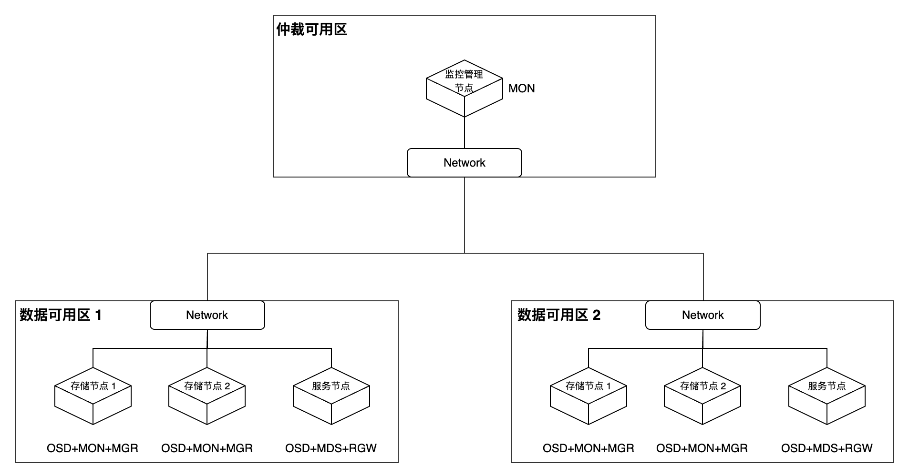

# Create Storage Service - Create Stretch Cluster

A stretch cluster can extend across two geographically distinct locations, providing disaster recovery capabilities for storage infrastructure. In the event of a disaster, when one availability zone in the two zones is completely unavailable, Ceph can still maintain availability.

## Terminology

| Term                                      | Explanation                                                                      |
| --------------------------------------- | --------------------------------------------------------------------------- |
| **MON (Monitor)**                    | Primarily responsible for maintaining the Cluster Map, recording cluster members, configuration and state information, handling member authentication, and participating in quorum voting.                    |
| **OSD (Object Storage Daemon)** | Primarily manages physical storage devices, handles data replication, recovery, and rebalancing, communicates with other OSDs to ensure data consistency, and reports status to the monitor.                     |
| **MGR (Manager)**                    | Responsible for monitoring runtime metrics and cluster status, providing additional monitoring and interface functionality, managing various resources of the cluster (including storage utilization, current load, etc.), and providing a dashboard interface for administrators to monitor and manage the cluster. |
| **MDS (Metadata Server)**         | Primarily responsible for managing the metadata of the CephFS file system, maintaining the file system directory structure, managing file permissions and attributes, and providing a POSIX-compliant file system interface.             |
| **RGW (RADOS Gateway)**           | Primarily provides S3 and Swift compatible RESTful APIs, handles object storage requests, manages user authentication and access control, and supports multi-tenant isolation.             |
| **Quorum Availability Zone**                               | Usually located in a separate zone that does not bear primary workloads, focusing on maintaining cluster consistency, and is primarily used for arbitration decisions when a failure occurs in the main data center or a network partition occurs.                 |
| **Data Availability Zone**                               | The primary area in the Ceph cluster where data is actually stored and processed, bearing operational loads and data storage tasks, forming a complete high-availability storage system together with the quorum zone.               |

## Typical Deployment Scheme

The following content provides a typical deployment scheme for stretch clusters, along with component descriptions and principles of disaster recovery.

### Component Description

Nodes need to be distributed across three availability zones, including two data availability zones and one quorum availability zone.

- Both data availability zones need to fully deploy all core Ceph components (MON, OSD, MGR, MDS, RGW), and each data availability zone must configure two MON instances for high availability. When both MON instances in the same data availability zone are unavailable, the system will determine that the availability zone is in a failure state.

- The quorum availability zone only requires the deployment of one MON instance, serving as the arbitration decision node.

### Disaster Recovery Explanation

- When a data availability zone completely fails, the Ceph cluster will automatically enter a degraded state and trigger an alarm notification. The system will adjust the minimum number of replicas in the storage pool (min\_size) from the default of 2 to 1. Since the other data availability zone still maintains dual replicas, the cluster remains available. When the failed data availability zone recovers, the system will automatically execute data synchronization and return to a healthy state; if the failure cannot be repaired, it is recommended to replace it with a new data availability zone.

- When the network connection between the two data availability zones is interrupted, but they can still connect normally to the quorum availability zone, the quorum availability zone will arbitrate between the two data availability zones based on preset policies, selecting the one in a better state to continue providing services as the primary data zone.

## Constraints and Limitations

- **Storage Pool Limitations**: Erasure-coded storage pools are not supported, and only replica mechanisms can be used for data protection.

- **Device Classification Limitations**: Device class functionality is not supported, and storage cannot be stratified based on device characteristics.

- **Regional Deployment Limitations**: Only two data availability zones are supported; no more than two data availability zones can exist.

- **Data Balancing Requirements**: The OSD weights of the two data availability zones must strictly remain consistent to ensure balanced data distribution.

- **Storage Medium Requirements**: Only all-flash (All-Flash) OSD configurations are permitted, minimizing the time required for recovery after a connection is restored, and reducing the potential for data loss as much as possible.

- **Network Latency Requirements**: The RTT (round-trip time) between the two data availability zones must not exceed 10ms, and the quorum availability zone must meet the ETCD specification latency requirements to ensure the reliability of the arbitration mechanism.

## Prerequisites\{#pre}

Please classify all or part of the nodes in the cluster into three availability zones in advance, as follows:

- Ensure that at least 5 nodes are distributed among one quorum availability zone and two data availability zones. Among them, the quorum availability zone must have at least one node, which can be a virtual machine or cloud host.

- Ensure that at least one availability zone in the three availability zones contains a Master node (control node).

- Ensure that at least 4 computing nodes are evenly distributed across the 2 data availability zones, with at least 2 computing nodes configured in each data availability zone.

- Try to ensure that the number of nodes and disk configurations in the two data availability zones are consistent.

## Operational Steps

### Tagging Nodes

1. Access **Platform Management**.

2. In the left navigation bar, click **Cluster Management** > **Cluster**.

3. Click on the corresponding cluster name to enter the cluster overview page.

4. Switch to the **Nodes** tab.

5. Based on the planning in the [Prerequisites](#pre), add the `topology.kubernetes.io/zone=<zone>` label to these nodes to classify them into the specified availability zone. Here, replace \<zone> with the name of the availability zone.

### Create Storage Service

This document only describes the parameters that differ from standard type clusters; for other parameters, please refer to [Create Storage Service - Create Standard Type Cluster](./create_service_stand.mdx).

**Create Cluster**

| Parameter        | Description             |
| --------- | -------------- |
| **Cluster Type**  | Select **Stretch**.     |
| **Quorum Availability Zone** | Choose the name of the quorum availability zone.    |
| **Data Availability Zone** | Select the names of the availability zones and choose the nodes. |

**Create Storage Pool**

| Parameter       | Description                                         |
| -------- | ------------------------------------------ |
| **Number of Replicas** | Default is 4.                                     |
| **Number of Instances** | When the storage type is **Object Storage**, to ensure availability, the minimum number of instances is 2 and the maximum is 5. |

## Related Operations

### Create Standard Type Cluster

For specific instructions, please refer to [Create Storage Service - Create Standard Type Cluster](./create_service_stand.mdx).
