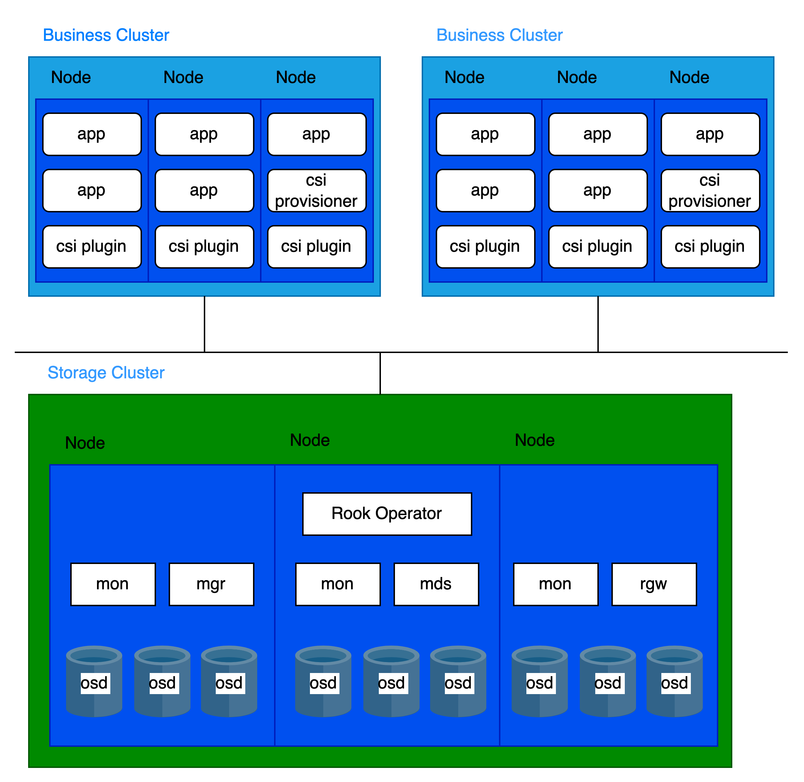
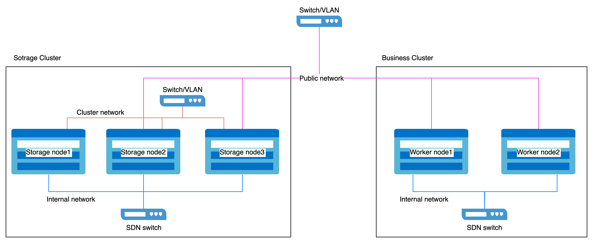

# Configure a Dedicated Cluster for Distributed Storage  

Dedicated cluster deployment refers to using an independent cluster to deploy the platform's distributed storage, where other business clusters within the platform access and utilize the storage services it provides through integration.  
To ensure the performance and stability of the platform's distributed storage, only the platform's core components and distributed storage components are deployed in the dedicated storage cluster, avoiding the co-location of other business workloads. This separated deployment approach is the recommended best practice for the platform's distributed storage.

## Architecture  

Storage-Compute Separation Architecture

  


## Infrastructure requirements

### Platform requirements  

Supported in version 3.18 and later.

### Cluster requirements  

It is recommended to use bare-metal clusters as dedicated storage clusters.

### Resource requirements  

Please refer to the [Core Concepts](../concepts/concept.mdx) for the components of distributed storage deployment.

Each component has distinct CPU and memory requirements. The recommended configurations are as follows:

|Process|CPU|Memory|
|:---|:---:|:---:|
|MON|2c|3Gi|
|MGR|3c|4Gi|
|MDS|3c|8Gi|
|RGW|2c|4Gi|
|OSD|4c|8Gi|


A cluster typically runs:  
- 3 MON
- 2 MGR  
- multiple OSD
- 2 MDS (if using CephFS)
- 2 RGW (if using CephObjectStorage) 


Based on the component distribution, the following per-node resource recommendations apply:  

|CPU|Memory|
|:---|:---|
|16c + (4c * OSD per node)|20Gi + (8Gi * OSD per node)|  

### Storage device requirements  

It is recommended to deploy 12 or fewer storage devices per node. This helps restrict the recovery time following a node failure.

#### Storage device type requirements  

It is recommended to use enterprise SSDs with a capacity of 10TiB or smaller per device, and ensure all disks are identical in size and type.

#### Capacity planning  

Before deployment, storage capacity must be planned according to specific business requirements. By default, the distributed storage system employs a 3-replica redundancy strategy. Therefore, the usable capacity is calculated by dividing the total raw storage capacity (from all storage devices) by 3.  

Example for 30(N) nodes (replica count = 3), The usable capacity scenario is as follows:  
|Storage device size(D)|Storage device per node(M)|Total Capacity(D*M*N)|Usable Capacity(D*M*N/3)|
|:---:|:---:|:---:|:---:|
|0.5 TiB|3|45 TiB|15 TiB|
|2 TiB|6|360 TiB|120 TiB|
|4 TiB|9|1080 TiB|360 TiB|

#### Capacity monitoring and expansion    

1. **Proactive Capacity Planning**  

    Always ensure usable storage capacity exceeds consumption. If storage is fully exhausted, recovery requires manual intervention and cannot be resolved by simply deleting or migrating data.

2. **Capacity Alerts**  

    The cluster triggers alerts at two thresholds:  

    - **80% utilization** ("near full"): Proactively **free up space** or scale out the cluster.
    - **95% utilization** ("full"): Storage is fully exhausted, and standard commands cannot free space. Contact platform support immediately.  

    Always address alerts promptly and monitor storage usage regularly to avoid outages.

3. **Scaling Recommendations**  

    - **Avoid**: Adding storage devices to existing nodes.
    - **Recommended**: Scale out by adding new storage nodes.
    - **Requirement**: New nodes must use storage devices identical in size, type, and quantity to existing nodes.

### Network requirements  

Distributed storage must utilize **HostNetwork**.   

#### Network Isolation  

The network is categorized into two types:

    - **Public Network**: Used for client-to-storage component interactions (e.g., I/O requests).
    - **Cluster Network**: Dedicated to data replication between replicas and data rebalancing (e.g., recovery).

To ensure service quality and performance stability:

1. For Dedicated Storage Clusters:  
    Reserve two network interfaces on each host:
        - Public Network: For client and component communication.
        - Cluster Network: For internal replication and rebalancing traffic.
2. For Business Clusters:  
    Reserve one network interface on each host to access the storage Public Network.

Example Network Isolation Configuration  

  

#### Network interface speed requirements  

1. **Storage Nodes**  
    - **Public Network** and **Cluster Network** require 10GbE or higher network interfaces.  

2. **Business Cluster Nodes**  
    - The network interface used to access the storage **Public Network** must be 10GbE or higher.


## Procedure  

<Steps>
### Deploy Operator  

1. Access **Platform Management**.  

2. In the left sidebar, click **Storage Management** > **Distributed Storage**.  

3. Click **Create Now**.  

4. In the **Deploy Operator** wizard page, click the **Deploy Operator** button at the bottom right.  
   - When the page automatically advances to the next step, it indicates that the Operator has been deployed successfully.  
   - If the deployment fails, please refer to the prompt on the interface **Clean Up Deployed Information and Retry**, and redeploy the Operator; if you wish to return to the distributed storage selection page, click **Application Store**, first uninstall the resources in the already deployed **rook-operator**, and then uninstall **rook-operator**.


### Create ceph cluster  

Execute commands on the **control node** of the storage cluster.
<details> 
    <summary>Click to view</summary>

    ```yaml
    cat << EOF | kubectl create -f -
    apiVersion: ceph.rook.io/v1
    kind: CephCluster
    metadata:
      name: ceph-cluster
      namespace: rook-ceph
    spec:
      cephConfig:
        global:
          mon_memory_target: "3221225472"
          mds_cache_memory_limit: "8589934592"
          osd_memory_target: "8589934592"
          bluefs_buffered_io: "false"
        mon:
          auth_allow_insecure_global_id_reclaim: "true"
          mon_warn_on_insecure_global_id_reclaim: "false"
          mon_warn_on_insecure_global_id_reclaim_allowed: "false"
      cephVersion:
        image: build-harbor.alauda.cn/3rdparty/ceph/ceph:v18.2.4-0
      dashboard:
        enabled: true
      dataDirHostPath: /var/lib/rook
      mgr:
        count: 2
        modules:
        - enabled: true
          name: pg_autoscaler
      mon:
        count: 3
      monitoring:
        enabled: true
      network:
        ipFamily: IPv4
        addressRanges:
          public:
          - <public network cidr>
          cluster:
          - <cluster network cidr>
        provider: host
      placement:
        all:
          tolerations:
          - effect: NoSchedule
            operator: Exists
          - key: "node-role.kubernetes.io/master"
            operator: "Exists"
            effect: "NoSchedule"
          - key: "node-role.kubernetes.io/control-plane"
            operator: "Exists"
            effect: "NoSchedule"
          - key: "node-role.kubernetes.io/cpaas-system"
            operator: "Exists"
            effect: "NoSchedule"
        mgr:
          podAffinity:
            podAntiAffinity:
              requiredDuringSchedulingIgnoredDuringExecution:
              - labelSelector:
                  matchExpressions:
                  - key: app
                    operator: In
                    values:
                    - rook-ceph-mgr
                  topologyKey: kubernetes.io/hostname
      priorityClassNames:
        all: system-node-critical
      resources:
        crashcollector:
          limits:
            cpu: 200m
            memory: 128Mi
          requests:
            cpu: 100m
            memory: 64Mi
        mgr:
          requests:
            cpu: "3"
            memory: 4Gi
        mon:
          requests:
            cpu: "2"
            memory: 3Gi
        osd:
          requests:
            cpu: "4"
            memory: 8Gi
      storage:
        <storage devices>
    EOF
    ```
</details>

**Parameters**:  
- **public network cidr**: CIDR of the storage **Public Network** (e.g., ```- 10.0.1.0/24```).
- **cluster network cidr**: CIDR of the storage **Cluster Network** (e.g., ```- 10.0.2.0/24```).
- **storage devices**: Specify the storage devices to be utilized by the distributed storage.  
    Example Formatting:
    ```         
      nodes:
      - name: storage-node-01
        devices:
        - name: /dev/disk/by-id/wwn-0x5000cca01dd27d60
        useAllDevices: false
      - name: storage-node-02
        devices:
        - name: sdb
        - name: sdc
        useAllDevices: false
      - name: storage-node-03
        devices:
        - name: sdb
        - name: sdc
        useAllDevices: false
    ```  
    <Directive type="info" title="Tip">
    Uses the disk's World Wide Name (WWN) for stable naming, which avoids reliance on volatile device paths like ```sdb``` that may change after reboots.
    </Directive>

### Create storage pools  

Three storage pool types are available. Select and create the appropriate ones based on your business requirements.

#### Create file pool  

Execute commands on the **control node** of the storage cluster.
<details> 
    <summary>Click to view</summary>

    ```yaml
    cat << EOF | kubectl apply -f -
    apiVersion: ceph.rook.io/v1
    kind: CephFilesystem
    metadata:
      name: cephfs
      namespace: rook-ceph
    spec:
      metadataPool:
        failureDomain: host
        replicated:
          requireSafeReplicaSize: true
          size: 3
      dataPools:
      - failureDomain: host
        replicated:
          requireSafeReplicaSize: true
          size: 3
      preserveFilesystemOnDelete: false
      metadataServer:
        activeCount: 1
        activeStandby: true
        placement:
          podAntiAffinity:
            requiredDuringSchedulingIgnoredDuringExecution:
            - labelSelector:
                matchExpressions:
                - key: app
                  operator: In
                  values:
                  - rook-ceph-mds
              topologyKey: kubernetes.io/hostname
          tolerations:
          - effect: NoSchedule
            operator: Exists
        resources:
          requests:
            cpu: "3"
            memory: 8Gi
    EOF
    ```
</details>  

#### Create block pool  

Execute commands on the **control node** of the storage cluster.
<details> 
    <summary>Click to view</summary>

    ```yaml
    cat << EOF | kubectl apply -f -
    apiVersion: ceph.rook.io/v1
    kind: CephBlockPool
    metadata:
      name: block
      namespace: rook-ceph
    spec:
      failureDomain: host
      replicated:
        size: 3
    EOF
    ```
</details>

#### Create object pool  

Execute commands on the **control node** of the storage cluster.
<details> 
    <summary>Click to view</summary>

    ```yaml
    cat << EOF | kubectl apply -f -
    apiVersion: ceph.rook.io/v1
    kind: CephObjectStore
    metadata:
      name: object
      namespace: rook-ceph
    spec:
      metadataPool:
        failureDomain: host
        replicated:
          requireSafeReplicaSize: true
          size: 3
      dataPool:
        failureDomain: host
        replicated:
          requireSafeReplicaSize: true
          size: 3
      preservePoolsOnDelete: false
      gateway:
        instances: 2
        placement:
          podAntiAffinity:
            requiredDuringSchedulingIgnoredDuringExecution:
            - labelSelector:
                matchExpressions:
                - key: app
                  operator: In
                  values:
                  - rook-ceph-rgw
              topologyKey: kubernetes.io/hostname
          tolerations:
          - effect: NoSchedule
            operator: Exists
        port: 7480
        resources:
          requests:
            cpu: "2"
            memory: 4Gi
    EOF
    ```
</details>

</Steps>

## Follow-up Actions  

When other clusters need to utilize the distributed storage service, refer to the following guidelines.  
[Accessing Storage Services](/storage/storagesystem_ceph/functions/access_storage_service.mdx)
