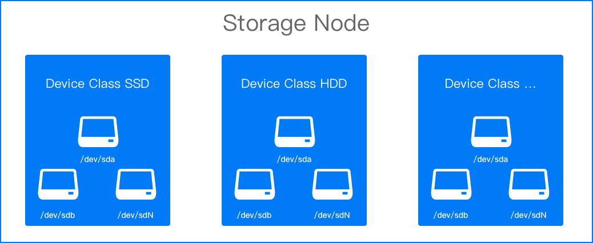

# Device Management

Whether for initial deployment or resource expansion, you need to map the available disks on the node into storage devices for use and management.

Storage devices with similar characteristics are typically used in a centralized manner, and these devices are categorized under **Device Classes** in local storage. Using device classes is equivalent to directly using disks, ensuring zero loss and high performance, while also reducing application awareness and dependence on specific devices.

## Prerequisites

- At least 1 [Device Class (deviceClasses.classes)](./create_topolvm.mdx) must have been added when creating the local storage cluster, including devices in the device class.

- There must be at least 1 bare disk present on the node.

## Adding Devices

1. Go to **Platform Management**.

2. In the left navigation bar, click **Storage Management** > **Local Storage**.

3. In the **Details** tab, click **Add Storage Node**.

4. Configure the related parameters according to the instructions below.

   | Parameter         | Description                                                                          |
   | ----------------- | ---------------------------------------------------------------------------------- |
   | **Storage Node**  | A node that has at least 1 bare disk.                                             |
   | **Device Class**  | Each device class corresponds to a group of storage devices with the same characteristics; it is recommended to name it according to the nature of the disks, e.g., *hdd*, *ssd*. |
   | **Storage Device** | For example, */dev/sda*. If there are multiple disks, they can be added one by one.     <b>Note</b>: The storage device should be the entire hard disk, not a partition on the hard disk, as this will cause errors. |

5. Click **Add**.

   **Note**: If the device class status is `Unavailable` due to the lack of added devices, you can proceed with the following operations.

6. Switch to the **Storage Devices** tab and click **Add Storage Device**.

7. Add devices according to the prompts on the interface.

8. Click **Add**.
