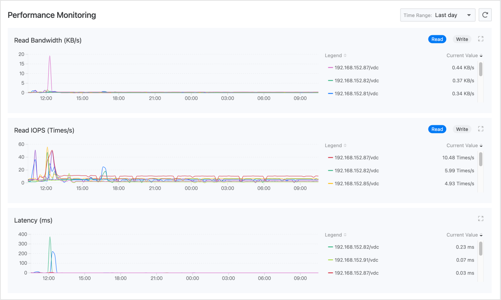
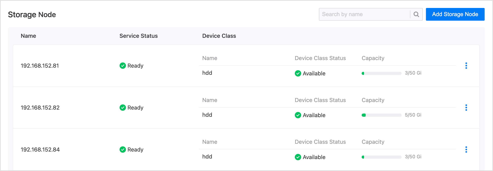

# Monitoring and Alerting

Local storage provides out-of-the-box monitoring metrics collection and alerting capabilities. Once the platform monitoring component is enabled, monitoring and alerts can be configured based on storage clusters, storage performance, and storage capacity, with support for configuring notification policies.

The intuitively presented monitoring data can be utilized to support decision making for operational inspections or performance tuning, and a comprehensive alerting mechanism will help ensure the stable operation of the storage system.

## Monitoring

### Performance Monitoring

By default, the platform will collect commonly used performance monitoring metrics such as read and write bandwidth, IOPS, and latency for local storage. On the **Monitoring** tab of the **Local Storage** page under **Storage Management**, real-time monitoring data for these metrics can be viewed.

### Capacity Monitoring

Since local storage can only use locally available storage resources on nodes, it is required that users ensure there is sufficient available capacity on the nodes before declaring local storage, to avoid issues caused by over-declaring.

In this regard, the platform provides capacity monitoring for device types in the **Details** section of local storage. If any device type is found to have insufficient available capacity, space should be cleared or additional disk devices should be added before using local storage.

## Alerts

The platform enables a set of default alerting policies. If any resources are abnormal or if monitoring data reaches a warning state, alerts will be triggered automatically. The preconfigured policies are capable of meeting common operational needs such as cluster status alerts and device type capacity alerts.

### Configuring Notifications

To ensure timely receipt of alerts, it is recommended that you set up notification policies in the operations center: sending alert information via email, SMS, and other means to relevant personnel to remind them to take necessary measures to resolve issues or prevent failures. Click   to switch to the operations center to complete this action, refer to [Creating Alert Policies]() for guidance.

### Handling Alerts

- If the health status of the storage cluster is monitored as `Alert`, you can refer to the table below to troubleshoot and resolve issues in the **Details** section of local storage.

  | Inspection Item  | Corresponding Status | Cause                                  |
  | ---------------- | -------------------- | -------------------------------------- |
  | **Health Status**  | Alert               | Caused by abnormal node services or device type issues.  |
  | **Service Status**  | Unknown             | Indicates a node is in `notready` state, potentially due to network failures or power outages. |
  | **Device Type Status** | Unavailable         | The used disk may not be a raw disk, or the disk may be missing. |

- If real-time alerts are triggered on the **Alert** tab, even if the storage cluster is currently in a `Healthy` state, alerts should be addressed promptly to prevent further failures. The table below outlines the meanings of alert levels used in the preconfigured policies, which can serve as a reference for your alert handling principles.

  | Alert Level    | Meaning                                       |
  | --------------- | -------------------------------------------- |
  | **Critical**   | Resources associated with the alert rule are malfunctioning, leading to platform service interruptions or data loss, with significant impact.  |
  | **Major**      | Resources associated with the alert rule have known issues that may cause platform function failures, affecting normal business operations. |
  | **Warning**    | Resources associated with the alert rule are at risk of operational issues; if not addressed promptly, they may impact normal business operations. |

### Post-Mortem Analysis

**Alert History** records all alerts that have been triggered in the past and no longer require action. When conducting a post-mortem analysis using alert history, you may need to answer the following questions to effectively summarize your experiences:

- What were the specific abnormal circumstances at the time of the incident?

- Is there a pattern to the repeated occurrence of a specific alert in the alert list? Can it be prevented in advance next time?

- Is the surge in alerts shown on the timeline during a specific period due to external factors or operational incidents? Is there a need to adjust the operational strategy?
