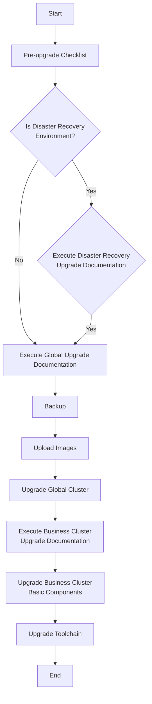

# Overview
This document is intended for system administrators with basic Linux knowledge and details the full upgrading process of the <Term name="productShort" /> `global` cluster.

In this document, the following terms will be used frequently, please pay attention to the distinction:

-   **`global` cluster**: Refers to the cluster responsible for core platform management tasks, such as cluster management and tenant management.
-   **Platform**: Usually refers to the container platform itself, a complete system that provides an application runtime environment and integrates container scheduling, management, networking, storage, and other functions. The **platform** is an overall concept that covers all components, including the `global` cluster and workload clusters.

# Upgrading Process

<table>
  <thead>
    <tr>
      <th>Upgrade Steps</th>
      <th>Upgrade Content</th>
      <th>Time Window</th>
    </tr>
  </thead>
  <tbody>
    <tr>
      <td>Pre-upgrade Checklist</td>
      <td>
        The implementation personnel must execute the checklist and report the results to after-sales for risk assessment. 
        Upgrades are prohibited if the project has not executed the checklist! 
        Is it a disaster recovery environment? 
        If it is a disaster recovery environment, follow the disaster recovery functionality, and finally verify that data synchronization between the standby clusters is functioning properly.
      </td>
      <td>one week before the upgrade when the project initiates the upgrade plan.</td>
    </tr>
    <tr>
      <td>Check data synchronization</td>
      <td>Check data synchronization between the clusters is functioning properly.</td>
      <td>1 hour before upgrading</td>
    </tr>
    <tr>
      <td>Backup</td>
      <td>Back up etcd and Kubernetes configurations for a! Refer to the "Backup" section for specific steps.</td>
      <td>Perform the backup 1 hour before upgrading.</td>
    </tr>
    <tr>
      <td>Upload images.</td>
      <td>Choose between "Upload images using online upgrades" or "Upload images using offline installation package" based on the customer's environment. Refer to the "Update Images" section for specific steps.</td>
      <td>1 day before the upgrade</td>
    </tr>
    <tr>
      <td>Upgrade the global cluster</td>
      <td>Complete the product management and global cluster upgrade documentation. Refer to the "Upgrading Global Cluster" section.</td>
      <td>Execute on the upgrade day</td>
    </tr>
    <tr>
      <td>Execute the business cluster upgrade documentation</td>
      <td>Ensure the global upgrade is successful before executing the business cluster upgrade documentation. Refer to the "Upgrading Components of Business Cluster" section.</td>
      <td>Execute on the upgrade night</td>
    </tr>
    <tr>
      <td>Upgrade the toolchain</td>
      <td>Refer to the "Upgrading DevOps Toolkitchain Instance" section for specific steps.</td>
      <td>Execute on the upgrade night</td>
    </tr>
  </tbody>
</table>

<Directive type="warning" title="WARNING">
To proactively identify and address potential upgrade-blocking issues prior to the upgrade process, it is strongly recommended to perform cluster inspections using the checklist script. If you are unaware of the checklist script's availability location, please contact post-sales support personnel.
</Directive>
