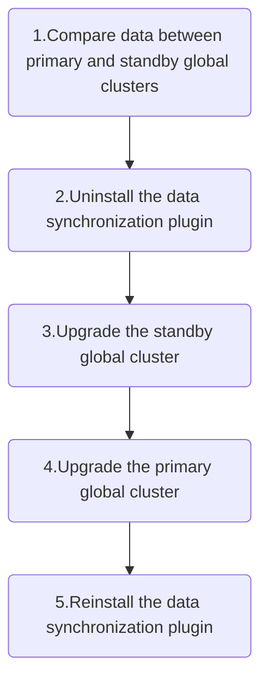

# Upgrade for global DR

Starting from version 4.0, platforms that use the **global disaster recovery (DR)** solution must follow an adjusted upgrade process.

The new upgrade flow is as follows:



<Directive type="warning" title="WARNING">
In versions <Term name="productShort" /> 3.16 and 3.18, the **uninstallation steps for the data sync plugin differ** due to changes between the versions. Instructions for both are provided below.
</Directive>

<Steps>

### Compare Data Consistency

1. Refer to the daily inspection steps for the global DR solution and verify that the data in the **standby global cluster** is consistent with that in the **primary global cluster**. If any inconsistencies are found, **contact technical support** before proceeding.
2. On **both** clusters, run the following command to ensure there are no non-running `Machine` nodes. If any are found, contact technical support to resolve the issue before continuing:

```bash
kubectl get machines.platform.tkestack.io
```

### Uninstall the Data Sync Plugin

<Tabs>
  <Tab label="Upgrading from 3.18">
  1. Access the **Web Console** of the **standby global cluster** using its IP or VIP.
  2. Log into the console and switch to **Administrator** view.
  3. Navigate to **Marketplace > Cluster Plugins**.
  4. Select the cluster as `global` in the dropdown at the top of the   page.
  5. Locate the plugin named **Alauda Container Platform etcd   Synchronizer**, and click **Uninstall**. Wait for the uninstallation   to complete.
  </Tab>

  <Tab label="Upgrading from 3.16">
  Log in to any **control plane node** of the **primary global cluster**, and run the following commands to stop the data sync pods:

  ```bash
  helm3 del etcd-sync -n default 2> /dev/null
  helm3 del etcd-sync -n cpaas-system 2> /dev/null

  kubectl delete configmaps,secret -n kube-system   etcd-master-mirror-cert etcd-slave-mirror-cert etcd-sync-env   etcd-sync-ignore-text &> /dev/null

  kubectl delete deploy -n kube-system etcd-mirror-etcd-mirror &> /dev/  null

  kubectl get pod -n kube-system | grep etcd-mirror  # Ensure no   etcd-mirror pods remain
  ```
  </Tab>
</Tabs>

<Directive type="warning" title="WARNING">
If the standby cluster Web Console is not accessible via IP, log in to any **control plane node** of the standby cluster and edit the `ProductBase` resource to add a reachable IP to `spec.alternativeURLs[]`:

```bash
kubectl edit ProductBase base

spec:
  alternativeURLs:
  - https://192.168.162.10  # Replace with an IP address that can access the Web Console of the standby cluster
```
</Directive>

### Upgrade the Standby global Cluster

If the Web Console is accessed via a domain name, update the DNS resolution to point to the **standby** global cluster. Wait about **5 minutes** and verify DNS has taken effect.

Log into the standby global cluster’s Web Console and follow the instructions in
[**Upgrade Procedure – Trigger the Upgrade and Upgrade the global Cluster**](./upgrade_procedure.mdx).

### Upgrade the Primary global Cluster

If the Web Console is accessed via a domain name, switch the DNS resolution **back to the primary global cluster**. Wait 5 minutes and verify the update.

Then, access the Web Console of the primary global cluster and follow the same upgrade instructions in
[**Upgrade Procedure – Trigger the Upgrade and Upgrade the global Cluster**](./upgrade_procedure.mdx).

### Reinstall the Data Sync Plugin

Before reinstalling, verify that port `2379` on both the **primary** and **standby** global cluster VIPs has been properly forwarded to the control plane nodes.

To reinstall:

1. Access the standby global cluster’s Web Console via its IP or VIP.
2. Log into the Web Console and switch to **Administrator** view.
3. Go to **Marketplace > Cluster Plugins**.
4. Select the cluster as `global` and find the **Alauda Container Platform etcd Synchronizer** plugin.
5. Click **Install**, provide the required parameters, and wait for the plugin to be installed.

To verify the plugin installation, log in to any control plane node of the **standby** global cluster and run:

```bash
kubectl get po -n cpaas-system -l app=etcd-sync  # Pod should be 1/1 Running

kubectl logs -n cpaas-system $(kubectl get po -n cpaas-system -l app=etcd-sync --no-headers | awk '{print $1}' | head -1) | grep -i "Start Sync update"
# Wait until the logs contain "Start Sync update"

# Recreate one etcd-sync pod to trigger sync of Kubernetes resources with ownerReferences
kubectl delete po -n cpaas-system $(kubectl get po -n cpaas-system -l app=etcd-sync --no-headers | awk '{print $1}' | head -1)
```

### Check Data Synchronization Status

Run the following to verify synchronization results:

```bash
curl "$(kubectl get svc -n cpaas-system etcd-sync-monitor -ojsonpath='{.spec.clusterIP}')/check"
```

**Explanation of output:**

* `"LOCAL ETCD missed keys:"` – These keys exist in the **primary cluster** but are missing from the standby. This can occur during pod startup when dependent resources are not yet available. Restarting the etcd-sync pod usually resolves this.
* `"LOCAL ETCD surplus keys:"` – These keys exist in the **standby cluster** but not in the primary. They may be leftover and should be reviewed with the operations team before deletion.
</Steps>
