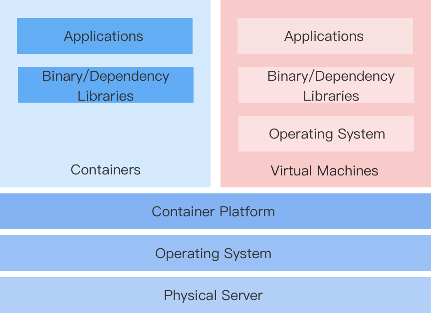

# Introduction

For enterprises using a virtual machine-based architecture, transitioning to a Kubernetes and container-based architecture inevitably requires application modernization. However, due to constraints such as the need for continuous business uptime or the difficulty in changing development habits, enterprises often cannot completely disengage from virtualization architecture in a short period.

Therefore, a solution that can uniformly configure, manage, and control container resources and virtual machine resources on the same platform becomes particularly important.

## Container-Orchestrated Virtual Machine Solution

This platform implements a virtual machine (VMI, VirtualMachineInstance) solution based on the open-source component KubeVirt, allowing for easier and faster creation of container-orchestrated virtual machines and running virtualized applications.

## Features

**Rapid Transformation**

There is no need to rewrite applications or modify images. Simply package the existing application into a qcow2 or raw format virtual machine image, and create a virtual machine using that image on the platform, allowing the application to be deployed to the container platform.

**Maintain Behavioral Habits**

Containerized virtual machines can be managed using a similar approach to traditional virtual machines, without needing to focus on the underlying container implementation, including virtual machine lifecycle management, disks and networks, and snapshot management.

**Coexistence of Virtualization and Containerization**

- The unified platform supports managing virtualized services while also enabling Kubernetes-based container scheduling and management.

- On the basis of continuing to use virtual machine workloads, it allows for a gradual modernization of containerized applications.

- The development of new containerized applications that need to interact with virtualized applications remains unaffected.

## Product Features

- **Virtual Machine**: Supports creating virtual machines with images allocated by administrators and managing them, including starting and stopping virtual machines, managing snapshots, remote login to virtual machines, and modifying virtual machine configurations.

- **Virtual Disk**: Supports viewing and managing disk information created in the current project, including creating disks, viewing disk names, storage classes, capacities, and associated virtual machines.

- **Virtual Machine Snapshots**: Supports viewing details such as the status of virtual machine snapshots, the associated virtual machine, and the most recent rollback time.

- **Virtual Machine Images**: Supports viewing virtual machine image information under the current project, including image provision method and operating system.

- **Key Pairs**: Supports viewing and managing key pairs created in the current project, including creating key pairs and viewing the list of associated virtual machines.

## Constraints and Limitations

It must be implemented based on a physical machine cluster, and KubeVirt components must be deployed within the cluster with virtualization enabled. The platform provides the capability to deploy KubeVirt components via Operator and an interface to enable virtualization, with all related configurations completed by the platform administrator.
