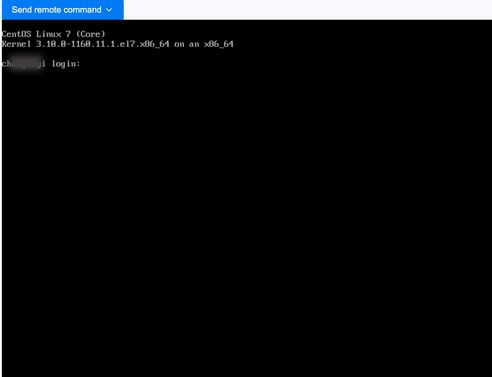

# Logging into the Virtual Machine using VNC

Log into the virtual machine using the Web Console (VNC) as an emergency operation method.

## Steps

1. Access the **Container Platform**.

2. In the left navigation bar, click **Virtualization** > **Virtual Machines**.

3. Click ⋮ > **VNC Login**.

4. The console window will open automatically; you will need to enter your username and password to log in.

   

   **Note**:

   - Supports sending common keyboard commands.

   - Supports copying and pasting commands and parameters.
