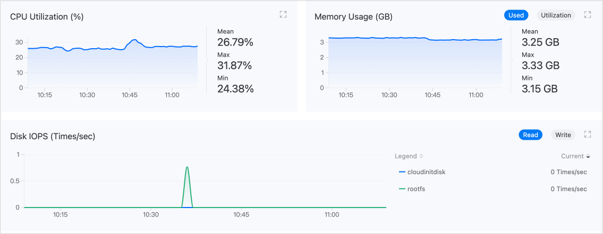

# Monitoring and Alerts

Monitor and alert on virtual machines in terms of CPU, memory, storage, and network. To facilitate timely alerts, notification policies can also be configured.

The intuitively presented monitoring data can be used to provide decision-making support for operations inspection or performance tuning, while the comprehensive alerting and notification mechanism will help ensure the stable operation of virtual machines.

## Monitoring

By default, the platform collects commonly used performance monitoring metrics for virtual machines, including CPU, memory, storage, and network. Navigate to **Virtualization** > **Virtual Machines**, and on the **Monitoring** tab in the virtual machine details, you can view real-time monitoring data for the metrics.



## Alerts

### Configuring Alert Policies

To enable alerts, you must first create an alert policy. An alert policy describes the objects you wish to monitor, the conditions under which you wish to be alerted, and how you will be notified of relevant alerts. Navigate to **Container Platform** > **Virtualization** > **Virtual Machines**, and in the virtual machine details, click **Create Alert Policy** on the **Alerts** tab to complete the configuration.

| Parameter   | Description                                                                                                                                                                                                                                                       |
| :----------- | :------------------------------------------------------------------------------------------------------------------------------------------------------------------------------------------------------------------------------------------------------------------- |
| **Alert Type**  | - Metric Alert: The monitored object is a platform predefined metric, such as *Memory Usage Rate*. <br />- Event Alert: The monitored object is the cause of an event, that is, the reason the virtual machine transitioned to its current state, e.g., BackOff, Pulling, Failed. |
| **Trigger Condition** | Composed of comparison operators, alert thresholds, and duration. By comparing the real-time monitoring results with the set thresholds, it determines whether to alert. <br />If a duration is set, the platform will also compare the duration for which the monitored object has been in the alert state.                                                          |
| **Alert Level** | - Hint: The monitored object has expected issues that do not immediately affect business operations but pose potential risks. For example, if CPU usage exceeds 70% for 3 minutes. <br />- Warning: The monitored object has operational risks that may affect normal business operations if not addressed promptly. For example, if CPU usage exceeds 80% for 3 minutes. <br />- Serious: The monitored object has known issues that may lead to platform functionality failures, affecting normal business operations. <br />- Disaster: The monitored object has failed, resulting in platform service interruptions, data loss, with significant impact. |

**Tip**: The virtual machine alerting function is similar to the platform's general alerting function. For more detailed configuration guidance, refer to the platform's general alerting documentation.

### Handling Alerts

Navigate to the **Alerts** tab, and if there are alert status strategies indicated, please address them promptly.

### Binding Notification Policies

In addition to real-time alerts on the **Alerts** tab, the platform also supports sending alert information via email, SMS, and other means to relevant personnel, notifying them to take necessary measures to resolve issues or prevent failures. The notification policy needs to be set up by contacting the administrator.

## Using the API

Alert policies are backed by Prometheus rules. You can also define an alert directly as a `PrometheusRule` (`monitoring.coreos.com/v1`):

```yaml
apiVersion: monitoring.coreos.com/v1
kind: PrometheusRule
metadata:
  name: vm-high-memory
  namespace: demo
spec:
  groups:
    - name: vm.rules
      rules:
        - alert: VMHighMemoryUsage
          expr: kubevirt_vmi_memory_used_bytes / kubevirt_vmi_memory_available_bytes > 0.8
          for: 3m
          labels:
            severity: warning
          annotations:
            summary: "VMI {{ $labels.name }} memory usage above 80%"
```

KubeVirt emits per-virtual-machine-instance metrics (prefix `kubevirt_vmi_*`, with `namespace` and `name` labels) that you can query in Prometheus or use in your own dashboards — for example `kubevirt_vmi_memory_used_bytes`, `kubevirt_vmi_network_receive_bytes_total`, `kubevirt_vmi_storage_read_traffic_bytes_total`, and `kubevirt_vmi_migration_data_processed_bytes`. Exact metric names vary by KubeVirt version; list the full set with the query `{__name__=~"kubevirt_vmi_.+"}`.
