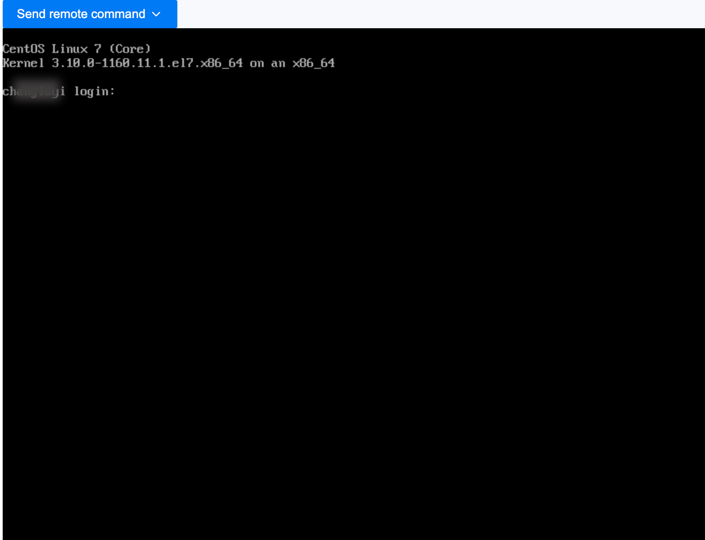

# Logging into the Virtual Machine using VNC

Log into the virtual machine using the Web Console (VNC) as an emergency operation method.

> In the **new console**, open the graphical console from the virtual machine's **detail** page or its row ⋮ menu (**VNC Console**). For a text terminal (headless Linux, kernel boot or panic logs), use the [Serial Console](./console_access.mdx) instead.

## Procedure

1. Access the **Container Platform**.

2. In the left navigation bar, click **Virtualization** > **Virtual Machines**.

3. Click ⋮ > **VNC Login**.

4. The console window will open automatically; you will need to enter your username and password to log in.

   

   **Note**:

   - Supports sending common keyboard commands.

   - Supports copying and pasting commands and parameters.

## Using the API

```bash
virtctl vnc web-01 -n demo
```

`virtctl vnc` launches a local VNC viewer connected to the virtual machine instance `vnc` subresource over a WebSocket:

```text
GET /apis/subresources.kubevirt.io/v1/namespaces/demo/virtualmachineinstances/web-01/vnc
Upgrade: websocket
```

A running instance returns `101 Switching Protocols`; the connection requires the `get` verb on `virtualmachineinstances/vnc`.
