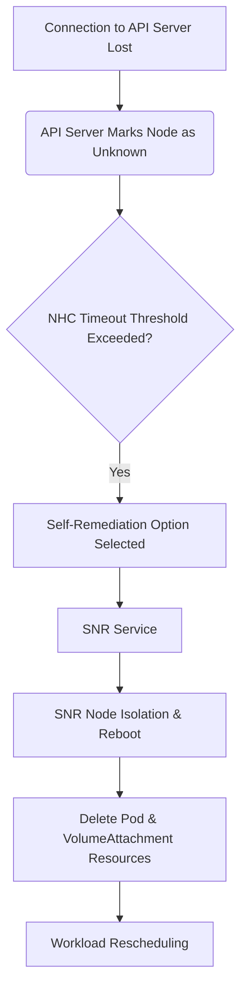

# Configuring High Availability for Virtual Machines    

## Overview 

Hardware is imperfect and software contains bugs. When node-level failures, such as the kernel hangs or network interface controllers (NICs) fail, the work required from the cluster does not decrease, and workloads from affected nodes need to be restarted somewhere. However, some workloads, such as ReadWriteOnce (RWO) volumes and StatefulSets, might require at-most-one semantics.

Failures affecting these workloads risk data loss, corruption, or both. It is important to ensure that the node reaches a safe state, known as fencing before initiating recovery of the workload, known as remediation and ideally, recovery of the node also.

It is not always practical to depend on administrator intervention to confirm the true status of the nodes and workloads. To facilitate such intervention, Alauda Container Platform provides multiple components for the automation of failure detection, fencing and remediation.

## Glossary

| **Acronym** | **Term** |
| :--- | :--- |
| **SNR** | Self Node Remediation |
| **NHC** | Node Health Check |

## Component Overview

- **Self Node Remediation Operator**

    The Self Node Remediation Operator is a Alauda Container Platform add-on Operator that implements an external system of fencing and remediation that reboots unhealthy nodes and deletes resources, such as Pods and VolumeAttachments. The reboot ensures that the workloads are fenced, and the resource deletion accelerates the rescheduling of affected workloads. Unlike other external systems, Self Node Remediation does not require any management interface, like, for example, Intelligent Platform Management Interface (IPMI) or an API for node provisioning.

    Self Node Remediation can be used by failure detection systems, like Machine Health Check or Node Health Check.

- **Node Health Check Operator**

    The Node Health Check Operator is a Alauda Container Platform add-on Operator that implements a failure detection system that monitors node conditions. It does not have a built-in fencing or remediation system and so must be configured with an external system that provides these features. By default, it is configured to utilize the Self Node Remediation system.

## Flow of events during fencing and remediation



## Procedure

<Steps>

### Operator Listing 

- **Download** the **Alauda Build of SelfNodeRemediation** installation package corresponding to your platform architecture.
- **Upload** the **Alauda Build of SelfNodeRemediation** installation package using the Upload Packages mechanism.
- **Download** the **Alauda Build of NodeHealthCheck** installation package corresponding to your platform architecture.
- **Upload** the **Alauda Build of NodeHealthCheck** installation package using the Upload Packages mechanism.

### Deploying Self Node Remediation Operator

1. Login, go to the **Platform Management** page.

2. Click **Marketplace** > **OperatorHub** to enter the **OperatorHub** page.

3. Find the **Alauda Build of SelfNodeRemediation**, click **Install**, and navigate to the **Install Alauda Build of SelfNodeRemediation** page.

    Configuration Parameters:
    | **Parameter**   | **Recommended Configuration**                          |
    | :-------------- | :----------------------------------------------------- |
    | **Channel**   | The default channel is `alpha`.                        |
    | **Installation Mode** | `Cluster`: All namespaces in the cluster share a single Operator instance for creation and management, resulting in lower resource usage. |
    | **Installation Place** | Select `Recommended`, Namespace only support **workload-availability**.|
    | **Upgrade Strategy** | `Manual`: When there is a new version in the Operator Hub, manual confirmation is required to upgrade the Operator to the latest version. |

### Configuring Self Node Remediation Operator(optional)

The Self Node Remediation Operator creates the `SelfNodeRemediationConfig` CR with the name `self-node-remediation-config`. The CR is created in the namespace of the Self Node Remediation Operator.

<Directive type="info" title="Note">
A change in the `SelfNodeRemediationConfig` CR re-creates the Self Node Remediation daemon set.
</Directive>

The `SelfNodeRemediationConfig` CR resembles the following YAML file:

```yaml
apiVersion: self-node-remediation.medik8s.io/v1alpha1
kind: SelfNodeRemediationConfig
metadata:
  name: self-node-remediation-config
  namespace: workload-availability
spec:
  safeTimeToAssumeNodeRebootedSeconds: 180 
  watchdogFilePath: /dev/watchdog 
  isSoftwareRebootEnabled: true 
  apiServerTimeout: 15s 
  apiCheckInterval: 5s 
  maxApiErrorThreshold: 3 
  peerApiServerTimeout: 5s 
  peerDialTimeout: 5s 
  peerRequestTimeout: 5s 
  peerUpdateInterval: 15m 
  hostPort: 30001 
  customDsTolerations: 
  - effect: NoSchedule
    key: node-role.kubernetes.io.infra
    operator: Equal
    value: "value1"
    tolerationSeconds: 3600
```

Parameters

| **Parameter** | **Description** |
| :--- | :--- |
| **safeTimeToAssumeNodeRebootedSeconds** | Specify an optional time duration that the Operator waits before recovering affected workloads running on an unhealthy node. Starting replacement pods while they are still running on the failed node can lead to data corruption and a violation of run-once semantics. The Operator calculates a minimum duration using the values in the ApiServerTimeout, ApiCheckInterval, MaxApiErrorThreshold, PeerDialTimeout, and PeerRequestTimeout fields, as well as the watchdog timeout and the cluster size at the time of remediation. |
| **watchdogFilePath** | Specify the file path of the watchdog device in the nodes. If you enter an incorrect path to the watchdog device, the Self Node Remediation Operator automatically detects the softdog device path.<br></br>If a watchdog device is unavailable, the `SelfNodeRemediationConfig` CR uses a software reboot. |
| **isSoftwareRebootEnabled** | Specify if you want to enable software reboot of the unhealthy nodes. By default, the value of `isSoftwareRebootEnabled` is set to `true`. To disable the software reboot, set the parameter value to `false`. |
| **apiServerTimeout** | Specify the timeout duration to check connectivity with each API server. When this duration elapses, the Operator starts remediation. The timeout duration must be greater than or equal to 10 milliseconds. |
| **apiCheckInterval** | Specify the frequency to check connectivity with each API server. The timeout duration must be greater than or equal to 1 second. |
| **maxApiErrorThreshold** | Specify a threshold value. After reaching this threshold, the node starts contacting its peers. The threshold value must be greater than or equal to 1 second. | 
| **peerApiServerTimeout** | Specify the duration of the timeout for the peer to connect the API server. The timeout duration must be greater than or equal to 10 milliseconds. |
| **peerDialTimeout** | Specify the duration of the timeout for establishing connection with the peer. The timeout duration must be greater than or equal to 10 milliseconds. |
| **peerRequestTimeout** | Specify the duration of the timeout to get a response from the peer. The timeout duration must be greater than or equal to 10 milliseconds. |
| **peerUpdateInterval** | Specify the frequency to update peer information such as IP address. The timeout duration must be greater than or equal to 10 seconds. |
| **hostPort** | Specify an optional value to change the port that Self Node Remediation agents use for internal communication. The value must be greater than 0. The default value is port 30001. | 
| **customDsTolerations** | Specify custom toleration Self Node Remediation agents that are running on the DaemonSets to support remediation for different types of nodes. |

<Directive type="info" title="Note">
- The Self Node Remediation Operator creates the CR by default in the deployment namespace.
- The name for the CR must be `self-node-remediation-config`.
- You can only have one `SelfNodeRemediationConfig` CR.
- Deleting the `SelfNodeRemediationConfig` CR disables Self Node Remediation.
</Directive>

### Configuring Self Node Remediation Template(optional)

The Self Node Remediation Operator also creates the SelfNodeRemediationTemplate Custom Resource Definition (CRD). This CRD defines the remediation strategy for the nodes that is aimed to recover workloads faster. The following remediation strategies are available:

- **Automatic**

    This remediation strategy simplifies the remediation process by letting the Self Node Remediation Operator decide on the most suitable remediation strategy for the cluster. This strategy checks if the `OutOfServiceTaint` strategy is available on the cluster. If the `OutOfServiceTaint` strategy is available, the Operator selects the `OutOfServiceTaint` strategy. If the `OutOfServiceTaint` strategy is not available, the Operator selects the `ResourceDeletion` strategy. `Automatic` is the default remediation strategy.

- **ResourceDeletion**

    This remediation strategy removes the pods on the node, rather than the removal of the node object.

- **OutOfServiceTaint**

    This remediation strategy implicitly causes the removal of the pods and associated volume attachments on the node, rather than the removal of the node object. It achieves this by placing the `OutOfServiceTaint` strategy on the node. 

The Self Node Remediation Operator creates the SelfNodeRemediationTemplate CR for the strategy self-node-remediation-automatic-strategy-template, which the Automatic remediation strategy uses.

The SelfNodeRemediationTemplate CR resembles the following YAML file:

```yaml
apiVersion: self-node-remediation.medik8s.io/v1alpha1
kind: SelfNodeRemediationTemplate
metadata:
  creationTimestamp: "2022-03-02T08:02:40Z"
  name: self-node-remediation-<remediation_object>-deletion-template 
  namespace: workload-availability
spec:
  template:
    spec:
      remediationStrategy: <remediation_strategy>  
```

Parameters

| **Parameter** | **Description** |
| :--- | :--- |
| **remediation_strategy** | Values: Automatic、ResourceDeletion、OutOfServiceTaint |

### Deploying Node Health Check Operator

1. Login, go to the **Platform Management** page.

2. Click **Marketplace** > **OperatorHub** to enter the **OperatorHub** page.

3. Find the **Alauda Build of NodeHealthCheck**, click **Install**, and navigate to the **Install Alauda Build of NodeHealthCheck** page.

    Configuration Parameters:
    | **Parameter**   | **Recommended Configuration**                          |
    | :-------------- | :----------------------------------------------------- |
    | **Channel**   | The default channel is `alpha`.                        |
    | **Installation Mode** | `Cluster`: All namespaces in the cluster share a single Operator instance for creation and management, resulting in lower resource usage. |
    | **Installation Place** | Select `Recommended`, Namespace only support **workload-availability**.|
    | **Upgrade Strategy** | `Manual`: When there is a new version in the Operator Hub, manual confirmation is required to upgrade the Operator to the latest version. |

### Create NodeHealthCheck instance

Execute the following command on the cluster control node:

<Tabs>
<Tab label="Command">
```yaml
cat << EOF | kubectl apply -f -
apiVersion: remediation.medik8s.io/v1alpha1
kind: NodeHealthCheck
metadata:
  name: nodehealthcheck-<name>
spec:
  minHealthy: <minHealthy>
  remediationTemplate:
    apiVersion: self-node-remediation.medik8s.io/v1alpha1
    kind: SelfNodeRemediationTemplate
    name: self-node-remediation-automatic-strategy-template
    namespace: workload-availability
  selector: <selector>
  unhealthyConditions:
    - duration: 300s
      status: 'False'
      type: Ready
    - duration: 300s
      status: Unknown
      type: Ready
EOF
```

</Tab>
<Tab label="Example">
```yaml
cat << EOF | kubectl apply -f -
apiVersion: remediation.medik8s.io/v1alpha1
kind: NodeHealthCheck
metadata:
  name: nodehealthcheck-worker
spec:
  minHealthy: 51%
  remediationTemplate:
    apiVersion: self-node-remediation.medik8s.io/v1alpha1
    kind: SelfNodeRemediationTemplate
    name: self-node-remediation-automatic-strategy-template
    namespace: workload-availability
  selector:
    matchExpressions:
      - key: node-role.kubernetes.io/control-plane
        operator: DoesNotExist
      - key: node-role.kubernetes.io/master
        operator: DoesNotExist
  unhealthyConditions:
    - duration: 300s
      status: 'False'
      type: Ready
    - duration: 300s
      status: Unknown
      type: Ready
EOF
```
</Tab>
</Tabs>

Parameters:
| **Parameter** | **Description** |
| :--- | :--- |
| **name** | resource name | 
| **minHealthy** | Specify the minimum proportion of healthy nodes. Faulty nodes will only be repaired when the proportion of healthy nodes is greater than or equal to this value. The default value is 51% |
| **selector** | Specify LabelSelector to match the nodes to be inspected and self-repaired. Please avoid specifying control-plane and worker nodes simultaneously in the same instance |

### Verification(optional)

Simulate the failure of the running node of the virtual machine and confirm that the virtual machine is automatically scheduled to run on other nodes.

</Steps>
