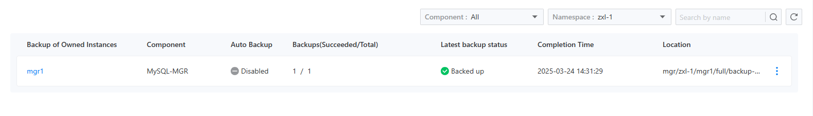
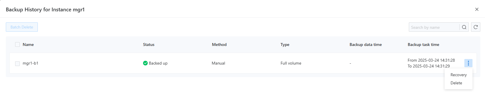

# Управление резервным копированием

Функция управления резервным копированием предоставляет вам интуитивный и практичный интерфейс. Просто выбрав проект и пространство имен, вы можете всесторонне просмотреть статус резервного копирования экземпляров, включая переключатель автоматического резервного копирования, количество успешных и неудачных резервных копий, результаты последнего резервного копирования и место хранения. Это позволяет вам быстро оценить ситуацию с резервным копированием и своевременно выявить проблемы. Через меню с правой стороны экземпляра вы можете перейти на страницу истории резервного копирования, на которой четко отображается основная информация, такая как время резервного копирования, результаты и методы хранения. Более того, вы можете массово удалить избыточные резервные копии, чтобы освободить место, или точно восстановить определенные резервные копии для устранения потери данных или сбоев в системе, обеспечивая непрерывность и стабильность бизнеса.

- **Улучшенная видимость данных и контроль**

Страница управления резервным копированием предоставляет обширный обзор статуса резервного копирования экземпляров, что позволяет вам легко понять прогресс, эффективность и места хранения, избавляя от утомительных поисков и повышая эффективность управления. В то же время вы можете в любое время.adjust стратегии, чтобы обеспечить безопасность и надежность данных.

- **Удобная историческая трассируемость и диагностика проблем**

С функцией истории резервного копирования вы можете четко проследить историю резервного копирования экземпляра, быстро проверить такую информацию, как время и результаты, точно определить проблемы, проверить целостность данных, минимизировать перерывы в бизнесе и обеспечить нормальную работу.

## Основные функции

### Просмотр списка резервных копий

Пользователи могут выбрать функцию управления резервным копированием в центре резервного копирования, чтобы перейти на страницу списка резервных копий, как показано на следующем изображении.

На этой странице пользователи могут просмотреть статус резервного копирования экземпляров для указанного проекта и пространства имен, включая, наконец, включено ли автоматическое резе.ервное копирование, счетчики успешных и неудачных резервных копий, а также результат самой последней резервной копии. 

### Просмотр истории резервного копирования

Выбирая функцию `История` из меню с правой стороны указанного экземпляра, пользователи увидят всплывающее меню, отображающее все записи резервных копий для этого экземпляра, как показано на следующем изображении.

Эта страница позволяет напрямую запрашивать ресурсы резервного копирования соответствующего компонента, а подробную информацию можно найти в документации по восстановлению резервных копий для соответствующего компонента.

### Операции восстановления

На странице истории резервного копирования, после выбора записи резервного копирования, пользователи могут выбрать меню на стороне и нажать кнопку `Восстановление`. Система откроет вкладку для параметров восстановления. Разные компоненты могут поддерживать разные методы восстановления; однако по умолчанию все они поддерживают восстановление на новый экземпляр, в то время как MGR дополнительно поддерживает восстановление на существующий экземпляр.

- Если пользователь выбирает восстановление на новый экземпляр, система перенаправит на страницу создания нового экземпляра. После ввода пользователем соответствующей информации о новом экземпляре (имя, спецификации, параметры и т. д.) система автоматически применит данные резервной копии для восстановления, как только экземпляр будет создан. Как только статус нового экземпляра изменится на готовый, указанные данные резервной копии будут успешно восстановлены.

- Если пользователь выбирает восстановление на существующий экземпляр, система предложит пользователю выбрать экземпляр и выполнить операцию восстановления.

### Операции по удалению резервных копий

На странице истории резервного копирования пользователи могут удалить конкретные записи резервных копий из меню с правой стороны или выбрать несколько различных записей резервных копий для массового удаления. Примечание: **Эта операция不可逆на; пожалуйста, действуйте осторожно!**
