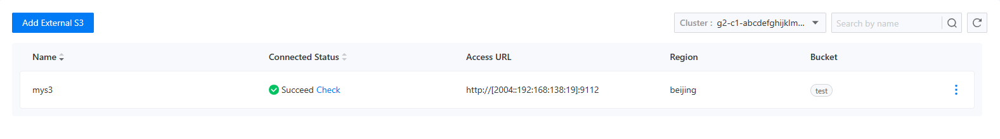

# Внешнее S3 Хранилище

## Обзор функции

Эта функция предоставляет услуги регистрации внешнего S3 хранилища для текущего выбранного проекта. С простым и интуитивно понятным интерфейсом вы можете легко выполнить несколько шагов для успешной регистрации внешнего S3 хранилища для проекта. Страница списка внешнего хранилища также интегрирует интеллектуальный механизм обнаружения. Вы можете вручную инициировать сканирование, чтобы проверить доступность внешнего S3 хранилища. Если возникнут какие-либо проблемы, например, сбой подключения, вам будут отправлены немедленные уведомления, что позволит вам контролировать статус хранилища в режиме реального времени. Когда вы или другие участники проекта нуждаетесь в резервном копировании данных, будь то создание автоматической задачи резервного копирования или ручное инициирование мгновенного резервного копирования, вам просто нужно легко выбрать зарегистрированное внешнее S3 хранилище в настройках резервного копирования, и система быстро и безопасно сохранит резервные данные в этом хранилище.

- **Улучшенная безопасность данных**

Хранение резервных данных во внешнем S3 хранилище обеспечивает дополнительный уровень безопасности для ваших данных. Внешнее S3 хранилище обычно обладает надежными механизмами избыточности данных и восстановления после катастроф, эффективно предотвращая потерю данных из-за локальных аппаратных сбоев, стихийных бедствий и других причин. Даже если локальная среда столкнется с непредвиденными проблемами, ваши данные останутся в безопасности во внешнем хранилище, что гарантирует непрерывность бизнеса.

- **Увеличенная гибкость и масштабируемость**

Эта функция поддерживает гибкий выбор хранилища для резервного копирования, позволяя вам свободно распределять ресурсы резервного копирования в зависимости от различных требований и сценариев. Вы можете выбрать наиболее подходящее внешнее S3 хранилище для хранения резервных данных с учетом таких факторов, как производительность, стоимость и географическое расположение. Кроме того, по мере роста вашего бизнеса и увеличения объема данных вы можете легко добавить новое внешнее S3 хранилище для расширения ресурсов хранения, адаптируясь к постоянно меняющимся потребностям бизнеса.

## Основные функции

### Добавить внешнее S3 хранилище

Перед добавлением внешнего S3 хранилища пользователи должны собрать следующую информацию о хранилище:

- URL-адрес конечной точки
- Ключ доступа
- Секретный ключ доступа
- Название корзины

Внешнее хранилище не нужно развертывать в текущем кластере или пространстве имен, если доступна сетевое подключение. Пользователи могут предварительно проверить доступность внешнего хранилища с помощью веб-запросов. Чтобы добавить внешнее S3 хранилище, просто заполните форму регистрации внешнего S3 хранилища в центре резервного копирования, как показано на изображении ниже.

### Просмотр списка внешнего S3 хранилища

После успешной регистрации внешнего S3 хранилища оно будет видно в списке хранилищ. Список хранилищ интегрирует автоматическую проверку состояния хранилища: когда добавляется вновь зарегистрированное внешнее S3 хранилище, автоматически запускается проверка состояния соединения. Пользователи также могут вручную нажать кнопку `Проверить` рядом со статусом подключения, чтобы инициировать ручную проверку. Результаты проверки состояния соединения будут непосредственно отображены в списке, как показано на изображениях ниже:

