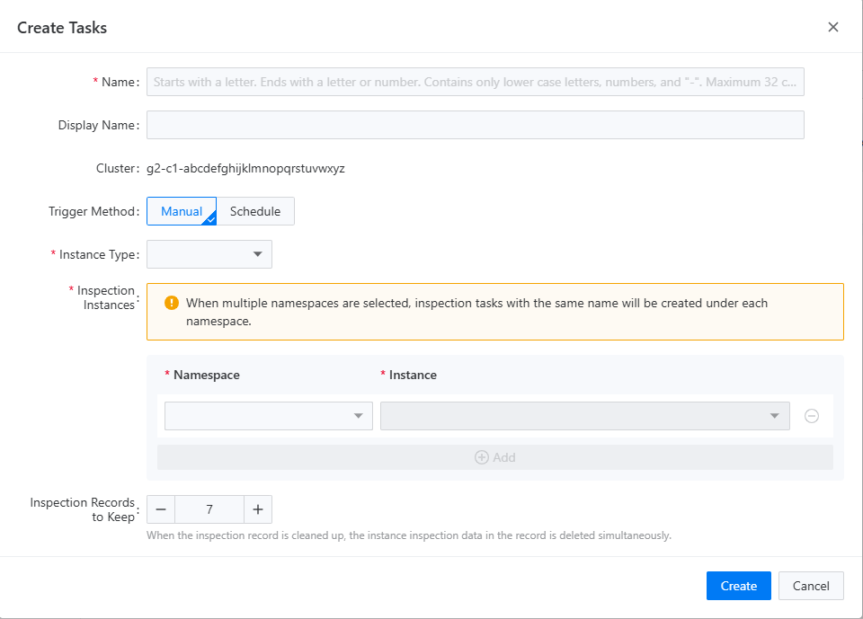

# Создание задачи инспекции

Задача инспекции представляет собой планирование и управление инспекциями для конкретных экземпляров компонентов. При создании задачи инспекции вы можете указать экземпляры компонентов, которые необходимо инспектировать, а также цикл и стратегию инспекции. Вы также можете указать максимальное количество записей инспекций, которые следует сохранить; любые результаты инспекций, превышающие это количество, будут автоматически перезаписаны.

## Процедура

<Tabs>
  <Tab label="CLI">
    При создании задачи инспекции вы можете использовать следующую команду для её создания:

    ```bash
    $ kubectl -n <namespace> apply -f - <<EOF
    {
      "apiVersion": "middleware.alauda.io/v1",
      "kind": "Inspection",
      "metadata": {
        "name": "insp-task",
        "namespace": "tongrds-1"
      },
      "spec": {
        "component": "mysqlcluster",
        "instances": [
          {
            "name": "mgr1"
          }
        ],
        "jobsHistoryLimit": 3,
        "trigger": "Manual"
      }
    }
    EOF
    ```

    ::: info

    - `<name>` это имя ресурса задачи инспекции; вы можете задать имя, которое легко запомнить.
    - `<namespace>` это пространство имён, к которому принадлежит задача инспекции и также целевое пространство имён для инспекции. Например, если вы хотите инспектировать экземпляр компонента `mgr1` в пространстве имён `tongrds-1`, вы должны установить `<namespace>` в `tongrds-1`.
    - `<spec.component>` используется для указания целевого типа компонента для задачи инспекции, например `mysqlcluster`.
    - `<spec.instances.name>` используется для указания целевого имени экземпляра для задачи инспекции; вы можете указать несколько экземпляров в одном пространстве имён или использовать символ подстановки `*`, чтобы соответствовать всем экземплярам.
    - `<spec.jobsHistoryLimit>` используется для указания максимального количества записей инспекций, которые текущая задача инспекции будет сохранять. Любые записи, превышающие это значение, будут автоматически перезаписаны.
    - `<spec.trigger>` используется для указания способа срабатывания текущей задачи инспекции, в данный момент поддерживаются `Manual` и `Schedule`, которые представляют собой ручное срабатывание и запланированное срабатывание соответственно. Если установлено `Schedule`, также необходимо установить следующий параметр:
      - `<spec.schedule>` используется для указания времени срабатывания текущей задачи инспекции, например, `0 0 1 * *` указывает на срабатывание в 1 час ночи каждый день. Для получения дополнительной информации о запланированных задачах смотрите [Политика планирования инспекции](../how_to/inspection_policy.mdx).

    :::
  </Tab>

  <Tab label="Web Console">
    1. Перейдите в `Задачи` инспекции.

    2. Выберите проекты, которые вы хотите инспектировать, в верхнем левом углу.

    3. Нажмите кнопку `Создать задачи` и заполните необходимую информацию в всплывающей форме.

    

    4. После заполнения вышеупомянутой формы и нажатия `Создать` эта задача инспекции появится в списке задач инспекции сразу.
  </Tab>
</Tabs>

После успешного создания задачи инспекции служба на стороне сервера выполнит соответствующие операции инспекции в соответствии с настройками задачи инспекции. Для получения дополнительной информации о выполнении инспекций смотрите [Выполнение задач инспекции](./run_inspection_task.mdx).
