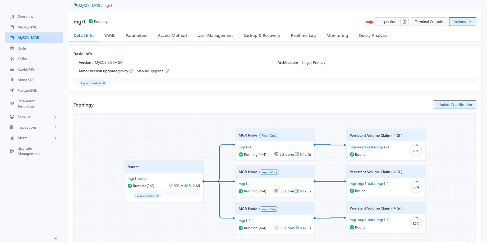
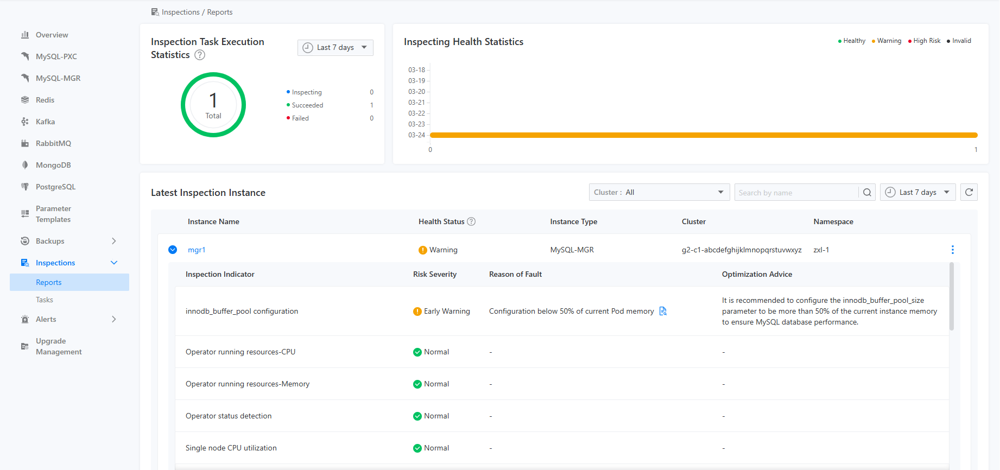

# Задача инспекции Exec

Существует два метода запуска инспекционных задач: ручной запуск и запланированный запуск. Если пользователь выбирает ручной запуск инспекции, соответствующее действие инспекции выполняется немедленно, а результаты инспекции представляются в различных местах в зависимости от метода запуска.

- Если пользователь запускает инспекцию со страницы деталей конкретного экземпляра компонента, результаты инспекции будут отображены на странице деталей этого экземпляра компонента и также появятся на странице отчета инспекции, как показано на изображениях ниже:






- Если пользователь запускает инспекцию по конкретной задаче инспекции, независимо от того, вручную или автоматически, результаты инспекции будут представлены в виде записей инспекции на записях этой задачи инспекции, как показано ниже:


## Процедура

<Tabs>
  <Tab label="CLI">
    Результат конкретного выполнения задачи инспекции можно запросить через CLI, как показано ниже:

    ```bash

    $ kubectl get -n namespace inspectionjobs/name -o yaml

    apiVersion: middleware.alauda.io/v1
    kind: InspectionJob
    metadata:
      annotations:
        cpaas.io/creator: admin
        cpaas.io/updated-at: "2025-02-24T06:36:11Z"
      creationTimestamp: "2025-02-24T06:36:11Z"
      generation: 1
      labels:
        inspection.middleware.io/cluster: business-1
        inspection.middleware.io/component: mysqlcluster
        inspection.middleware.io/inspection: insp-task
        inspection.middleware.io/namespace: tongrds-1
        inspection.middleware.io/project: tongrds
        inspection.middleware.io/trigger: Manual
      name: insp-task-8259621030
      namespace: tongrds-1
      ownerReferences:
      - apiVersion: middleware.alauda.io/v1
        blockOwnerDeletion: true
        controller: true
        kind: Inspection
        name: insp-task
        uid: b9252d5a-4f94-4901-8036-e963f0cc0acb
      resourceVersion: "58806102"
      uid: 524ad817-ef5e-4eea-9b06-83782616ca03
    spec:
      component: mysqlcluster
      instances:
      - name: mgr1
    status:
      instanceCount: 1
      message: ""
      results:
      - healthyStatus: HealthyWithWarning
        id: mgr1-2x4eojeu
        instance: mgr1
        message: ""
        startTime: "2025-02-24T06:36:14Z"
        status: done
        stopTime: "2025-02-24T06:36:22Z"
      startTime: "2025-02-24T06:36:11Z"
      status: succeed
      stopTime: "2025-02-24T06:36:22Z"

    ```

    ::: info

    - `<spec.component>` это целевой тип экземпляра для выполнения этой инспекции.
    - `<spec.instances>` это список целевых экземпляров для выполнения этой инспекции.
    - `<status.results>` это список результатов для выполнения этой инспекции, с полями, которые включают время начала и окончания инспекции, общую информацию об инспекции и статус, среди прочего.

    :::
  </Tab>

  <Tab label="Web Console">
    Существует два способа запустить инспекцию для указанного ресурса, первый — нажать кнопку `Inspection` в правом верхнем углу страницы деталей указанного экземпляра, что проиллюстрировано на графике ниже.

    

    Второй способ запуска инспекции заключается в списке задач управления инспекцией. Вы можете выбрать выпадающее меню конкретной задачи инспекции справа. Доступен выбор `Execute immediately`, что проиллюстрировано на графике ниже.

    
  </Tab>
</Tabs>
