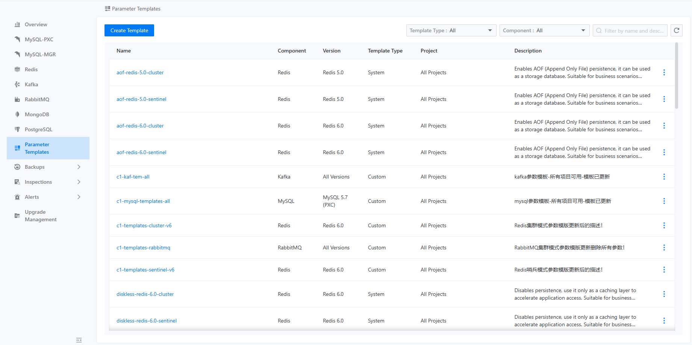
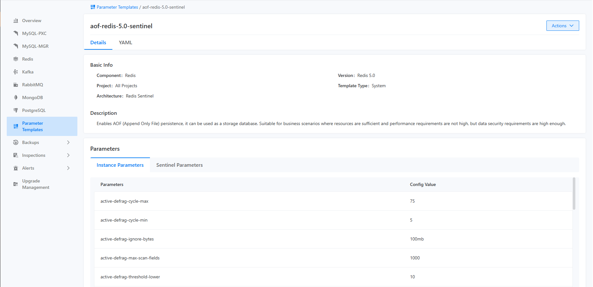
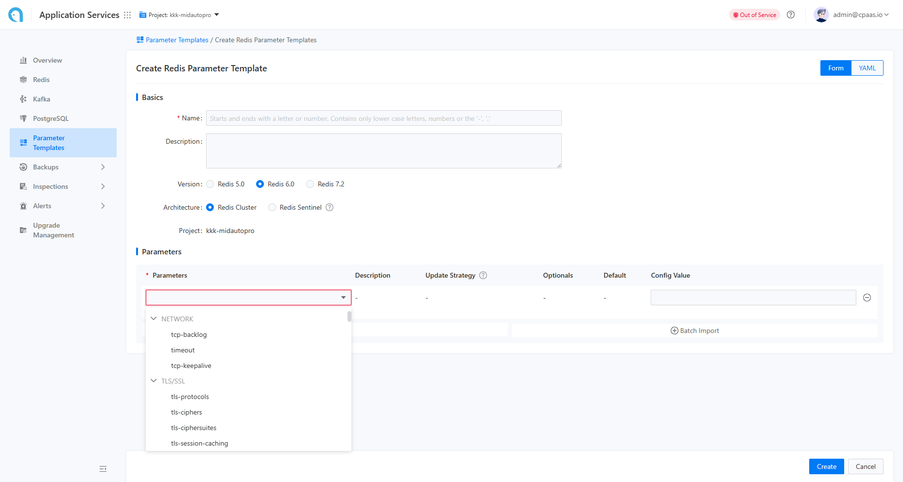

# Управление шаблонами параметров

Функция шаблона параметров предназначена для единого управления и поддержания наборов параметров для различных компонентов. Это включает в себя просмотр того, какие параметры включены в шаблоны параметров, а также их значения по умолчанию и описания. В настоящее время компоненты, которые поддерживают шаблоны параметров, включают MySQL (включая PXC и MGR), Redis и Kafka. Платформа поставляется с преднастроенными шаблонами параметров для различных сценариев и спецификаций компонентов, представляя лучшие практики отрасли для использования в этих сценариях, что позволяет пользователям использовать их напрямую. Кроме того, пользователи могут создавать пользовательские шаблоны параметров на основе своих конкретных бизнес-потребностей, что упрощает внедрение внутренних стандартов. Все шаблоны параметров могут быть выбраны для использования при создании экземпляров.

## Основные функции

### Просмотр списка шаблонов параметров

Пользователи могут щелкнуть по шаблону параметров, чтобы получить доступ к странице списка, как показано на рисунке ниже.



На этой странице пользователи могут просмотреть шаблоны параметров для конкретных проектов в зависимости от типа компонента и типа шаблона. Поддерживаемые типы компонентов в настоящее время включают MySQL, Redis и Kafka. Доступные типы шаблонов — это преднастроенные шаблоны платформы и пользовательские шаблоны. Преднастроенные шаблоны платформы могут применяться ко всему кластеру, в то время как пользователи могут создавать пользовательские шаблоны, специально предназначенные для текущего проекта.

::: info
Шаблоны параметров для MySQL могут применяться как к архитектуре PXC, так и к архитектуре MGR.
:::

### Просмотр деталей указанного шаблона параметров

Щелчок по конкретному шаблону приведет пользователей на страницу деталей шаблона, как показано на рисунке ниже.



Эта страница отображает подробную информацию о шаблоне, включая имя шаблона, тип шаблона, тип компонента, описание шаблона, список параметров и значения параметров по умолчанию.

### Создание шаблона параметров

С соответствующими правами пользователи могут щелкнуть кнопку "Создать шаблон параметров" в верхнем левом углу, чтобы получить доступ к странице создания шаблона, как показано на рисунке ниже.



На этой странице пользователи могут заполнить информацию, такую как имя шаблона, тип шаблона, тип компонента и описание шаблона, а затем указать параметры, включенные в шаблон, вместе с их значениями по умолчанию по одному. Поскольку каждый экземпляр может указывать только один шаблон параметров при создании, необходимо, чтобы шаблон параметров включал как можно более полный список параметров. Чтобы облегчить ввод данных пользователями, платформа поддерживает пакетный импорт параметров и импорт параметров из документации.

::: info
Формат для пакетного импорта параметров:

```
Parameter1 ParameterValue1
Parameter2 ParameterValue2
...
```

:::

### Экспорт шаблона параметров

Пользователи могут выбрать опцию "Экспорт" в правом меню на странице списка шаблонов параметров или в выпадающем меню действий на странице деталей шаблона параметров для экспорта информации о конфигурации шаблона параметров. Формат экспортируемого файла — текстовый файл, соответствующий формату импорта.
