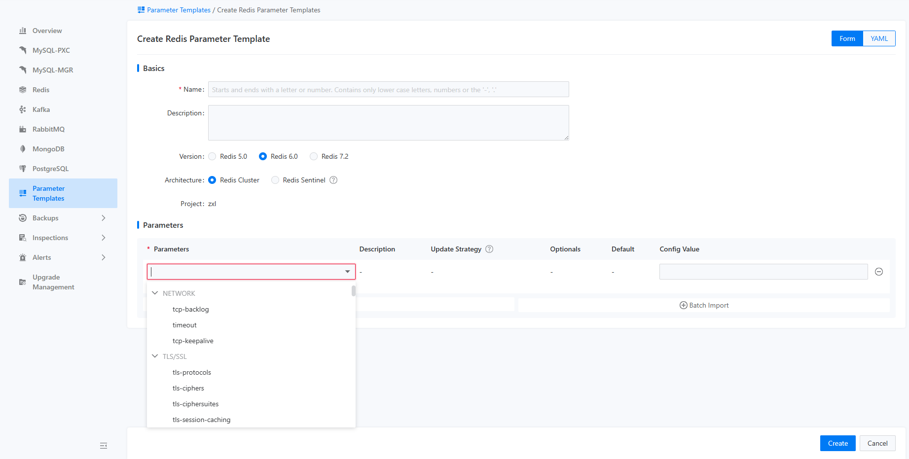

# Управление шаблонами параметров

Функция шаблона параметров предназначена для унифицированного управления и обслуживания наборов параметров различных компонентов. Это включает просмотр, какие параметры включены в шаблоны параметров, а также их значения по умолчанию и описания. В настоящее время компоненты, поддерживающие шаблоны параметров, включают MySQL (включая PXC и MGR), Redis и Kafka. Платформа поставляется с заранее настроенными шаблонами параметров для различных сценариев и спецификаций компонентов, которые представляют собой лучшие практики отрасли для использования в этих сценариях, что позволяет пользователям использовать их напрямую. Кроме того, пользователи могут создавать собственные шаблоны параметров на основе своих конкретных бизнес-нужд, что способствует реализации внутренних стандартов. Все шаблоны параметров могут быть выбраны для использования при создании экземпляров.

## Основные функции

### Просмотр списка шаблонов параметров

Пользователи могут щелкнуть по шаблону параметров, чтобы получить доступ к странице списка, как показано на рисунке ниже.


На этой странице пользователи могут просматривать шаблоны параметров для конкретных проектов в зависимости от типа компонента и типа шаблона. Поддерживаемые типы компонентов в настоящее время включают MySQL, Redis и Kafka. Доступные типы шаблонов включают предварительно настроенные шаблоны платформы и пользовательские шаблоны. Предварительно настроенные шаблоны платформы применимы ко всему кластеру, в то время как пользователи могут создавать собственные шаблоны специально для текущего проекта.

::: info
Шаблоны параметров для MySQL могут применяться как к архитектуре PXC, так и к архитектуре MGR.
:::

### Просмотр деталей указанного шаблона параметров

Щелчок на конкретном шаблоне приведет пользователей к странице деталей шаблона, как показано на рисунке ниже.


Эта страница отображает подробную информацию о шаблоне, включая название шаблона, тип шаблона, тип компонента, описание шаблона, список параметров и значения параметров по умолчанию.

### Создание шаблона параметров

При наличии соответствующих прав пользователи могут щелкнуть кнопку "Создать шаблон параметров" в верхнем левом углу, чтобы перейти на страницу создания шаблона, как показано на рисунке ниже.



На этой странице пользователи могут заполнить информацию, такую как название шаблона, тип шаблона, тип компонента и описание шаблона, а затем поочередно указать параметры, включенные в шаблон, с их значениями по умолчанию. Поскольку каждый экземпляр может указать только один шаблон параметров во время создания, необходимо, чтобы шаблон параметров включал как можно более полный список параметров. Чтобы облегчить ввод данных пользователями, платформа поддерживает пакетный импорт параметров и импорт параметров из документации.

::: info
Формат пакетного импорта параметров:

```
Parameter1 ParameterValue1
Parameter2 ParameterValue2
...
```

:::

### Экспорт шаблона параметров

Пользователи могут выбрать пункт "Экспорт" в правом меню на странице списка шаблонов параметров или из выпадающего меню действий на странице деталей шаблона параметров, чтобы экспортировать информацию о конфигурации шаблона параметров. Формат экспортируемого файла представляет собой текстовый файл, соответствующий формату импорта.
