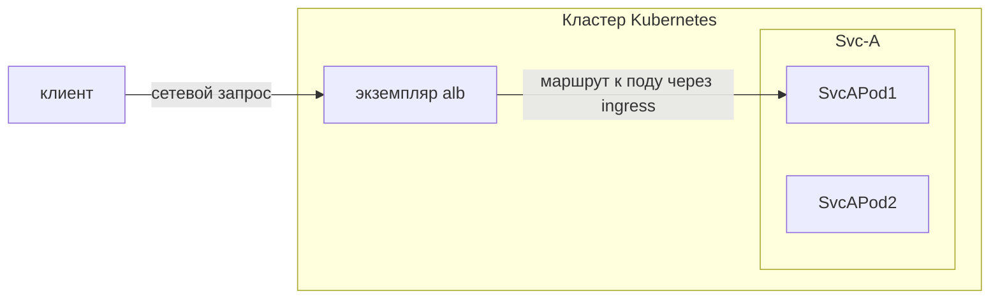

## Быстрый старт

### Развертывание ALB Оператора

1. Создайте кластер.
2. ```shell
    helm repo add alb https://alauda.github.io/alb/;helm repo update;helm search repo|grep alb
   ```
3. ```shell
    helm install alb-operator alb/alauda-alb2
   ```

### Развертывание экземпляра ALB

```yaml
cat <<EOF | kubectl apply -f -
apiVersion: crd.alauda.io/v2beta1
kind: ALB2
metadata:
    name: alb-demo
    namespace: kube-system
spec:
    address: "172.20.0.5"  # IP-адрес узла, на котором развернут alb
    type: "nginx"
    config:
        networkMode: host
        loadbalancerName: alb-demo
        projects:
        - ALL_ALL
        replicas: 1
EOF
```

### Запуск демонстрационного приложения

```yaml
cat <<EOF | kubectl apply -f -
apiVersion: apps/v1
kind: Deployment
metadata:
  name: hello-world
  labels:
    k8s-app: hello-world
spec:
  replicas: 1
  selector:
    matchLabels:
      k8s-app: hello-world
  template:
    metadata:
      labels:
        k8s-app: hello-world
    spec:
      terminationGracePeriodSeconds: 60
      containers:
      - name: hello-world
        image: docker.io/crccheck/hello-world:latest
        imagePullPolicy: IfNotPresent
---
apiVersion: v1
kind: Service
metadata:
  name: hello-world
  labels:
    k8s-app: hello-world
spec:
  ports:
  - name: http
    port: 80
    targetPort: 8000
  selector:
    k8s-app: hello-world
---
apiVersion: networking.k8s.io/v1
kind: Ingress
metadata:
  name: hello-world
spec:
  rules:
  - http:
      paths:
      - path: /
        pathType: Prefix
        backend:
          service:
            name: hello-world
            port:
              number: 80
EOF
```

Теперь вы можете получить доступ к приложению через `curl http://${ip}`

## Общие концепции ALB

Следующее определяет общие концепции в ALB.

### Аутентификация

Аутентификация — это механизм, который выполняет проверку подлинности перед тем, как запрос достигнет фактического сервиса. Это позволяет вам обрабатывать аутентификацию на уровне ALB единообразно, не реализуя логику аутентификации в каждом бэкенд-сервисе.

Узнайте больше об ALB [Аутентификации](../concepts/auth.mdx).

### Сетевой режим

Экземпляр ALB может быть развернут в двух режимах: режиме сетевого хоста и режиме контейнерной сети.

#### Режим сетевого хоста

Прямое использование сетевого стека узла, совместное использование IP-адреса и порта с узлом.

В этом режиме экземпляр балансировщика нагрузки напрямую связывается с портом узла, без сопоставления портов или аналогичного преобразования контейнерной сетевой инкапсуляции.

:::note

Чтобы избежать конфликтов портов, на одном узле разрешено развертывать только один экземпляр ALB.

:::


В режиме сетевого хоста экземпляр ALB будет по умолчанию слушать все сетевые интерфейсы узла.

##### Преимущества:

1. Лучшая производительность сети.
2. Доступ по IP-адресу узла.

##### Недостатки:

1. На одном узле разрешен только один экземпляр ALB.
2. Порт может конфликтовать с другими процессами.

#### Режим контейнерной сети

В отличие от режима сетевого хоста, режим контейнерной сети развертывает ALB с использованием контейнерной сети.


##### Преимущества:

1. Поддерживает развертывание нескольких экземпляров ALB на одном узле.
2. ALB предоставляет интеграцию с MetalLB, который может предоставить VIP для ALB.
3. Порт не будет конфликтовать с другими процессами.

##### Недостатки:

1. Немного более низкая производительность.
2. Доступ к ALB должен осуществляться через сервис LoadBalancer.

### Фронтенд

Мы определяем ресурс, называемый фронтендом (сокращенно ft), который используется для объявления всех портов, на которых должен слушать ALB.

Каждый фронтенд соответствует порту прослушивания на балансировщике нагрузки (LB). Фронтенд ассоциируется с ALB через метки.

```yaml
apiVersion: crd.alauda.io/v1
kind: Frontend
metadata:
  labels:
    alb2.cpaas.io/name: alb-demo # [!code callout]
  name: alb-demo-00080 # [!code callout]
  namespace: cpaas-system
spec:
  backendProtocol: "http"
  certificate_name: "" # [!code callout]
  port: 80
  protocol: http # [!code callout]
  serviceGroup: # [!code callout]
    services:
      - name: hello-world
        namespace: default
        port: 80
        weight: 100 # [!code callout]
```

<Callouts>
  1. Обязательно, указывает на экземпляр ALB, к которому принадлежит этот фронтенд.
  2. Формат как `$alb_name-$port`.
  3. Формат как `$secret_ns/$secret_name`.
  4. Протокол этого фронтенда.
     - `http|https|grpc|grpcs` для l7 прокси.
     - `tcp|udp` для l4 прокси.
  5. Для l4 прокси `serviceGroup` является обязательным. Для l7 прокси `serviceGroup` является необязательным. Когда запрос поступает, ALB сначала попытается сопоставить его с правилами, связанными с этим фронтендом. Только если запрос не соответствует ни одному правилу, ALB затем перенаправит его на стандартную `serviceGroup`, указанную в конфигурации фронтенда.
  6. Конфигурация `weight` применима к алгоритмам планирования Round Robin и Weighted Round Robin.
</Callouts>

:::note
ALB слушает входящие запросы и автоматически создает `Frontend` или [Rule](#rules). Поле `source` определяется следующим образом:

1. `spec.source.type` в настоящее время поддерживает только `ingress`.
2. `spec.source.name` — это имя ingress.
3. `spec.source.namespace` — это пространство имен ingress.

:::

#### Дополнительные ресурсы

- [L4/L7 таймаут](../concepts/timeout.mdx)
- [Keepalive](../concepts/keepalive.mdx)

### Правила

Мы определяем ресурс, называемый правилом, который используется для описания того, как экземпляр ALB должен обрабатывать запрос на 7-м уровне.

Сложные схемы сопоставления и распределения трафика могут быть настроены с помощью правил. Когда трафик поступает, он обрабатывается в соответствии с внутренними правилами и выполняет соответствующее перенаправление, а также предоставляет некоторые дополнительные функции, такие как cors, переписывание URL и т.д.

```yaml
apiVersion: crd.alauda.io/v1
kind: Rule
metadata:
  labels:
    alb2.cpaas.io/frontend: alb-demo-00080 # [!code callout]
    alb2.cpaas.io/name: alb-demo #[!code callout]
  name: alb-demo-00080-test
  namespace: kube-system
spec:
  backendProtocol: "" #[!code callout]
  certificate_name: "" #[!code callout]
  dslx:
    - type: METHOD
      values:
        - - EQ
          - POST
    - type: URL
      values:
        - - STARTS_WITH
          - /app-a
        - - STARTS_WITH
          - /app-b
    - type: PARAM
      key: group
      values:
        - - EQ
          - vip
    - type: HOST
      values:
        - - ENDS_WITH
          - .app.com
    - type: HEADER
      key: LOCATION
      values:
        - - IN
          - east-1
          - east-2
    - type: COOKIE
      key: uid
      values:
        - - EXIST
    - type: SRC_IP
      values:
        - - RANGE
          - "1.1.1.1"
          - "1.1.1.100"
  enableCORS: false
  priority: 4 #[!code callout]
  serviceGroup: #[!code callout]
    services:
      - name: hello-world
        namespace: default
        port: 80
        weight: 100
```

<Callouts>
  1. Обязательно, указывает на фронтенд, к которому принадлежит это правило.
  2. Обязательно, указывает на ALB, к которому принадлежит это правило.
  3. То же самое, что и для фронтенда.
  4. То же самое, что и для фронтенда.
  5. Чем меньше число, тем выше приоритет.
  6. То же самое, что и для фронтенда.
</Callouts>

#### dslx

dslx — это язык, специфичный для области, который используется для описания критериев сопоставления.

Например, нижеуказанное правило сопоставляет запрос, который удовлетворяет всем следующим критериям:

- URL начинается с /app-a или /app-b
- Метод — POST
- Параметр URL с ключом group равен vip
- Хост — \*.app.com
- Заголовок LOCATION равен east-1 или east-2
- Существует cookie с именем uid
- IP-адреса источника находятся в диапазоне 1.1.1.1-1.1.1.100

```yaml
dslx:
  - type: METHOD
    values:
      - - EQ
        - POST
  - type: URL
    values:
      - - STARTS_WITH
        - /app-a
      - - STARTS_WITH
        - /app-b
  - type: PARAM
    key: group
    values:
      - - EQ
        - vip
  - type: HOST
    values:
      - - ENDS_WITH
        - .app.com
  - type: HEADER
    key: LOCATION
    values:
      - - IN
        - east-1
        - east-2
  - type: COOKIE
    key: uid
    values:
      - - EXIST
  - type: SRC_IP
    values:
      - - RANGE
        - "1.1.1.1"
        - "1.1.1.100"
```

### Изоляция проектов

Для правил по умолчанию используется изоляция проектов, каждый пользователь может видеть только правила своего проекта.

#### Режим проекта

ALB может использоваться несколькими проектами, и эти проекты могут управлять этим ALB. Все порты ALB видны для этих проектов.

#### Режим проектирования портов

Порт ALB может принадлежать различным проектам. Этот режим развертывания называется режимом проектирования портов. Администратору необходимо указать диапазон портов, который может использовать каждый проект. Пользователи этого проекта могут создавать порты только в пределах этого диапазона портов и могут видеть только порты в пределах этого диапазона.

## Взаимосвязь между ALB, экземпляром ALB, фронтендом/FT, правилами, Ingress и проектом

LoadBalancer является ключевым компонентом в современных облачных архитектурах, служащим интеллектуальным маршрутизатором трафика и балансировщиком нагрузки.

Чтобы понять, как ALB работает в кластере Kubernetes, нам нужно понять несколько основных концепций и их взаимосвязей:

- Сам ALB
- Фронтенд (FT)
- Правила
- Ресурсы Ingress
- Проекты

Эти компоненты работают вместе, чтобы обеспечить гибкие и мощные возможности управления трафиком.

Далее будет представлено, как эти концепции работают вместе и какую роль они играют в цепочке вызовов запросов. Подробные описания каждой концепции будут рассмотрены в других статьях.



В цепочке вызовов запросов:

1. Клиент отправляет запрос HTTP/HTTPS/другого протокола, и в конечном итоге запрос **попадает на под ALB**, и под (экземпляр ALB) начинает обрабатывать этот запрос.
2. Этот экземпляр ALB находит правило, которое может соответствовать этому запросу.
3. При необходимости модифицирует/перенаправляет/переписывает запрос на основе правила.
4. Находит и выбирает один IP-адрес пода из сервисов, которые настроены в правиле. И перенаправляет запрос на под.

### Ingress

Ingress — это ресурс в Kubernetes, используемый для описания того, какой запрос должен быть отправлен какому сервису.

### Контроллер Ingress

Программа, которая понимает ресурс Ingress и будет проксировать запрос к сервису.

### ALB

ALB является контроллером Ingress.

В кластере Kubernetes мы используем ресурс `alb2` для управления ALB. Вы можете использовать `kubectl get alb2 -A`, чтобы просмотреть все ALB в кластере.

ALB создаются пользователями вручную. Каждый ALB имеет свой собственный IngressClass. Когда вы создаете Ingress, вы можете использовать поле `.spec.ingressClassName`, чтобы указать, какой контроллер Ingress должен обрабатывать этот Ingress.

### Экземпляр ALB

ALB также является развертыванием (группой подов), работающим в кластере. Каждый под называется экземпляром ALB.

Каждый экземпляр ALB обрабатывает запросы независимо, но все экземпляры делят фронтенд (FT), правила и другие конфигурации, принадлежащие одному и тому же ALB.

### ALB-Оператор

ALB-Оператор, компонент по умолчанию, развернутый в кластере, является оператором для ALB. Он будет создавать/обновлять/удалять развертывание и другие связанные ресурсы для каждого ALB в соответствии с ресурсом ALB.

### Фронтенд (сокращение: FT)

FT — это ресурс, определяемый самим ALB. Он используется для представления портов прослушивания экземпляра ALB.

FT может быть создан ALB-Лидером или пользователем вручную.

Случаи создания FT ALB-Лидером:

1. Если Ingress имеет сертификат, мы создадим FT 443 (HTTPS).
2. Если Ingress не имеет сертификата, мы создадим FT 80 (HTTP).

### ПРАВИЛО

ПРАВИЛО — это ресурс, определяемый самим ALB.
Он выполняет ту же роль, что и Ingress, но более специфичен.
ПРАВИЛО уникально связано с FT.

ПРАВИЛО может быть создано ALB-Лидером или пользователем вручную.

Случаи создания ПРАВИЛА ALB-Лидером:

1. Синхронизация Ingress с ПРАВИЛОМ.

## ALB Лидер

В нескольких экземплярах ALB один будет избран лидером.
Лидер отвечает за:

1. Перевод Ingress в правила.
   Мы создадим правило для каждого пути в Ingress.
2. Создание FT, необходимых для Ingress.
   Например, если Ingress имеет сертификат, мы создадим FT 443 (HTTPS), если Ingress не имеет сертификата, мы создадим FT 80 (HTTP).

### Проект

С точки зрения ALB проект — это набор пространств имен.

Вы можете настроить один или несколько проектов в ALB.
Когда ALB Лидер переводит Ingress в правила, он будет игнорировать Ingress в пространствах имен, которые не принадлежат проекту.

## Дополнительные ресурсы:

- [Настройка балансировщика нагрузки](../how_to/create_loadbalancer.mdx)
