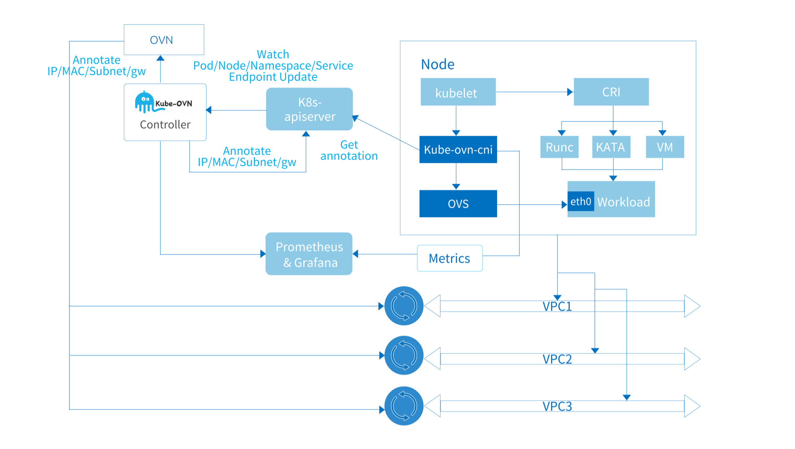

# Понимание Kube-OVN

Этот документ описывает общую архитектуру Kube-OVN, функциональность каждого компонента и то, как они взаимодействуют друг с другом.

В целом, Kube-OVN служит мостом между Kubernetes и OVN, сочетая проверенные решения SDN с облачными нативными технологиями.
Это означает, что Kube-OVN не только реализует сетевые спецификации в Kubernetes, такие как CNI, Service и Networkpolicy,
но также предоставляет множество возможностей в области SDN для облачной нативности, таких как логические коммутаторы, логические маршрутизаторы, VPC,
шлюзы, QoS, ACL и зеркалирование трафика.

Kube-OVN также сохраняет хорошую открытость для интеграции с многими технологическими решениями, такими как Cilium, Submariner, Prometheus, KubeVirt и т.д.

Компоненты Kube-OVN можно условно разделить на три категории.

- Компоненты upstream OVN/OVS.
- Основной контроллер и агент.
- Инструменты мониторинга, эксплуатации и обслуживания, а также расширения компонентов.

## Компоненты upstream OVN/OVS

Этот тип компонентов поступает из сообщества OVN/OVS с конкретными изменениями для сценариев использования Kube-OVN.
OVN/OVS сам по себе является зрелой системой SDN для управления виртуальными машинами и контейнерами,
и мы настоятельно рекомендуем пользователям, заинтересованным в реализации Kube-OVN, сначала прочитать [ovn-architecture(7)](https://www.mankier.com/7/ovn-architecture), 
чтобы понять, что такое OVN и как с ним интегрироваться.
Kube-OVN использует северный интерфейс OVN для создания и координации виртуальных сетей и отображения сетевых концепций в Kubernetes.

Все компоненты, связанные с OVN/OVS, были упакованы в образы и готовы к запуску в Kubernetes.

### ovn-central

Развертывание `ovn-central` выполняет компоненты управляющего уровня OVN, включая `ovn-nb`, `ovn-sb` и `ovn-northd`.

- `ovn-nb`: Сохраняет конфигурацию виртуальной сети и предоставляет API для управления виртуальной сетью. `kube-ovn-controller` в основном будет взаимодействовать с `ovn-nb` для настройки виртуальной сети.
- `ovn-sb`: Содержит таблицу логических потоков, созданную из логической сети `ovn-nb`, а также текущее состояние физической сети каждого узла.
- `ovn-northd`: переводит виртуальную сеть `ovn-nb` в логическую таблицу потоков в `ovn-sb`.

Несколько экземпляров `ovn-central` будут синхронизировать данные через протокол Raft для обеспечения высокой доступности.

### ovs-ovn

`ovs-ovn` работает как DaemonSet на каждом узле, с `openvswitch`, `ovsdb` и `ovn-controller`, работающими внутри Pod.
Эти компоненты действуют как агенты для `ovn-central`, чтобы преобразовать логические таблицы потоков в реальные конфигурации сети.

## Основной контроллер и агент

Эта часть является основным компонентом Kube-OVN, служа в качестве моста между OVN и Kubernetes, соединяя две системы и переводя сетевые концепции между ними.
Большинство основных функций реализованы в этих компонентах.

### kube-ovn-controller

Этот компонент выполняет преобразование всех ресурсов в Kubernetes в ресурсы OVN и действует как управляющий уровень для всей системы Kube-OVN.
`kube-ovn-controller` отслеживает события по всем ресурсам, связанным с сетевой функциональностью, и обновляет логическую сеть
в рамках OVN в зависимости от изменений ресурсов. Основные ресурсы, которые отслеживаются, включают:

Pod, Service, Endpoint, Node, NetworkPolicy, VPC, Subnet, Vlan, ProviderNetwork.

В качестве примера события Pod, `kube-ovn-controller` отслеживает событие создания Pod, распределяет адрес через встроенную функцию IPAM в памяти,
и вызывает `ovn-central` для создания логических портов, статических маршрутов и возможных правил ACL.
Затем `kube-ovn-controller` записывает назначенный адрес и информацию о подсети, такую как CIDR, шлюз, маршрут и т. д., в аннотацию Pod.
Эта аннотация затем читается `kube-ovn-cni` и используется для настройки локальной сети.

### kube-ovn-cni

Этот компонент работает на каждом узле как DaemonSet, реализует интерфейс CNI и управляет локальным OVS для настройки локальной сети.

Этот DaemonSet копирует двоичный файл `kube-ovn` на каждую машину в качестве инструмента для взаимодействия между `kubelet` и `kube-ovn-cni`.
Этот двоичный файл отправляет соответствующий запрос CNI `kube-ovn-cni` для дальнейшей обработки.
По умолчанию двоичный файл будет скопирован в каталог `/opt/cni/bin`.

`kube-ovn-cni` настроит конкретную сеть для выполнения соответствующих сетевых операций,
а основные задачи включают:

1. Настройка `ovn-controller` и `vswitchd`.
2. Обработка запросов CNI Add/Del:
   1. Создание или удаление пары veth и привязка или отвязывание к портам OVS.
   2. Настройка портов OVS
   3. Обновление правил iptables/ipset/route на хосте.
3. Динамическое обновление качества обслуживания сети.
4. Создание и настройка интерфейса `ovn0` для соединения контейнерной сети и сети хоста.
5. Настройка сетевой карты хоста для реализации Vlan/Underlay/EIP.
6. Динамическая настройка шлюзов между кластерами.

## Инструменты мониторинга, эксплуатации и обслуживания и расширительные компоненты

Эти компоненты предоставляют инструменты мониторинга, диагностики, эксплуатации и внешний интерфейс для расширения основных сетевых возможностей Kube-OVN
и упрощения повседневной эксплуатации и обслуживания.

### kube-ovn-speaker

Этот компонент является DaemonSet, работающий на конкретных помеченных узлах, который публикует маршруты во внешнюю сеть,
что позволяет внешним пользователям получать доступ к контейнеру напрямую через IP Pod.

### kube-ovn-pinger

Этот компонент является DaemonSet, работающим на каждом узле для сбора информации о состоянии OVS, качества сети узлов, задержке сети и т. д.

### kube-ovn-monitor 

Этот компонент собирает информацию о состоянии OVN и мониторинговые метрики.

### kubectl-ko

Этот компонент является плагином kubectl, который может быстро выполнять общие операции.
