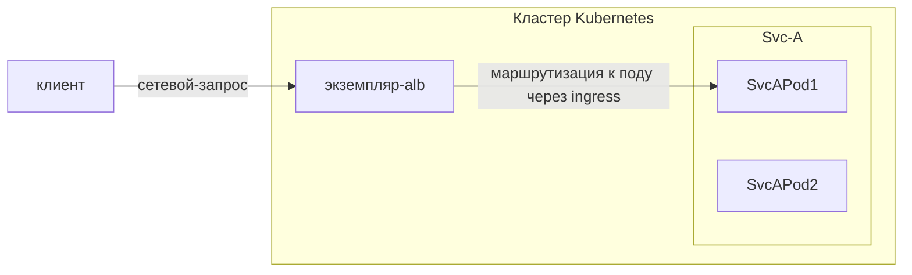

# Взаимосвязь между ALB, экземпляром ALB, Frontend/FT, Правилами, Ingress и Проектом

LoadBalancer является ключевым компонентом в современных облачных архитектурах, выступая в роли интеллектуального маршрутизатора трафика и балансировщика нагрузки.

Для понимания того, как работает ALB в кластере Kubernetes, необходимо разобраться с несколькими основными концепциями и их взаимосвязями:

- Сам ALB
- Frontend (FT)
- Правила
- Ресурсы Ingress
- Проекты

Эти компоненты работают совместно, обеспечивая гибкие и мощные возможности управления трафиком.

В данной статье в основном рассматривается, как эти концепции взаимодействуют и какие роли они выполняют в цепочке вызовов запросов. Подробные введения для каждой концепции будут рассмотрены в других статьях.

В цепочке вызовов запросов:

1. Клиент отправляет запрос по протоколу HTTP/HTTPS/другому, и в конечном итоге запрос **приходит на под ALB**, и под (экземпляр ALB) начинает обрабатывать этот запрос.
2. Этот экземпляр ALB находит правило, которое может соответствовать этому запросу.
3. При необходимости изменяет/перенаправляет/переписывает запрос на основе правила.
4. Находит и выбирает один IP пода из сервисов, которые конфигурируются правилом. И перенаправляет запрос на под.

## Ingress

Ingress - это ресурс в Kubernetes, используемый для описания того, какой запрос должен быть отправлен на какой сервис.

## Ingress Controller

Программа, которая понимает ресурс Ingress и будет проксировать запрос к сервису.

## ALB

ALB является контроллером Ingress.

В кластере Kubernetes мы используем ресурс `alb2` для управления ALB. Вы можете использовать `kubectl get alb2 -A`, чтобы просмотреть все ALB в кластере.

ALB создаются пользователями вручную. Каждый ALB имеет свой собственный IngressClass. Когда вы создаете Ingress, вы можете использовать поле `.spec.ingressClassName`, чтобы указать, какой контроллер Ingress должен обрабатывать этот Ingress.

## Экземпляр ALB

ALB также является Deployment (группой подов), работающей в кластере. Каждый под называется экземпляром ALB.

Каждый экземпляр ALB обрабатывает запросы независимо, но все экземпляры делят Frontend (FT), Правила и другие конфигурации, принадлежащие тому же ALB.

## ALB-Operator

ALB-Operator, это компонент по умолчанию, развернутый в кластере, является оператором для ALB. Он будет создавать/обновлять/удалять Deployment и другие связанные ресурсы для каждого ALB в соответствии с ресурсом ALB.

## Frontend (сокращенно: FT)

FT - это ресурс, определенный самим ALB. Он используется для представления портов прослушивания экземпляра ALB.

FT могут создаваться ALB-Leader или пользователем вручную.

Случаи создания FT ALB-Leader:

1. Если у Ingress имеется сертификат, мы создадим FT 443 (HTTPS)
2. Если у Ingress нет сертификата, мы создадим FT 80 (HTTP)

## ПРАВИЛО

ПРАВИЛО - это ресурс, определенный самим ALB.
Оно выполняет такую же роль, как и Ingress, но более специфично.
ПРАВИЛО уникально связано с FT.

ПРАВИЛО могут создаваться ALB-Leader или пользователем вручную.

Случаи создания ПРАВИЛА ALB-Leader:

1. Синхронизация Ingress с ПРАВИЛОМ.

## ALB Leader

Среди нескольких экземпляров ALB один будет избран в качестве лидера.
Лидер отвечает за:

1. Перевод Ingress в Правила.
   Мы создадим Правило для каждого пути в Ingress.
2. Создание FT, необходимых для Ingress.
   Например, если у Ingress есть сертификат, мы создадим FT 443 (HTTPS), если у Ingress нет сертификата, мы создадим FT 80 (HTTP).

## Проект

С точки зрения ALB, Проект - это набор пространств имен.

Вы можете настроить один или несколько Проектов в ALB.
Когда ALB Leader переводит Ingress в Правила, он будет игнорировать Ingress в пространствах имен, которые не принадлежат Проекту.
