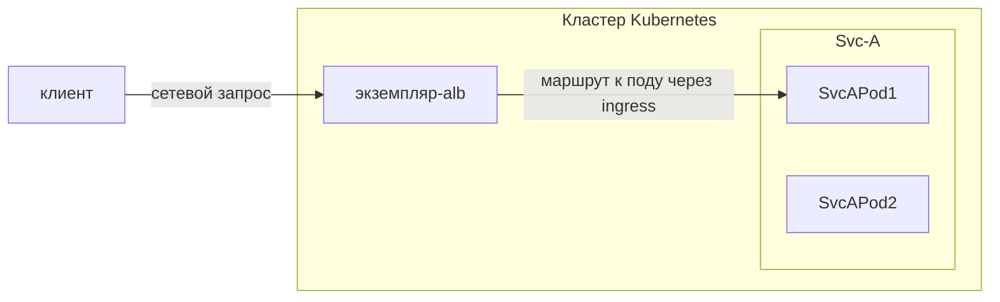

# Связь между ALB, экземпляром ALB, Frontend/FT, Правилом, Ingress и Проектом

LoadBalancer является ключевым компонентом современных облачных архитектур, выполняя функцию интеллектуального маршрутизатора трафика и балансировщика нагрузки.

Чтобы понять, как работает ALB в кластере Kubernetes, нужно разобраться в нескольких основных концепциях и их взаимосвязях:

- Сам ALB
- Frontend (FT)
- Правила
- Ресурсы Ingress
- Проекты

Эти компоненты работают вместе, чтобы обеспечить гибкие и мощные возможности управления трафиком.

В этой статье в основном представлено, как эти концепции работают совместно и какие роли они играют в цепочке вызовов запросов. Подробное описание каждой концепции будет представлено в других статьях.

В цепочке вызова запросов:

1. Клиент отправляет HTTP/HTTPS/другой протокол запрос, и в конце тот **приходит на под ALB**, и этот под (экземпляр ALB) начинает обрабатывать этот запрос.
2. Этот экземпляр ALB находит правило, которое может соответствовать этому запросу.
3. При необходимости, изменяет/перенаправляет/перезаписывает запрос в соответствии с правилом.
4. Находит и выбирает IP пода из сервисов, настроенных по правилу. И перенаправляет запрос на под.

## Ingress

Ingress — это ресурс в Kubernetes, используемый для описания, какой запрос следует отправить какому сервису.

## Ingress Controller

Программа, которая понимает ресурс Ingress и будет проксировать запрос к сервису.

## ALB

ALB является контроллером Ingress.

В кластере Kubernetes мы используем ресурс `alb2` для управления ALB. Вы можете использовать команду `kubectl get alb2 -A`, чтобы просмотреть все ALB в кластере.

ALB создаются пользователями вручную. Каждый ALB имеет свой собственный IngressClass. При создании Ingress вы можете использовать поле `.spec.ingressClassName`, чтобы указать, какой контроллер Ingress должен обрабатывать это Ingress.

## Экземпляр ALB

ALB также является развертыванием (множество подов), работающим в кластере. Каждый под называется экземпляром ALB.

Каждый экземпляр ALB обрабатывает запросы независимо, но все экземпляры используют Frontend (FT), Правило и другие конфигурации, принадлежащие одному и тому же ALB.

## ALB-Оператор

ALB-Оператор, стандартный компонент, развернутый в кластере, является оператором для ALB. Он будет создавать/обновлять/удалять развертывание и другие связанные ресурсы для каждого ALB в соответствии с ресурсом ALB.

## Frontend (сокращенно: FT)

FT — это ресурс, определяемый самим ALB. Он используется для представления портов прослушивания экземпляра ALB.

FT может быть создан ALB-Лидером или вручную пользователем.

Случаи создания FT ALB-Лидером:

1. Если Ingress имеет сертификат, мы создадим FT 443 (HTTPS)
2. Если Ingress не имеет сертификата, мы создадим FT 80 (HTTP)

## ПРАВИЛО

ПРАВИЛО — это ресурс, определяемый самим ALB.
Он выполняет ту же функцию, что и Ingress, но более специфично.
ПРАВИЛО уникально связано с FT.

ПРАВИЛО может быть создано ALB-Лидером или вручную пользователем.

Случаи создания ПРАВИЛА ALB-Лидером:

1. Синхронизация Ingress с ПРАВИЛОМ.

## ALB Лидер

В нескольких экземплярах ALB один будет избран лидером.
Лидер отвечает за:

1. Перевод Ingress в Правила.
   Мы создадим правило для каждого пути в Ingress.
2. Создание FT, необходимых для Ingress.
   Например, если Ingress имеет сертификат, мы создадим FT 443 (HTTPS), если Ingress не имеет сертификата, мы создадим FT 80 (HTTP).

## Проект

С точки зрения ALB, проект — это набор пространств имен.

Вы можете настроить один или несколько проектов в ALB.
Когда ALB Лидер переводит Ingress в Правила, он будет игнорировать Ingress в пространствах имен, которые не принадлежат проекту.
