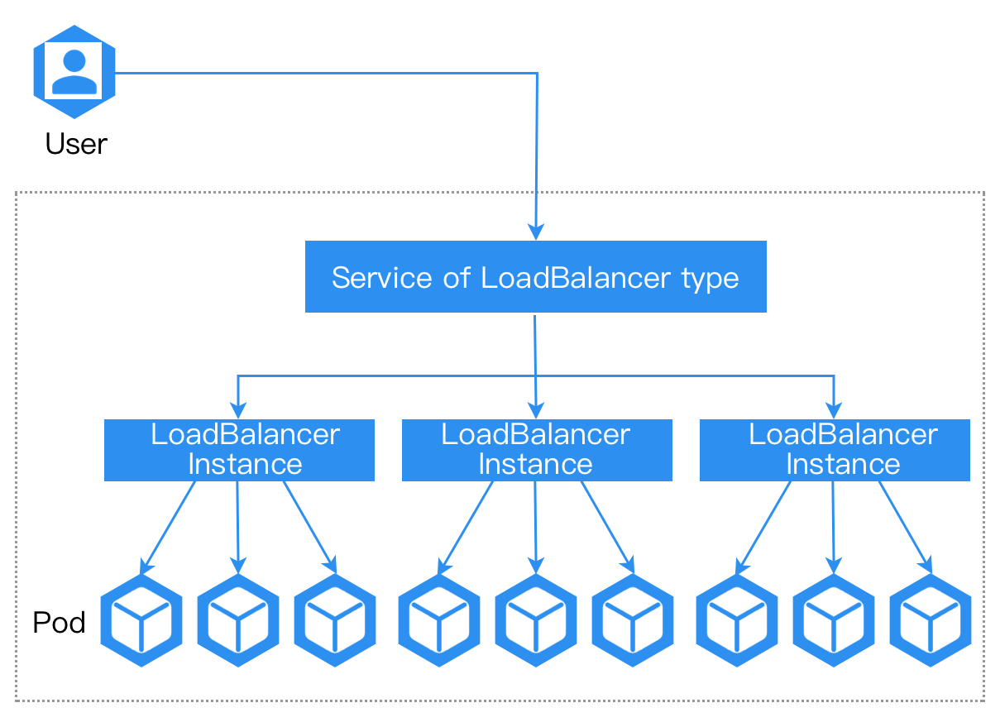

# Режим сети ALB

Экземпляр ALB может быть развернут в двух режимах: режим сетевого интерфейса хоста и режим контейнерной сети.

## Режим сетевого интерфейса хоста

Прямое использование сетевого стека узла, совместное использование IP-адреса и порта с узлом.

В этом режиме экземпляр балансировщика нагрузки напрямую связывается с портом узла, без картирования портов или аналогичного преобразования контейнерной сети.

**Примечание**: Чтобы избежать конфликтов портов, на одном узле разрешено развертывание только одного экземпляра ALB.

В режиме сетевого интерфейса хоста экземпляр ALB будет слушать все сетевые интерфейсы узла по умолчанию.

### Преимущества:

1. Лучшая производительность сети.
2. Может быть доступен по IP-адресу узла.

### Недостатки:

1. На одном узле разрешено развертывание только одного экземпляра ALB.
2. Порт может конфликтовать с другими процессами.

## Режим контейнерной сети

В отличие от режима сетевого интерфейса хоста, режим контейнерной сети развертывает ALB с использованием контейнерной сети.

### Преимущества:

1. Поддерживает развертывание нескольких экземпляров ALB на одном узле.
2. ALB предоставляет интеграцию с MetalLB, который может предоставлять VIP для ALB.
3. Порт не будет конфликтовать с другими процессами.

### Недостатки:

1. Немного меньшая производительность.
2. Необходимо получить доступ к ALB через сервис балансировщика нагрузки.
