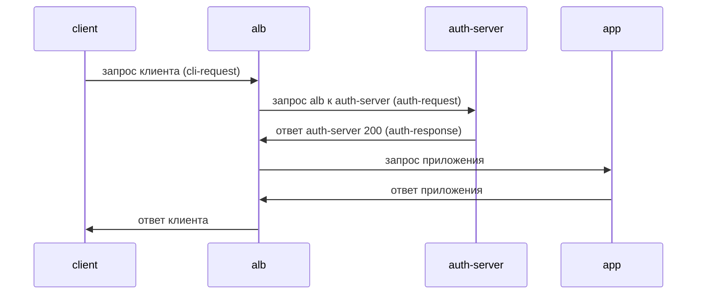
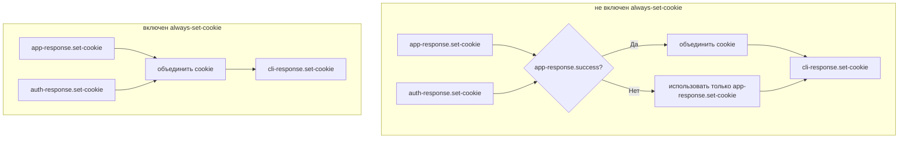
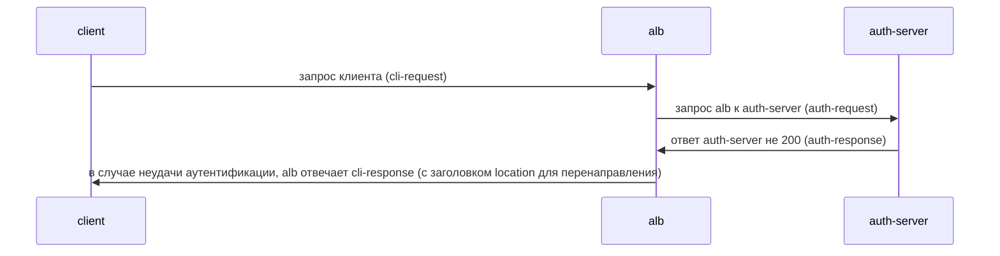
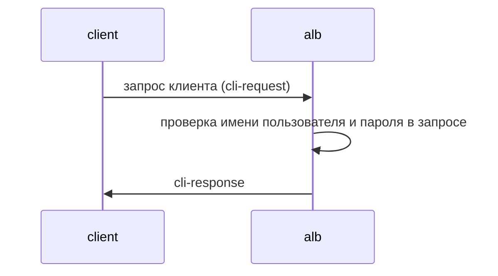

# Аутентификация

## Основная концепция

### Что такое аутентификация

Аутентификация — это механизм, который выполняет проверку подлинности перед тем, как запрос достигнет фактического сервиса. Это позволяет обрабатывать аутентификацию на уровне ALB единообразно, без необходимости реализовывать логику аутентификации в каждом бэкенд-сервисе.

### Поддерживаемые методы аутентификации

ALB поддерживает два основных метода аутентификации:

1. **Переадресация аутентификации (внешняя аутентификация)**

   - Отправка запроса на внешний сервис аутентификации для проверки личности пользователя
   - Применимые сценарии: Необходима сложная логика аутентификации, такая как OAuth, SSO и т.д.
   - Рабочий процесс:
     1. Запрос пользователя поступает в ALB
     2. ALB пересылает информацию об аутентификации на сервис аутентификации
     3. Сервис аутентификации возвращает результат проверки
     4. На основе результата аутентификации решается, разрешить ли доступ к бэкенд-сервису

2. **Базовая аутентификация (Basic Authentication)**
   - Простой механизм аутентификации на основе имени пользователя и пароля
   - Применимые сценарии: Простое управление доступом, защита среды разработки
   - Рабочий процесс:
     1. Запрос пользователя поступает в ALB
     2. ALB проверяет имя пользователя и пароль в запросе
     3. Сравнивает с настроенной информацией аутентификации
     4. Если проверка проходит, пересылает на бэкенд-сервис

### Методы конфигурации аутентификации

1. **Глобальная аутентификация**

   - Конфигурация на уровне ALB, применима ко всем сервисам
   - Конфигурация на уровне ALB или FT CR

2. **Аутентификация на уровне пути**

   - Конфигурация на конкретном пути Ingress
   - Конфигурация на конкретном правиле
   - Может переопределять глобальную конфигурацию аутентификации

3. **Отключение аутентификации**
   - Отключение аутентификации для конкретного пути
   - Конфигурация на Ingress с аннотацией: `alb.ingress.cpaas.io/auth-enable: "false"`
   - Конфигурация на правиле с CR

### Обработка результатов аутентификации

- Успех аутентификации: Запрос будет переслан на бэкенд-сервис
- Ошибка аутентификации: Возвращается ошибка 401 неавторизован
- Можно настроить поведение перенаправления после неудачи аутентификации (применимо к переадресации аутентификации)

## Быстрый старт

Настройка базовой аутентификации с ALB

### Развертывание ALB

```bash
cat <<EOF | kubectl apply -f -
apiVersion: crd.alauda.io/v2
kind: ALB2
metadata:
  name: auth
  namespace: cpaas-system
spec:
  config:
    networkMode: container
    projects:
    - ALL_ALL
    replicas: 1
    vip:
      enableLbSvc: false
  type: nginx
EOF
export ALB_IP=$(kubectl get pods -n cpaas-system -l service_name=alb2-auth -o jsonpath='{.items[*].status.podIP}');echo $ALB_IP
```

### Настройка секрета и Ingress

```bash
# echo "Zm9vOiRhcHIxJHFJQ05aNjFRJDJpb29pSlZVQU1tcHJxMjU4L0NoUDE=" | base64 -d #  foo:$apr1$qICNZ61Q$2iooiJVUAMmprq258/ChP1
# openssl passwd -apr1 -salt qICNZ61Q bar # $apr1$qICNZ61Q$2iooiJVUAMmprq258/ChP1

kubectl apply -f - <<'END'
apiVersion: v1
kind: Secret
metadata:
  name: auth-file
type: Opaque
data:
  auth: Zm9vOiRhcHIxJHFJQ05aNjFRJDJpb29pSlZVQU1tcHJxMjU4L0NoUDE=
---
apiVersion: networking.k8s.io/v1
kind: Ingress
metadata:
  name: auth-file
  annotations:
    "nginx.ingress.kubernetes.io/auth-type": "basic"
    "nginx.ingress.kubernetes.io/auth-secret": "default/auth-file"
    "nginx.ingress.kubernetes.io/auth-secret-type": "auth-file"
spec:
  rules:
  - http:
      paths:
      - path: /app-file
        pathType: Prefix
        backend:
          service:
            name: app-server
            port:
              number: 80
END
```

### Проверка

```bash
# echo "Zm9vOiJhYXIi" | base64 -d # foo:bar
curl -v -X GET -H "Authorization: Basic Zm9vOmJhcg==" http://$ALB_IP:80/app-file # должен вернуть 200
# неверный пароль
curl -v -X GET -H "Authorization: Basic XXXXOmJhcg==" http://$ALB_IP:80/app-file # должен вернуть 401
```

## Связанные аннотации Ingress

[Ingress-nginx](./ingress.mdx) определяет ряд аннотаций для настройки конкретных деталей процесса аутентификации. Ниже приведен список аннотаций, которые поддерживает ALB, где "v" указывает на поддержку, а "x" — на отсутствие поддержки.

|                                                                                                                                                        | поддержка | тип                | примечание                                                                                 |
| ------------------------------------------------------------------------------------------------------------------------------------------------------ | --------- | ------------------- | ------------------------------------------------------------------------------------------ |
| переадресация-аутентификации                                                                                                                         |           |                     | переадресация аутентификации путем отправки http-запроса                                 |
| nginx.ingress.kubernetes.io/auth-url                                                                                                                   | v         | строка              |                                                                                           |
| nginx.ingress.kubernetes.io/auth-method                                                                                                                | v         | строка              |                                                                                           |
| nginx.ingress.kubernetes.io/auth-signin                                                                                                                | v         | строка              |                                                                                           |
| nginx.ingress.kubernetes.io/auth-signin-redirect-param                                                                                                 | v         | строка              |                                                                                           |
| nginx.ingress.kubernetes.io/auth-response-headers                                                                                                      | v         | строка              |                                                                                           |
| nginx.ingress.kubernetes.io/auth-proxy-set-headers                                                                                                     | v         | строка              |                                                                                           |
| nginx.ingress.kubernetes.io/auth-request-redirect                                                                                                      | v         | строка              |                                                                                           |
| nginx.ingress.kubernetes.io/auth-always-set-cookie                                                                                                     | v         | логическое          |                                                                                           |
| nginx.ingress.kubernetes.io/auth-snippet                                                                                                               | x         | строка              |                                                                                           |
| базовая-аутентификация                                                                                                                                 |           |                     | аутентификация по имени пользователя и паролю                                              |
| nginx.ingress.kubernetes.io/auth-realm                                                                                                                 | v         | строка              |                                                                                           |
| nginx.ingress.kubernetes.io/auth-secret                                                                                                                | v         | строка              |                                                                                           |
| nginx.ingress.kubernetes.io/auth-secret-type                                                                                                           | v         | строка              |                                                                                           |
| nginx.ingress.kubernetes.io/auth-type                                                                                                                  | -         | "basic" или "digest" | basic: поддерживает apr1 **digest: не поддерживается**                                     |
| кэш-аутентификации                                                                                                                                   |           |                     |                                                                                           |
| nginx.ingress.kubernetes.io/auth-cache-key                                                                                                             | x         | строка              |                                                                                           |
| nginx.ingress.kubernetes.io/auth-cache-duration                                                                                                        | x         | строка              |                                                                                           |
| поддержка-ожидания-аутентификации                                                                                                                      |           |                     | поддержка ожидания при отправке запроса. укажите поведение ожидания через ряд аннотаций    |
| nginx.ingress.kubernetes.io/auth-keepalive                                                                                                             | x         | число                |                                                                                           |
| nginx.ingress.kubernetes.io/auth-keepalive-share-vars                                                                                                  | x         | "true" или "false"   |                                                                                           |
| nginx.ingress.kubernetes.io/auth-keepalive-requests                                                                                                    | x         | число                |                                                                                           |
| nginx.ingress.kubernetes.io/auth-keepalive-timeout                                                                                                     | x         | число                |                                                                                           |
| [auth-tls](https://github.com/kubernetes/ingress-nginx/blob/main/docs/user-guide/nginx-configuration/annotations.md#client-certificate-authentication) |           |                     | когда запрос является https, дополнительная проверка сертификата.                         |
| nginx.ingress.kubernetes.io/auth-tls-secret                                                                                                            | x         | строка              |                                                                                           |
| nginx.ingress.kubernetes.io/auth-tls-verify-depth                                                                                                      | x         | число                |                                                                                           |
| nginx.ingress.kubernetes.io/auth-tls-verify-client                                                                                                     | x         | строка              |                                                                                           |
| nginx.ingress.kubernetes.io/auth-tls-error-page                                                                                                        | x         | строка              |                                                                                           |
| nginx.ingress.kubernetes.io/auth-tls-pass-certificate-to-upstream                                                                                      | x         | "true" или "false"   |                                                                                           |
| nginx.ingress.kubernetes.io/auth-tls-match-cn                                                                                                          | x         | строка              |                                                                                           |

## переадресация-аутентификации



Связанные аннотации:

- nginx.ingress.kubernetes.io/auth-url
- nginx.ingress.kubernetes.io/auth-method
- nginx.ingress.kubernetes.io/auth-signin
- nginx.ingress.kubernetes.io/auth-signin-redirect-param
- nginx.ingress.kubernetes.io/auth-response-headers
- nginx.ingress.kubernetes.io/auth-proxy-set-headers
- nginx.ingress.kubernetes.io/auth-request-redirect
- nginx.ingress.kubernetes.io/auth-always-set-cookie

Эти аннотации описывают изменения, внесенные в auth-request, app-request и cli-response в приведенной выше диаграмме.

### Конструирование связанных аннотаций

#### auth-url

URL запроса аутентификации, значение может быть переменной.

#### auth-method

Метод запроса аутентификации.

#### auth-proxy-set-headers

Значение является ссылкой на ConfigMap в формате `ns/name`.
По умолчанию все заголовки из cli-request будут отправлены на auth-server. Дополнительные заголовки могут быть настроены через proxy\_set\_header. Следующие заголовки отправляются по умолчанию:

```
X-Original-URI          $request_uri;
X-Scheme                $pass_access_scheme;
X-Original-URL          $scheme://$http_host$request_uri;
X-Original-Method       $request_method;
X-Sent-From             "alb";
X-Real-IP               $remote_addr;
X-Forwarded-For         $proxy_add_x_forwarded_for;
X-Auth-Request-Redirect $request_uri;
```

### Конструирование аннотаций, связанных с app-request

#### auth-response-headers

Значение — это строка, разделенная запятыми, позволяющая нам перенести определенные заголовки из auth-response в app-request.
пример:

```
nginx.ingress.kubernetes.io/auth-response-headers: Remote-User,Remote-Name
```

Когда ALB инициирует app-request, он будет включать Remote-User и Remote-Name из заголовков auth-response.

### Обработка cookie

auth-response и app-response могут устанавливать cookie. По умолчанию только когда app-response.success, заголовок auth-response.set-cookie будет объединен с заголовком cli-response.set-cookie.



### Конфигурация перенаправления

Когда auth-server возвращает 401, мы можем установить заголовок перенаправления в cli-response, чтобы указать браузеру перенаправиться на URL, указанный в auth-signin для проверки.



#### auth-signin

Значение — это URL, указывающий заголовок location в cli-response.

#### auth-signin-redirect-param

Имя параметра запроса в signin-url, по умолчанию rd.
если signin-url не содержит указанного параметра `auth-signin-redirect-param`, alb автоматически добавит параметр. Значение параметра будет установлено в `$pass_access_scheme://$http_host$escaped_request_uri`, используется для записи оригинального URL запроса.

#### auth-request-redirect

Установите заголовок `x-auth-request-redirect` в auth-request.

## базовая-аутентификация

базовая-аутентификация — это процесс аутентификации, описанный в [RFC 7617](https://datatracker.ietf.org/doc/html/rfc7617).
Процесс взаимодействия выглядит следующим образом:



### auth-realm

[описание защищенной области](https://developer.mozilla.org/zh-CN/docs/Web/HTTP/Headers/WWW-Authenticate#realm)
Это значение realm в заголовке `WWW-Authenticate` cli-response.
WWW-Authenticate: Basic realm="$realm"

### auth-type

Тип схемы аутентификации, в настоящее время поддерживается только базовая

### auth-secret

Секретные ссылки имени пользователя и пароля, формат ns/name

### auth-secret-type

Секрет поддерживает два типа:

1. auth-file: данные секрета содержат только один ключ "auth", и его значение — это строка формата Apache htpasswd. например:

   ```
   data:
     auth: "user1:$apr1$xyz..."
   ```

2. auth-map: данные секрета, каждый ключ представляет имя пользователя, а соответствующее значение — это хэш пароля (без имени пользователя в формате htpasswd). например:
   ```
   data:
     user1: "$apr1$xyz...."
     user2: "$apr1$abc...."
   ```

Примечание: В настоящее время поддерживаются только хэши паролей формата htpasswd, сгенерированные с использованием алгоритма apr1.

## CR

ALB CR добавил элементы конфигурации, связанные с аутентификацией, которые могут быть настроены на ALB/Frontend/Rule CR.
Во время выполнения ALB преобразует аннотации на Ingress в правила.

```yaml
auth:
  # Конфигурация базовой аутентификации
  basic:
    #  строка; соответствует nginx.ingress.kubernetes.io/auth-type: basic
    auth_type: "basic"
    #  строка; соответствует nginx.ingress.kubernetes.io/auth-realm
    realm: "Ограниченный доступ"
    #  строка; соответствует nginx.ingress.kubernetes.io/auth-secret
    secret: "ns/name"
    #  строка; соответствует nginx.ingress.kubernetes.io/auth-secret-type
    secret_type: "auth-map|auth-file"
  # Конфигурация переадресации аутентификации
  forward:
    #  логическое; соответствует nginx.ingress.kubernetes.io/auth-always-set-cookie
    always_set_cookie: true
    #  строка; соответствует nginx.ingress.kubernetes.io/auth-proxy-set-headers
    auth_headers_cm_ref: "ns/name"
    #  строка; соответствует nginx.ingress.kubernetes.io/auth-request-redirect
    auth_request_redirect: "/login"
    #  строка; соответствует nginx.ingress.kubernetes.io/auth-method
    method: "GET"
    #  строка; соответствует nginx.ingress.kubernetes.io/auth-signin
    signin: "/signin"
    #  строка; соответствует nginx.ingress.kubernetes.io/auth-signin-redirect-param
    signin_redirect_param: "redirect_to"
    #  []строка; соответствует nginx.ingress.kubernetes.io/auth-response-headers
    upstream_headers:
      - "X-User-ID"
      - "X-User-Name"
      - "X-User-Email"
    #  строка; соответствует nginx.ingress.kubernetes.io/auth-url
    url: "http://auth-service/validate"
```

Аутентификация поддерживает конфигурацию на:

- Alb CR's `.spec.config.auth`
- Frontend CR's `.spec.config.auth`
- Rule CR's `.spec.config.auth`

Порядок наследования: Alb > Frontend > Rule. Если дочерний CR не настроен, будет использоваться конфигурация родительского CR.

## Специальная аннотация Ingress ALB

В процессе обработки Ingress ALB определяет приоритет на основе префикса аннотации. Приоритет от высокого к низкому:

- `index.$rule_index-$path_index.alb.ingress.cpaas.io`
- `alb.ingress.cpaas.io`
- `nginx.ingress.kubernetes.io`

Это может решить проблему совместимости с ingress-nginx и указать конфигурацию аутентификации на конкретном пути Ingress.

### Auth-Enable

```yaml
alb.ingress.cpaas.io/auth-enable: "false"
```

Новая аннотация, добавленная ALB, используется для указания, следует ли включать функциональность аутентификации для Ingress.

## Другие функции, связанные с аутентификацией Ingress-Nginx

### Глобальная аутентификация

В ingress-nginx вы можете установить глобальную аутентификацию через ConfigMap. Это эквивалентно настройке аутентификации для всех Ingress. В ALB вы можете настроить аутентификацию на ALB2 и FT CR. Правила под ними унаследуют эти конфигурации.

### No-Auth-Locations

В ALB вы можете отключить функцию аутентификации этого Ingress, настроив аннотацию: `alb.ingress.cpaas.io/auth-enable: "false"` на Ingress.

## Примечание: Несовместимые части с Ingress-Nginx

1. Не поддерживает auth-keepalive
2. Не поддерживает auth-snippet
3. Не поддерживает auth-cache
4. Не поддерживает auth-tls
5. Базовая аутентификация поддерживает только basic, не поддерживает digest
6. Базовая аутентификация basic поддерживает только алгоритм apr1, не поддерживает bcrypt sha256 и т.д.

## Устранение неполадок

1. Проверьте журнал контейнера Nginx в поде ALB
2. Проверьте заголовок `X-ALB-ERR-REASON` в ответе
