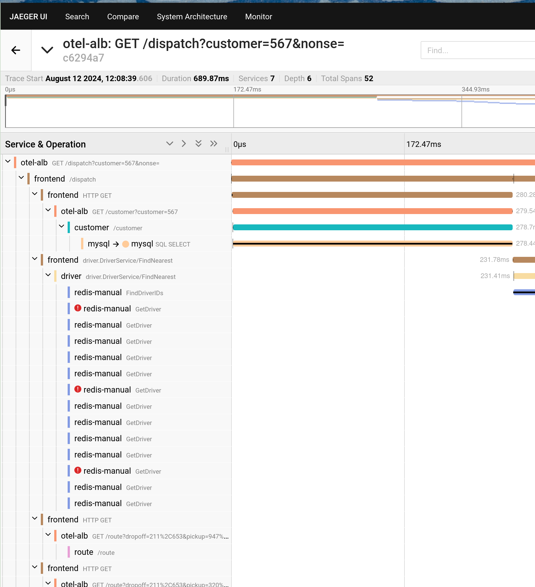

# OTel

OpenTelemetry (OTel) — это проект с открытым исходным кодом, целью которого является предоставление стандартов, не зависящих от поставщика, для сбора, обработки и экспорта телеметрических данных в распределенных системах, таких как архитектуры микросервисов. Он помогает разработчикам более легко анализировать производительность и поведение программного обеспечения, облегчая диагностику и решение проблем с приложениями.

## Терминология

| Термин                          | Объяснение                                                                                                                                                                                                                                                                                                                                                                                                                |
| ------------------------------- | -------------------------------------------------------------------------------------------------------------------------------------------------------------------------------------------------------------------------------------------------------------------------------------------------------------------------------------------------------------------------------------------------------------------------- |
| **Trace**                       | Данные, отправляемые на сервер OTel, которые представляют собой набор связанных событий или операций, используемых для отслеживания потока запросов в распределенных системах; каждый Trace состоит из нескольких Spans.                                                                                                                                                                                                                             |
| **Span**                        | Независимая операция или событие внутри Trace, которое включает время начала, продолжительность и другую соответствующую информацию.                                                                                                                                                                                                                                                                                                       |
| **OTel-сервер**                 | Сервер OTel, способный получать и сохранять данные Trace, такие как Jaeger, Prometheus и т. д.                                                                                                                                                                                                                                                                                                                               |
| **Jaeger**                      | Система распределенного отслеживания с открытым исходным кодом, используемая для мониторинга и решения проблем с архитектурами микросервисов, поддерживающая интеграцию с OpenTelemetry.                                                                                                                                                                                                                                                                  |
| **Атрибуты**                   | Пары ключ-значение, прикрепленные к Trace или Span для предоставления дополнительной контекстной информации. Это включает в себя атрибуты ресурса и атрибуты Span; см. [Атрибуты](#attri) для получения дополнительной информации.                                                                                                                                                                                                                            |
| **Сэмплер**                     | Стратегический компонент, который определяет, следует ли брать образец и сообщать о Trace. Могут быть настроены различные стратегии выборки, такие как полное выборка, пропорциональная выборка и т. д.                                                                                                                                                                                                                                             |
| **ALB (Еще один балансировщик нагрузки)** | Программное или аппаратное устройство, которое распределяет сетевые запросы между доступными узлами в кластере; балансировщик нагрузки (ALB), используемый на платформе, является программным балансировщиком нагрузки слоя 7, который можно настроить для мониторинга трафика с помощью OTel. ALB поддерживает отправку Trace на указанный Collectор и позволяет использовать различные стратегии выборки; он также поддерживает настройку, следует ли отправлять Trace на уровне Ingress. |
| **FT (Frontend)**               | Конфигурация порта для ALB, специфицирующая настройки на уровне порта.                                                                                                                                                                                                                                                                                                                                                      |
| **Правило**                     | Правила маршрутизации на порту (FT), используемые для сопоставления определённых маршрутов.                                                                                                                                                                                                                                                                                                                                                              |
| **HotROD (По запросу)**        | Пример приложения, предоставленный Jaeger для демонстрации использования распределенного отслеживания; обратитесь к [Hot R.O.D. - По запросу](https://github.com/jaegertracing/jaeger/tree/main/examples/hotrod) для получения дополнительной информации.                                                                                                                                                                                                        |
| **hotrod-with-proxy**           | Указывает адреса внутренних микросервисов HotROD через переменные окружения; обратитесь к [hotrod-with-proxy](https://github.com/woodgear/hotrod-with-proxy/blob/master/services/frontend/best_eta.go#L53) для получения дополнительной информации.                                                                                                                                                                                          |

## Предусловия

- **Убедитесь, что существует работоспособный ALB**: Создайте новый или используйте существующий ALB, где имя ALB заменяется на `<otel-alb>` в данном документе. Для получения инструкций по созданию ALB обратитесь к [Создание балансировщика нагрузки](../how_to/create_loadbalancer.mdx).

- **Убедитесь, что существует адрес сервера отчетности данных OTel**: Этот адрес далее будет называться `<jaeger-server>`.

## Шаги

### Обновление конфигурации ALB

1. На главном узле кластера используйте инструмент CLI для выполнения следующей команды для редактирования конфигурации ALB.

   ```
   kubectl edit alb2 -n cpaas-system <otel-alb> # Замените <otel-alb> на фактическое имя ALB
   ```

2. Добавьте следующие поля в раздел `spec.config`.

   ```yaml
   otel:
     enable: true
     exporter:
       collector:
         address: "<jaeger-server>" # Замените <jaeger-server> на фактический адрес сервера отчетности OTel
         request_timeout: 1000
   ```

   Пример конфигурации после завершения:

   ```yaml
   spec:
     address: 192.168.1.1
     config:
       otel:
         enable: true
         exporter:
           collector:
             address: "http://jaeger.default.svc.cluster.local:4318"
             request_timeout: 1000
       antiAffinityKey: system
       defaultSSLCert: cpaas-system/cpaas-system
       defaultSSLStrategy: Both
       gateway:
       ...
   type: nginx
   ```

3. Выполните следующую команду, чтобы сохранить изменения. После обновления ALB по умолчанию будет включен OpenTelemetry, и все данные о запросах Trace будут отправлены на сервер Jaeger.

   ```
   :wq
   ```

## Связанные операции

### Настройка OTel в Ingress

- **Включение или отключение OTel в Ingress**

  Настраивая, следует ли включать OTel в Ingress, вы можете лучше контролировать и отлаживать поток запросов приложений, выявляя узкие места производительности или ошибки, отслеживая запросы при их передаче между различными службами.

  **Шаги**

  Добавьте следующую конфигурацию в поле metadata.annotations Ingress:

  ```
  nginx.ingress.kubernetes.io/enable-opentelemetry: "true"
  ```

  Объяснение параметра:

  - **nginx.ingress.kubernetes.io/enable-opentelemetry**: При установке в `true` это указывает на то, что контроллер Ingress включает функциональность OpenTelemetry при обработке запросов через этот Ingress, что означает, что информация о запросе Trace будет собираться и отправляться. При установке в `false` или при удалении этой аннотации это означает, что информация о запросе Trace не будет собираться или отправляться.

- **Включение или отключение доверия OTel в Ingress**

  Доверие OTel определяет, доверяет ли Ingress и использует ли информацию Trace (например, идентификатор трассировки) из входящих запросов.

  **Шаги**

  Добавьте следующую конфигурацию в поле metadata.annotations Ingress:

  ```
  nginx.ingress.kubernetes.io/opentelemetry-trust-incoming-span: "true"
  ```

  Объяснение параметра:

  - **nginx.ingress.kubernetes.io/opentelemetry-trust-incoming-span**: При установленном значении `true` Ingress продолжает использовать уже существующую информацию о Trace, помогая поддерживать согласованность в кросс-сервисном трассировании, позволяя полностью отслеживать и анализировать всю цепочку запросов в системе распределенного отслеживания. При установке на `false` будет сгенерирована новая информация о трассировке для запроса, которая может привести к тому, что запрос будет обработан как часть новой цепочки трассировки после входа в Ingress, что прерывает непрерывность кросс-сервисной трассировки.

- **Добавление различных конфигураций OTel в Ingress**

  Эта конфигурация позволяет вам настраивать поведение OTel и методологию экспорта данных для различных ресурсов Ingress, позволяя тонко настраивать стратегию трассировки или целевую платформу для каждой службы.

  **Шаги**

  Добавьте следующую конфигурацию в поле metadata.annotations Ingress:

  ```yaml
  apiVersion: networking.k8s.io/v1
  kind: Ingress
  metadata:
    annotations:
      alb.ingress.cpaas.io/otel: >
       {
          "enable": true,
          "exporter": {
              "collector": {
                  "address": "<jaeger-server>", # Замените <jaeger-server> на фактический адрес сервера отчетности OTel, например, "address": "http://128.0.0.1:4318"
                  "request_timeout": 1000
              }
          }
       }
  ```

  Объяснение параметра:

  - **exporter**: Указывает, как собранные данные Trace отправляются на Collectор OTel (сервер отчетности OTel).
  - **address**: Указывает адрес Collectора OTel.
  - **request\_timeout**: Указывает тайм-аут запроса.

### Использование OTel в приложениях

Следующая конфигурация показывает полную структуру конфигурации OTel, которую можно использовать для определения того, как включить и использовать функции OTel в приложениях.

На главном узле кластера используйте инструмент CLI, чтобы выполнить следующую команду и получить полную структуру конфигурации OTel.

```
kubectl get crd alaudaloadbalancer2.crd.alauda.io -o json|jq ".spec.versions[2].schema.openAPIV3Schema.properties.spec.properties.config.properties.otel"
```

Эхо-результат:

```
{
    "otel": {
        "enable": true
    }
    "exporter": {
        "collector": {
            "address": ""
          },
    },
    "flags": { 
        "hide_upstream_attrs": false
        "notrust_incoming_span": false
        "report_http_request_header": false
        "report_http_response_header": false
    },
    "sampler": {
        "name": "", 
        "options": {
            "fraction": ""
            "parent_name": ""
          },
      },
 }
```

Объяснение параметра:

| Параметр                                | Описание                                                                                      |
| ---------------------------------------- | ------------------------------------------------------------------------------------------------ |
| **otel.enable**                          | Указывает, следует ли включать функциональность OTel.                                                            |
| **exporter.collector.address**           | Адрес сервера отчетности OTel, поддерживающий http/https протоколы и доменные имена. |
| **flags.hide\_upstream\_attrs**          | Указывает, следует ли отправлять информацию о верхнеуровневых правилах.                                              |
| **flag.notrust\_incoming\_span**         | Указывает, следует ли доверять и использовать информацию Trace OTel (например, идентификатор трассировки) из входящих запросов.     |
| **flags.report\_http\_request\_header**  | Указывает, следует ли отправлять заголовки запросов.                                                               |
| **flags.report\_http\_response\_header** | Указывает, следует ли отправлять заголовки ответов.                                                              |
| **sampler.name**                         | Имя стратегии выборки; см. [Стратегии выборки](#sampoli) для подробностей.                         |
| **sampler.options.fraction**             | Скорость выборки.                                                                                   |
| **sampler.options.parent\_name**         | Родительская стратегия для стратегий выборки parent\_base.                                        |

### Наследование

По умолчанию, если ALB настраивает определенные параметры OTel и FT не настроен, FT будет наследовать параметры от ALB как свою собственную конфигурацию; это означает, что FT наследует конфигурацию ALB, в то время как правило может наследовать конфигурации как от ALB, так и от FT.

- **ALB**: Конфигурация на ALB обычно является глобальной и по умолчанию. Вы можете настроить глобальные параметры, такие как адреса Collectор, которые будут наследоваться нижепрофильными FT и Правилом.

- **FT**: FT может наследовать конфигурации от ALB, что означает, что определенные параметры OTel, которые не настроены в FT, будут использовать конфигурацию от ALB. Тем не менее, FT также может быть дополнительно уточнен; например, вы можете выбрать выборочно включить или отключить OTel в FT, не влияя на другие FT или глобальные настройки ALB.

- **Правило**: Правило может наследовать конфигурации как от ALB, так и от FT. Тем не менее, Правило также может быть дополнительно уточнено; например, конкретное Правило может выбрать не доверять входящей информации Trace OTel или настроить стратегии выборки.

**Шаги**

Настраивая поле `spec.config.otel` в YAML-файлах ALB, FT и Правила, вы можете добавить связанную с OTel конфигурацию.

## Дополнительные замечания

### Стратегии выборки \{#sampoli}

| Параметр         | Объяснение                                                                                                                                                                                                                                                                                                                |
| ----------------- | -------------------------------------------------------------------------------------------------------------------------------------------------------------------------------------------------------------------------------------------------------------------------------------------------------------------------- |
| **всегда включено**     | Всегда сообщать все данные трассировки.                                                                                                                                                                                                                                                                                            |
| **всегда отключено**    | Никогда не сообщать данные трассировки.                                                                                                                                                                                                                                                                                                 |
| **traceid-отношение** | Определите, следует ли сообщать на основе `traceid`. Формат `traceparent` — `xx-traceid-xx-flag`, где первые 16 символов `traceid` представляют собой 32-битное шестнадцатеричное число. Если это число меньше, чем `fraction`, умноженное на 4294967295 (т. е. (2^32-1)), оно будет отправлено.                               |
| **parent-base**   | Решите, следует ли сообщать на основе части флага traceparent в запросе. Когда флаг равен 01, его будут отправлять; например: `curl -v "http://$ALB_IP/" -H 'traceparent: 00-xx-xx-01'`; когда флаг равен 02, его не будут отправлять; например: `curl -v "http://$ALB_IP/" -H 'traceparent: 00-xx-xx-02'`. |

### Атрибуты \{#attri}

- **Атрибуты ресурса**

  Эти атрибуты отправляются по умолчанию.

  | Параметр               | Описание                         |
  | ----------------------- | ----------------------------------- |
  | **hostname**            | Имя хоста Pod ALB         |
  | **service.name**        | Имя ALB                 |
  | **service.namespace**   | Пространство имен, в котором находится ALB |
  | **service.type**        | По умолчанию ALB                      |
  | **service.instance.id** | Имя Pod ALB             |

- **Атрибуты Span**

  - Атрибуты, отправляемые по умолчанию:

    | Параметр                      | Описание                                                          |
    | ------------------------------ | ------------------------------------------------------------------ |
    | **http.status\_code**          | Код состояния                                                          |
    | **http.request.resend\_count** | Количество повторных запросов                                                          |
    | **alb.rule.rule\_name**        | Имя правила, соответствующего этому запросу                         |
    | **alb.rule.source\_type**      | Тип правила, соответствующего этому запросу, в настоящее время только Ingress |
    | **alb.rule.source\_name**      | Имя Ingress                                              |
    | **alb.rule.source\_ns**        | Пространство имен, в котором находится Ingress                              |

  - Атрибуты, отправляемые по умолчанию, но которые могут быть исключены изменением поля flag.hide\_upstream\_attrs:

    | Параметр                  | Описание                                                              |
    | -------------------------- | ------------------------------------------------------------------------ |
    | **alb.upstream.svc\_name** | Имя службы (внутренний маршрут), на который перенаправляется трафик   |
    | **alb.upstream.svc\_ns**   | Пространство имен, в котором находится служба (внутренний маршрут) |
    | **alb.upstream.peer**      | IP-адрес и порт Pod, к которому выполняется пересылка                    |

  - Атрибуты, которые по умолчанию не отправляются, но могут быть отправлены изменением поля flag.report\_http\_request\_header:

    | Параметр                          | Описание    |
    | ---------------------------------- | -------------- |
    | `**http.request.header.<header>**` | Заголовок запроса |

  - Атрибуты, которые по умолчанию не отправляются, но могут быть отправлены изменением поля flag.report\_http\_response\_header:

    | Параметр                           | Описание     |
    | ----------------------------------- | --------------- |
    | `**http.response.header.<header>**` | Заголовок ответа |

## Пример конфигурации

Следующая YAML-конфигурация развертывает ALB и использует Jaeger в качестве сервера OTel, с Hotrod-proxy в качестве демонстрационного бэкенда. Настраивая правила Ingress, при запросах клиентов ALB трафик будет перенаправляться на HotROD. Кроме того, связь между внутренними микросервисами HotROD также осуществляется через ALB.

1. Сохраните следующий YAML в файл с именем all.yaml.

   ```yaml
   apiVersion: apps/v1
   kind: Deployment
   metadata:
     name: hotrod
   spec:
     replicas: 1
     selector:
       matchLabels:
         service.cpaas.io/name: hotrod
         service_name: hotrod
     template:
       metadata:
         labels:
           service.cpaas.io/name: hotrod
           service_name: hotrod
       spec:
         containers:
           - name: hotrod
             env:
               - name: PROXY_PORT
                 value: "80"
               - name: PROXY_ADDR
                 value: "otel-alb.default.svc.cluster.local:"
               - name: OTEL_EXPORTER_OTLP_ENDPOINT
                 value: "http://jaeger.default.svc.cluster.local:4318"
             image: theseedoaa/hotrod-with-proxy:latest
             imagePullPolicy: IfNotPresent
             command: ["/bin/hotrod","all","-v"]
   ---
   apiVersion: networking.k8s.io/v1
   kind: Ingress
   metadata:
     name: hotrod-frontend
   spec:
     ingressClassName: otel-alb
     rules:
     - http:
         paths:
         - backend:
             service:
               name: hotrod
               port:
                 number: 8080
           path: /dispatch
           pathType: ImplementationSpecific
         - backend:
             service:
               name: hotrod
               port:
                 number: 8080
           path: /frontend
           pathType: ImplementationSpecific
   ---
   apiVersion: networking.k8s.io/v1
   kind: Ingress
   metadata:
     name: hotrod-customer
   spec:
     ingressClassName: otel-alb
     rules:
     - http:
         paths:
         - backend:
             service:
               name: hotrod
               port:
                 number: 8081
           path: /customer
           pathType: ImplementationSpecific
   ---
   apiVersion: networking.k8s.io/v1
   kind: Ingress
   metadata:
     name: hotrod-route
   spec:
     ingressClassName: otel-alb
     rules:
     - http:
         paths:
         - backend:
             service:
               name: hotrod
               port:
                 number: 8083
           path: /route
           pathType: ImplementationSpecific
   ---
   apiVersion: v1
   kind: Service
   metadata:
     name: hotrod
   spec:
     internalTrafficPolicy: Cluster
     ipFamilies:
       - IPv4
     ipFamilyPolicy: SingleStack
     ports:
       - name: frontend
         port: 8080
         protocol: TCP
         targetPort: 8080
       - name: customer
         port: 8081
         protocol: TCP
         targetPort: 8081
       - name: router
         port: 8083
         protocol: TCP
         targetPort: 8083
     selector:
       service_name: hotrod
     sessionAffinity: None
     type: ClusterIP
   ---
   apiVersion: apps/v1
   kind: Deployment
   metadata:
     name: jaeger
   spec:
     replicas: 1
     selector:
       matchLabels:
         service.cpaas.io/name: jaeger
         service_name: jaeger
     template:
       metadata:
         labels:
           service.cpaas.io/name: jaeger
           service_name: jaeger
       spec:
         containers:
           - name: jaeger
             env:
              - name: LOG_LEVEL
                value: debug
             image: jaegertracing/all-in-one:1.58.1
             imagePullPolicy: IfNotPresent
         hostNetwork: true
         tolerations:
           - operator: Exists
   ---
   apiVersion: v1
   kind: Service
   metadata:
     name: jaeger
   spec:
     internalTrafficPolicy: Cluster
     ipFamilies:
       - IPv4
     ipFamilyPolicy: SingleStack
     ports:
       - name: http
         port: 4318
         protocol: TCP
         targetPort: 4318
     selector:
       service_name: jaeger
     sessionAffinity: None
     type: ClusterIP
   ---
   apiVersion: crd.alauda.io/v2
   kind: ALB2
   metadata:
     name: otel-alb
   spec:
     config:
       loadbalancerName: otel-alb
       otel:
         enable: true
         exporter:
           collector:
             address: "http://jaeger.default.svc.cluster.local:4318"
             request_timeout: 1000
       projects:
       - ALL_ALL
       replicas: 1
       resources:
         alb:
           limits:
             cpu: 200m
             memory: 2Gi
           requests:
             cpu: 50m
             memory: 128Mi
         limits:
           cpu: "1"
           memory: 1Gi
         requests:
           cpu: 50m
           memory: 128Mi
     type: nginx
   ```

2. В инструменте CLI выполните следующую команду для развертывания Jaeger, ALB, HotROD и всех необходимых CR для тестирования.

   ```
   kubectl apply ./all.yaml
   ```

3. <span id="jaeger">Выполните следующую команду, чтобы получить адрес доступа к Jaeger.</span>

   ```
   export JAEGER_IP=$(kubectl get po -A -o wide |grep jaeger | awk '{print $7}');echo "http://$JAEGER_IP:16686"
   ```

4. Выполните следующую команду, чтобы получить адрес доступа к otel-alb.

   ```
   export ALB_IP=$(kubectl get po -A -o wide|grep otel-alb | awk '{print $7}');echo $ALB_IP
   ```

5. Выполните следующую команду, чтобы отправить запрос к HotROD через ALB. Здесь ALB будет сообщать Trace в Jaeger.

   ```
   curl -v "http://<$ALB_IP>:80/dispatch?customer=567&nonse=" # Замените <$ALB_IP> в команде на адрес доступа к otel-alb, полученный на предыдущих шагах
   ```

6. Откройте адрес доступа к Jaeger, полученный на этапе [3](#jaeger), чтобы просмотреть результаты.



