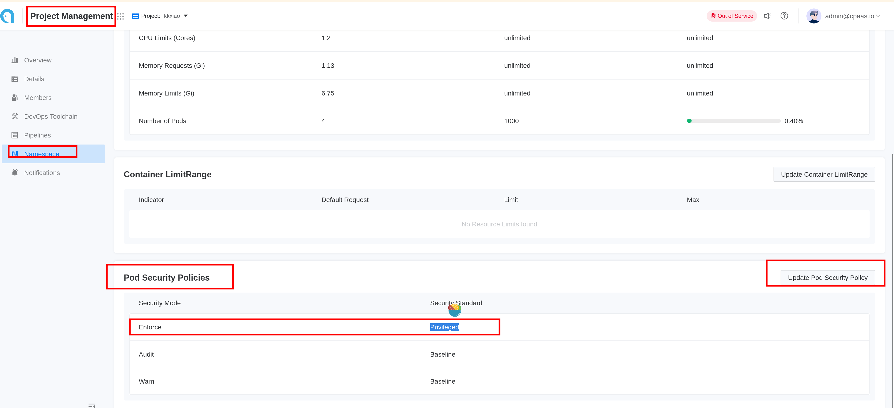

# Создание шлюза GatewayAPI

GatewayAPI — это новый API для Kubernetes, который предоставляет более гибкий и расширяемый способ управления входящим трафиком. Он позволяет вам определять правила маршрутизации, политики трафика и другие конфигурации более декларативным образом.\
Этот документ предоставляет пошаговое руководство по созданию шлюза GatewayAPI в кластере ACP Kubernetes.

# Требования

## Развертывание MetalLB

Шлюз GatewayAPI требует MetalLB для выделения IP-адреса. Пожалуйста, обратитесь к [Создание MetalLB](../functions/create_metallb.mdx) для получения инструкций по развертыванию MetalLB.

## Установите политики безопасности Pod в привилегированный режим

Если пространство имен, в котором вы хотите развернуть шлюз, создано через интерфейс, вам необходимо обновить его Политику безопасности Pod (PSP) до привилегированного режима.\

# Шаги

1. Перейдите в **Управление платформой**.

2. В левом боковом меню нажмите на **Управление сетью** > **Входящие шлюзы**.

3. Нажмите на **Создать входящие шлюзы**.

4. Следуйте инструкциям ниже, чтобы завершить настройку сети:

   | Параметр         | Описание                                                                                                                                                                               |
   | ----------------- | ----------------------------------------------------------------------------------------------------------------------------------------------------------------------------------------- |
   | **Имя**          | Имя шлюза.                                                                                                                                                                  |
   | **GatewayClass**  | Встроенный `exclusive-gateway` предоставляется ACP и поддерживается ALB. Он создаст ALB в режиме контейнерной сети для реализации спецификации шлюза GatewayAPI.                     |
   | **Спецификация** | Установите спецификации соответствующим образом в зависимости от ваших бизнес-потребностей. Вы также можете обратиться к [Выбор и планирование балансировщика нагрузки](../how_to/decide_performance_selection.mdx) для получения рекомендаций. |

5. Нажмите **Создать**. Процесс создания может занять некоторое время; пожалуйста, наберитесь терпения.

