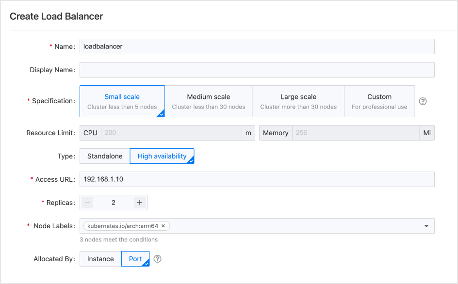

# Выбор и планирование балансировщика нагрузки

Для предложенных спецификаций платформы для **малых**, **средних**, **больших** и **настраиваемых** производственных сред, а также методов распределения ресурсов для **инстансов** и **портов**, можно использовать следующие рекомендации для развертывания.

### Маленькая производственная среда

Для небольших бизнес-масштабов, таких как наличие не более 5 узлов в кластере и использование только для запуска стандартных приложений, **один** балансировщик нагрузки будет достаточен. Рекомендуется использовать его в режиме **высокой доступности** с как минимум 2 репликами для обеспечения стабильности в среде.

Вы можете изолировать балансировщик нагрузки с помощью **портовой** изоляции, позволяя нескольким проектам делить его.

Пиковый QPS, измеренный в лабораторной среде для этой спецификации, составляет примерно 300 запросов в секунду.

### Средняя производственная среда

Когда объем бизнеса достигает определенного масштаба, например, наличие не более 30 узлов в кластере и необходимость обработки высококонкурентного бизнеса наряду с запуском стандартных приложений, **один** балансировщик нагрузки все еще будет достаточен. Рекомендуется использовать режим **высокой доступности** с как минимум 3 репликами для поддержания стабильности в среде.

Вы можете использовать либо **портовую** изоляцию, либо методы **распределения инстансов**, чтобы делить балансировщик нагрузки между несколькими проектами. Конечно, вы также можете создать новые балансировщики нагрузки для выделенного использования основными проектами.

Пиковый QPS, измеренный в лабораторной среде для этой спецификации, составляет около 10,000 запросов в секунду.

### Большая производственная среда

Для больших объемов бизнеса, таких как наличие более 30 узлов в кластере и необходимость обработки высококонкурентного бизнеса, а также длительных соединений с данными, рекомендуется использовать **несколько** балансировщиков нагрузки, каждый из которых должен быть в типе **высокой доступности** с как минимум 3 репликами для обеспечения стабильности в среде.

Вы можете изолировать балансировщик нагрузки, используя либо **портовую** изоляцию, либо методы **распределения инстансов** для нескольких проектов, чтобы делить его. Вы также можете создать новые балансировщики нагрузки для эксклюзивного использования основными проектами.

Пиковый QPS, измеренный в лабораторной среде для этой спецификации, составляет примерно 20,000 запросов в секунду.

### Рекомендации по развертыванию в особых сценариях

| Сценарий                          | Рекомендации по развертыванию                                                                                                                                                                                                                                                                                                                                                                                                                                                                                                                                                                     |
| --------------------------------- | ---------------------------------------------------------------------------------------------------------------------------------------------------------------------------------------------------------------------------------------------------------------------------------------------------------------------------------------------------------------------------------------------------------------------------------------------------------------------------------------------------------------------------------------------------------------------------------------------- |
| **Тестирование функций**              | Рекомендуется развернуть **один инстанс** балансировщика нагрузки.                                                                                                                                                                                                                                                                                                                                                                                                                                                                                                                          |
| **Тестовая среда**           | Если тестовая среда соответствует определениям **малой** или **средней**, как указано выше, использование **однопортового** балансировщика нагрузки будет достаточным. Инстанс балансировщика нагрузки может быть разделен между **несколькими проектами**.                                                                                                                                                                                                                                                                                                                                                                   |
| **Основные приложения**             | Рекомендуется использовать специальные балансировщики нагрузки исключительно для основных приложений.                                                                                                                                                                                                                                                                                                                                                                                                                                                                                                            |
| **Передача больших объемов данных** | Из-за минимального потребления памяти, вызванного самим балансировщиком нагрузки, достаточно зарезервировать 2Gi памяти даже для **большой** спецификации. Однако, если бизнес требует передачи больших объемов данных, что приведет к значительному потреблению памяти, распределение памяти для балансировщика нагрузки должно быть увеличено соответственно.    Рекомендуется постепенно увеличивать память балансировщика нагрузки в сценариях **настраиваемой** спецификации, внимательно следя за использованием памяти, чтобы в конечном итоге достичь приемлемого размера памяти для разумных уровней использования. |

### Выбор режима использования балансировщика нагрузки

| Режим использования                                                                                              | Преимущества                                                                                                                                                                | Недостатки                                                                                                                                                                                                                                                                                                                                                                                                                                                                                       |
| ------------------------------------------------------------------------------------------------------- | ------------------------------------------------------------------------------------------------------------------------------------------------------------------------- | --------------------------------------------------------------------------------------------------------------------------------------------------------------------------------------------------------------------------------------------------------------------------------------------------------------------------------------------------------------------------------------------------------------------------------------------------------------------------------------------------- |
| **(Рекомендуется) Выделить балансировщик нагрузки как ресурс инстанса для одного проекта**                | <ul><li>Управление относительно простое.</li><li>Каждый проект имеет свой собственный балансировщик нагрузки, что обеспечивает изоляцию правил и разделение ресурсов, без вмешательства.</li></ul> | В режиме сетевого хоста кластер должен обладать значительным количеством узлов, доступных для балансировщика нагрузки, что приводит к высоким требованиям к потреблению ресурсов.                                                                                                                                                                                                                                                                                                                                  |
| **Выделить балансировщик нагрузки как ресурс инстанса для нескольких проектов**                             | Управление относительно простое.                                                                                                                                 | Поскольку все назначенные проекты имеют полные права на инстанс балансировщика нагрузки, когда один проект настраивает порты и правила балансировщика нагрузки, могут возникнуть следующие ситуации: <ul><li>Правила, настроенные этим проектом, могут повлиять на другие проекты.</li><li>Ошибки при настройке балансировщика нагрузки могут изменить настройки других проектов.</li><li>Запросы трафика от конкретного бизнеса могут повлиять на общую доступность инстанса балансировщика нагрузки.</li></ul> |
| **Динамически выделять ресурсы балансировщика нагрузки по портам, с использованием разных портов для разных проектов** | Правила между проектами изолируют их, обеспечивая отсутствие вмешательства.                                                                                                        | <ul><li>Сложность управления увеличивается. Администраторы платформы должны активно планировать и выделять порты для проектов и настраивать внешние сопоставления сервисов.</li><li>Зрелость распределения по портам ниже. В настоящее время его используют меньше клиентов, и требуется дальнейшая доработка функций.</li><li>Конфликты ресурсов. Все сервисы, использующие один и тот же балансировщик нагрузки, могут столкнуться со сценариями, когда один сервис негативно влияет на весь балансировщик нагрузки.</li></ul>                       |
