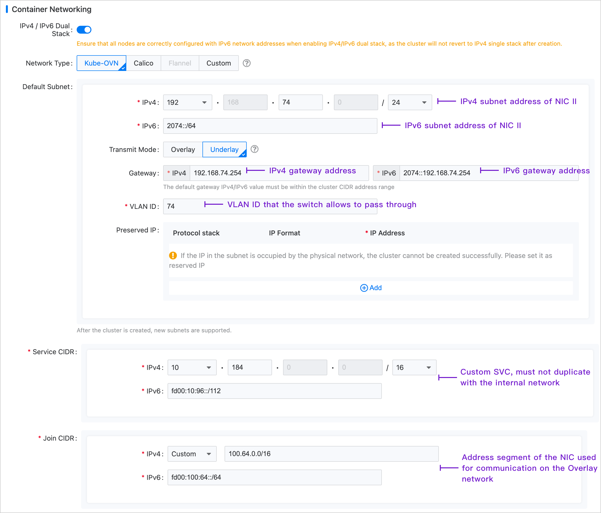

# Подготовка физической сети Kube-OVN Underlay

Сеть контейнеров в режиме транспортировки Kube-OVN Underlay зависит от поддержки физической сети. Перед развертыванием сети Kube-OVN Underlay, пожалуйста, сотрудничайте с администратором сети для планирования и завершения соответствующих конфигураций физической сети заранее, обеспечивая сетевое соединение.

## Инструкции по использованию

Kube-OVN Underlay требует развертывания с несколькими сетевыми интерфейсными картами (NIC), и подсеть Underlay должна использовать исключительно одну NIC. Никакие другие типы трафика, такие как SSH, не должны находиться на этой NIC; они должны использовать другие NIC.

Перед использованием убедитесь, что сервер узла имеет как минимум **двойную NIC** среду, и рекомендуется, чтобы скорость NIC была **не менее 10 Гбит/с или выше** (например, 10 Гбит/с, 25 Гбит/с, 40 Гбит/с).

- NIC Один: NIC с маршрутом по умолчанию, настроенный с IP-адресом, соединенный с интерфейсом внешнего коммутатора, который установлен в режим Access.

- NIC Два: NIC без маршрута по умолчанию и не настроенный с IP-адресом, соединенный с интерфейсом внешнего коммутатора, который установлен в режим Trunk. Подсеть Underlay использует исключительно NIC Два.


## Объяснение терминологии

VLAN (виртуальная локальная сеть) — это технология, которая логически делит локальную сеть на несколько сегментов (или меньших LAN) для облегчения обмена данными для виртуальных рабочих групп.

Появление технологии VLAN позволяет администраторам логически сегментировать различных пользователей в одной физической локальной сети на отдельные домены широковещательной рассылки на основе реальных потребностей приложения. Каждый VLAN включает группу рабочих станций с аналогичными требованиями и обладает теми же свойствами, что и физически сформированная LAN. Поскольку VLAN логически разделены, а не физически, рабочие станции в одном VLAN не ограничены одной физической областью; они могут находиться в разных физических сегментах LAN.

Основные преимущества VLAN включают:

- Сегментация портов. Даже на одном коммутаторе порты в разных VLAN не могут общаться друг с другом. Физический коммутатор может функционировать как несколько логических коммутаторов. Это обычно используется для контроля взаимного доступа между различными отделами и сайтами в сети.

- Сетевая безопасность. Разные VLAN не могут общаться напрямую, что устраняет небезопасность широковещательной информации. Широковещательный и уникастный трафик внутри VLAN не будет пересылаться в другие VLAN, что помогает контролировать трафик, снижать инвестиции в оборудование, упрощать управление сетью и повышать сетевую безопасность.

- Гибкое управление. При изменении сетевой принадлежности пользователя нет необходимости заменять порты или кабели; достаточно изменить конфигурацию программного обеспечения.

## Требования к окружению

В режиме Underlay Kube-OVN соединяет физическую NIC с OVS и отправляет пакеты напрямую на внешний интерфейс через эту физическую NIC. Возможности пересылки L2/L3 зависят от подлежащих сетевых устройств. Соответствующие шлюз, VLAN и политики безопасности должны быть предварительно настроены на подлежащих сетевых устройствах.

- **Требования к конфигурации сети**

  - Kube-OVN проверяет доступность шлюза через протокол ICMP при запуске контейнеров; подлежащий шлюз должен отвечать на ICMP-запросы.

  - Для трафика доступа к сервисам Pods сначала отправляют пакеты на шлюз, который должен иметь возможность пересылать пакеты обратно в локальную подсеть.

  - Когда на коммутаторе или мосту включена функция Hairpin, **Hairpin должен быть отключен**. Если используется среда виртуальной машины VMware, установите **Net.ReversePathFwdCheckPromisc** на хосте VMware в **1**, и Hairpin не нужно отключать.

  - Соединительная NIC **не может** быть **Linux Bridge**.

  - Режимы объединения NIC поддерживают режим 0 (balance-rr), режим 1 (active-backup), режим 4 (802.3ad), режим 6 (balance-alb), рекомендуется использовать 0 или 1. Другие режимы объединения не были протестированы; пожалуйста, используйте их с осторожностью.

- **Требования к конфигурации слоя IaaS (виртуализация)**

  - Для окружений VM OpenStack необходимо отключить **PortSecurity** для соответствующего сетевого порта.

  - Для сетей vSwitch VMware **MAC Address Changes**, **Forged Transmits** и **Promiscuous Mode Operation** должны быть установлены в **Accept**.

  - Для публичных облаков, таких как AWS, GCE и Alibaba Cloud, сети в режиме Underlay не могут быть поддержаны из-за отсутствия возможностей определения MAC-адресов пользователем.

## Пример конфигурации

Узлы в этом примере — это физические машины с двойной NIC. NIC Один — это NIC с маршрутом по умолчанию; NIC Два — это NIC без маршрута по умолчанию и не настроенный с IP-адресом, используемый исключительно для подсети Underlay. NIC Два соединен с внешним коммутатором.

- На стороне коммутатора интерфейс, подключенный к NIC Два, должен быть настроен в режиме Trunk, позволяя соответствующим VLAN проходить.

- Настройте адрес шлюза подсети кластера на соответствующем интерфейсе vlan-interface. Если требуется двойной стек, адрес IPv6 шлюза также можно настроить одновременно.

- Если шлюз находится за брандмауэром, доступ от узлов к сети cluster-cidr должен быть разрешен.

- Конфигурация для серверных NIC не требуется.

### Конфигурация коммутатора

Настройте интерфейс VLAN:

```
#
interface Vlan-interface74
  ip address 192.168.74.254 255.255.255.0   //IPv4 адрес шлюза
  ipv6 address 2074::192:168:74:254/64  //IPv6 адрес шлюза
#
```

Настройте интерфейс, подключенный к NIC Два:

```
#
interface Ten-GigabitEthernet1/0/19
  port link mode bridge
  port link-type trunk  // Настройте интерфейс в режим Trunk
  undo port trunk permit vlan 1
  port trunk permit vlan 74  // Разрешите соответствующему VLAN проходить
#
```

### Проверка сетевой доступности

Проверьте, может ли NIC Два общаться с адресом шлюза:

```
ip link add ens224.74 link ens224 type vlan id 74  // Имя NIC - ens224, а VLAN ID - 74
ip link set ens224.74 up
ip addr add 192.168.74.200/24 dev ens224.74  // Выберите тестовый адрес в подсети Underlay, здесь это 192.168.74.200/24
ping 192.168.74.254  // Если удается пинговать шлюз, это подтверждает, что физическая среда соответствует требованиям развертывания
ip addr del 192.168.74.200/24 dev ens224.74  // Удалите тестовый адрес после тестирования
ip link del ens224.74  // Удалите подинтерфейс после тестирования
```

### Конфигурация платформы

В левой боковой панели нажмите **Управление кластером > Кластер**, затем нажмите **Создать кластер**. Для конкретных шагов конфигурации, пожалуйста, обратитесь к документу [Создать кластер](), с конфигурацией сети контейнеров, показанной на изображении ниже.

**Примечание**: Подсеть Join не имеет практического значения в окружении Underlay и в основном служит для создания подсети Overlay позже, предоставляя диапазон IP-адресов, необходимый для связи между узлами и группами контейнеров.


