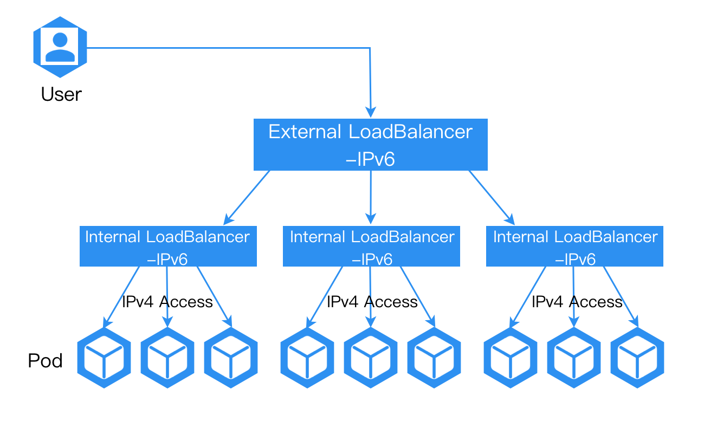

# Перенаправление трафика IPv6 на адреса IPv4 внутри кластера

С помощью конфигурации внешнего балансировщика нагрузки для кластера мы можем перенаправлять трафик IPv6 на внутренние адреса IPv4 внутри кластера. Это позволяет внедрить возможности IPv6 в существующую сеть IPv4, предоставляя большую гибкость и масштабируемость нашей архитектуре системы, а также лучшее удовлетворение разнообразных сетевых требований.

### Метод конфигурации

1. Настройте адрес IPv6 для узла, на котором находится балансировщик нагрузки.

2. Убедитесь, что у внешнего балансировщика нагрузки есть адрес IPv6, и проверьте, что трафик, обращающийся к адресу IPv6 балансировщика нагрузки, может быть перенаправлен на адрес IPv6 узла, где расположен балансировщик нагрузки.

После завершения вышеуказанной конфигурации услуги IPv4, размещенные на балансировщике нагрузки, могут предоставлять возможности внешнего доступа IPv6 через балансировщик нагрузки.

### Проверка результата

После конфигурации доступ к адресу IPv6 внешнего балансировщика нагрузки должен обеспечивать нормальный доступ к приложению.

