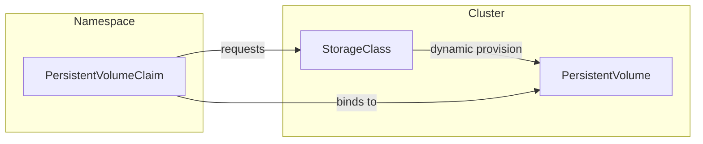

# Основные концепции

Хранение в Kubernetes сосредоточено на трех ключевых концепциях: **PersistentVolume (PV)**, **PersistentVolumeClaim (PVC)** и **StorageClass**. Эти концепции определяют, как запрашивается, выделяется и настраивается хранилище в кластере. Внутри системы драйверы **CSI** (Container Storage Interface) часто обрабатывают фактическое выделение и подключение хранилища. Давайте кратко рассмотрим каждую компоненту и затем выделим роль драйвера CSI.

## Постоянный том (PV)

**PersistentVolume (PV)** — это часть хранилища в кластере, которая была выделена (либо статически администратором, либо динамически через StorageClass). Он представляет собой базовое хранилище — например, диск у облачного провайдера или файловую систему, подключенную к сети — и рассматривается как ресурс в кластере, аналогично узлу.

## Запрос постоянного тома (PVC)

**PersistentVolumeClaim (PVC)** — это запрос на хранилище. Пользователи определяют, сколько хранилища им нужно, и режим доступа (например, чтение-запись). Если подходящий PV доступен или может быть динамически выделен (через StorageClass), PVC становится «связанным» с этим PV. После связывания Pods могут ссылаться на PVC для сохранения или совместного использования данных.

## StorageClass

**StorageClass** описывает *как* тома должны быть динамически выделены. Он соответствует конкретному провайдеру (часто драйверу CSI) и может включать параметры, такие как уровни хранения, характеристики производительности или другие настройки бэкенда. Создавая несколько StorageClass, вы можете предложить различные типы хранилища разработчикам.

*Диаграмма: Взаимосвязь между PVC, PV и StorageClass.*

## Интерфейс хранения контейнеров (CSI)

**Container Storage Interface (CSI)** — это стандартный API, который Kubernetes использует для интеграции с драйверами хранения. Он позволяет сторонним поставщикам хранилища создавать плагины вне дерева, что означает, что вы можете установить или обновить драйвер хранения, не изменяя сам Kubernetes.

Драйвер CSI обычно имеет две компоненты:

1. **Компонент контроллера**: Работает в кластере (часто как Deployment) и обрабатывает высокоуровневые операции, такие как **создание** или **удаление** томов. Для сетевого хранилища он также может обрабатывать подключение и отключение томов к узлам.

2. **Компонент узла**: Работает на каждом узле (часто как DaemonSet) и отвечает за **монтирование** и **размонтирование** тома на этом конкретном узле. Он взаимодействует с kubelet, чтобы обеспечить доступность тома для Pods.

Когда пользователь создает PVC, ссылаясь на StorageClass, использующий драйвер CSI, драйвер CSI наблюдает за этим запросом и выделяет хранилище соответствующим образом (если требуется динамическое выделение). После создания хранилища драйвер уведомляет Kubernetes, который создает соответствующий PV и связывает его с PVC. Каждый раз, когда Pod использует этот PVC, компонент узла драйвера обрабатывает монтирование тома, делая хранилище доступным внутри контейнера.

---

Используя **PV**, **PVC**, **StorageClass** и **CSI**, Kubernetes обеспечивает мощный декларативный подход к управлению хранилищем. Администраторы могут определить один или несколько StorageClass для представления различных бэкендов хранения или уровней производительности, в то время как разработчики просто запрашивают хранилище с помощью PVC — не беспокоясь о базовой инфраструктуре.
