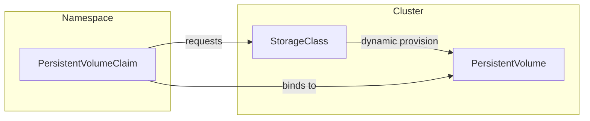

# Основные Концепции

Хранилище Kubernetes сосредоточено вокруг трех ключевых понятий: **PersistentVolume (PV)**, **PersistentVolumeClaim (PVC)** и **StorageClass**. Эти понятия определяют, как запрашивается, выделяется и настраивается хранилище в кластере. Внутри системы драйверы **CSI** (Container Storage Interface) обычно занимаются фактическим выделением и присоединением хранилища. Давайте кратко рассмотрим каждую из этих компонентов, а затем выделим роль драйвера CSI.

## Постоянный том (PV)

**PersistentVolume (PV)** — это часть хранилища в кластере, которая была выделена (либо статически администратором, либо динамически через StorageClass). Он представляет собой основное хранилище — например, диск у облачного провайдера или файловую систему, подключенную по сети — и рассматривается как ресурс в кластере, аналогично узлу.

## Запрос на постоянный том (PVC)

**PersistentVolumeClaim (PVC)** — это запрос на хранилище. Пользователи определяют, сколько хранилища им нужно, и режим доступа (например, чтение-запись). Если подходящий PV доступен или может быть динамически выделен (через StorageClass), PVC становится "связанным" с этим PV. После связывания Pods могут ссылаться на PVC для постоянного хранения или совместного использования данных.

## StorageClass

**StorageClass** описывает, *как* тома должны быть динамически подготовлены. Он сопоставляется с конкретным провайдером (часто драйвером CSI) и может включать параметры, такие как уровни хранилища, характеристики производительности или другие конфигурации бэкенда. Создавая несколько StorageClass, вы можете предложить разработчикам различные типы хранилища.

*Диаграмма: Отношение между PVC, PV и StorageClass.*

## Интерфейс хранения контейнера (CSI)

**Container Storage Interface (CSI)** — это стандартный API, который Kubernetes использует для интеграции с драйверами хранилища. Он позволяет сторонним провайдерам хранилища создавать плагины вне дерева, что означает, что вы можете устанавливать или обновлять драйвер хранилища, не изменяя сам Kubernetes.

Драйвер **CSI** обычно имеет две компоненты:

1. **Компонент контроллера**: Работает в кластере (часто как развертывание) и обрабатывает высокоуровневые операции, такие как **создание** или **удаление** томов. Для сетевого хранилища он также может обрабатывать присоединение и отсоединение томов от узлов.

2. **Компонент узла**: Работает на каждом узле (часто как DaemonSet) и отвечает за **подключение** и **отключение** тома на этом конкретном узле. Он взаимодействует с kubelet для обеспечения доступности тома для Pods.

Когда пользователь создает PVC, ссылаясь на StorageClass, использующий драйвер CSI, драйвер CSI наблюдает за этим запросом и выделяет хранилище соответствующим образом (если требуется динамическое выделение). Как только хранилище создано, драйвер уведомляет Kubernetes, который создает соответствующий PV и связывает его с PVC. Каждый раз, когда Pod использует этот PVC, компонент узла драйвера обрабатывает монтирование тома, делая хранилище доступным внутри контейнера.

---

Используя **PV**, **PVC**, **StorageClass** и **CSI**, Kubernetes предоставляет мощный декларативный подход к управлению хранилищем. Администраторы могут определить один или несколько StorageClass для представления различных бэкендов хранилища или уровней производительности, в то время как разработчики просто запрашивают хранилище, используя PVC — не беспокоясь о лежащей в основе инфраструктуре.
