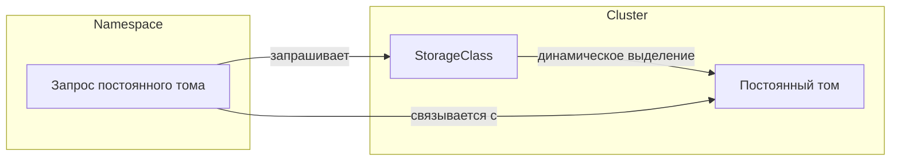

# Основные концепции

Хранение данных в Kubernetes сосредоточено вокруг трех ключевых понятий: **PersistentVolume (PV)**, **PersistentVolumeClaim (PVC)** и **StorageClass**. Эти понятия определяют, как запрашивается, выделяется и настраивается хранилище в кластере. В основе работы часто лежат драйверы **CSI** (Container Storage Interface), которые обрабатывают фактическоеProvisioning и подключение хранилища. Давайте кратко рассмотрим каждый компонент, а затем выделим роль драйвера CSI.

## Постоянный том (PV)

**PersistentVolume (PV)** — это часть хранилища в кластере, которая была выделена (либо статически администратором, либо динамически через StorageClass). Он представляет собой основное хранилище, такое как диск у облачного провайдера или файловая система, подключенная к сети, и рассматривается как ресурс в кластере, подобно узлу.

## Запрос постоянного тома (PVC)

**PersistentVolumeClaim (PVC)** — это запрос на хранилище. Пользователи определяют, сколько хранилища им нужно и режим доступа (например, чтение-запись). Если соответствующий PV доступен или может быть динамически выделен (через StorageClass), PVC «связывается» с этим PV. После связывания Pods могут ссылаться на PVC для сохранения или обмена данными.

## StorageClass

**StorageClass** описывает, *как* тома должны быть динамически выделены. Он соответствует конкретному провайдеру (часто драйверу CSI) и может включать такие параметры, как уровни хранилища, характеристики производительности или другие настройки бэкенда. Создавая несколько StorageClass, вы можете предложить разработчикам различные типы хранилищ.

*Диаграмма: Взаимосвязь между PVC, PV и StorageClass.*

## Интерфейс контейнерного хранилища (CSI)

**Container Storage Interface (CSI)** — это стандартный API, который Kubernetes использует для интеграции с драйверами хранилища. Он позволяет сторонним поставщикам хранилищ создавать плагины вне дерева, что означает, что вы можете установить или обновить драйвер хранения без изменения самого Kubernetes.

Драйвер CSI обычно состоит из двух компонентов:

1. **Компонент контроллера**: Запускается в кластере (часто как Deployment) и обрабатывает операции высокого уровня, такие как **создание** или **удаление** томов. Для сетевого хранилища он также может обрабатывать подключение и отключение томов к узлам.

2. **Компонент узла**: Запускается на каждом узле (часто как DaemonSet) и отвечает за **монтирование** и **размонтирование** тома на этом конкретном узле. Он взаимодействует с kubelet, чтобы обеспечить доступ к тому для Pods.

Когда пользователь создает PVC ссылаясь на StorageClass, использующий драйвер CSI, драйвер CSI наблюдает за этим запросом и соответственно выделяет хранилище (если требуется динамическое выделение). После создания хранилища драйвер уведомляет Kubernetes, который создает соответствующий PV и связывает его с PVC. Каждый раз, когда Pod использует этот PVC, компонент узла драйвера обрабатывает монтирование тома, делая хранилище доступным внутри контейнера.

---

Используя **PV**, **PVC**, **StorageClass** и **CSI**, Kubernetes обеспечивает мощный декларативный подход к управлению хранилищем. Администраторы могут определить один или несколько StorageClass для представления различных бэкендов хранения или уровней производительности, в то время как разработчики просто запрашивают хранилище, используя PVC, не беспокоясь о внутренней инфраструктуре.
