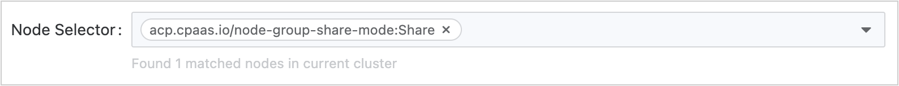

# Создание Deployments

**Deployment** – это контроллер рабочих нагрузок Kubernetes, который декларативно управляет жизненным циклом контейнеризованных приложений. Он позволяет вам развертывать и управлять реплицированными Pod'ами с автоматическими развертываниями/откатами, масштабированием и функциями самовосстановления. В архитектуре микросервисов вы можете организовать несколько Deployments в одном Kubernetes приложении для реализации различных микросервисов, что делает их особенно подходящими для безсостояний рабочих нагрузок, которые требуют горизонтального масштабирования и контроля версий.

## Предварительные требования

Получите адрес изображения. Источник изображений может быть из репозитория изображений, интегрированного администратором платформы через конвейер инструментов, или из репозиториев изображений сторонних платформ.

- В первом случае администратор обычно назначает репозиторий изображений для вашего проекта, и вы можете использовать изображения внутри него. Если требуемый репозиторий изображений не найден, пожалуйста, свяжитесь с администратором для его выделения.

- Если это репозиторий изображений сторонней платформы, убедитесь, что изображения могут быть извлечены напрямую из него в текущем кластере.

<a id="updatepolicy" />

## Процедура 1 - Настройка основной информации

1. **Контейнерная платформа**, перейдите в **Рабочие нагрузки** > **Deployments** в левом боковом меню.

2. Нажмите **Создать Deployment**.

3. **Выберите** или **введите** изображение и нажмите **Подтвердить**.

:::info
**Примечание**: При использовании изображений из репозитория изображений, интегрированного в веб-консоль, вы можете фильтровать изображения по **Уже интегрированные**. Название интеграционного проекта, например, изображения (docker-registry-projectname), содержит имя проекта projectname в этой веб-консоли и название проекта containers в репозитории изображений.
:::

4. В разделе **Основная информация** настройте декларативные параметры для рабочих нагрузок Deployment:

   | **Параметры**                  | **Описание**                                                                                                                                                                                                                                                                                                                                                                                                                                                                                                                                                                                                                                                                                                                                                                                                                                                                                                                                                                                                                                                                                                                                                                                                                                                                                                                                                                                                                                                                                                                           |
   | :------------------------------ | :----------------------------------------------------------------------------------------------------------------------------------------------------------------------------------------------------------------------------------------------------------------------------------------------------------------------------------------------------------------------------------------------------------------------------------------------------------------------------------------------------------------------------------------------------------------------------------------------------------------------------------------------------------------------------------------------------------------------------------------------------------------------------------------------------------------------------------------------------------------------------------------------------------------------------------------------------------------------------------------------------------------------------------------------------------------------------------------------------------------------------------------------------------------------------------------------------------------------------------------------------------------------------------------------------------------------------------------------------------------------------------------------------------------------------------------------------------------------------------------------------------------------------------- |
   | **Реплики**                    | Определяет желаемое количество реплик Pod в Deployment (по умолчанию: `1`). Регулируйте в зависимости от требований к рабочей нагрузке.                                                                                                                                                                                                                                                                                                                                                                                                                                                                                                                                                                                                                                                                                                                                                                                                                                                                                                                                                                                                                                                                                                                                                                                                                                                                                                                                                                                                                    |
   | **Дополнительно** > **Стратегия обновления** | Настройка стратегии `rollingUpdate` для развертываний с нулевым простоем:    **Максимальное количество** (`maxSurge`):  <ul><li>Максимальное количество Pod'ов, которые могут превышать желаемое количество реплик во время обновления. </li><li> Принимает абсолютные значения (например, `2`) или проценты (например, `20%`). </li><li> Расчет процента: `ceil(current_replicas × percentage)`. </li><li>Пример: 4.1 → `5` при расчете из 10 реплик. </li></ul> **Максимальное количество недоступных** (`maxUnavailable`): <ul><li> Максимальное количество Pod'ов, которые могут быть временно недоступны во время обновления.  </li><li>Процентные значения не могут превышать `100%`.  </li><li> Расчет процента: `floor(current_replicas × percentage)`.   </li><li> Пример: 4.9 → `4` при расчете из 10 реплик.  </li></ul> **Примечания**:   1. **Значения по умолчанию**: `maxSurge=1`, `maxUnavailable=1`, если не указано явно.    2. **Недоступные Pod'ы** (например, в состояниях `Pending`/`CrashLoopBackOff`) считаются недоступными.    3. **Одновременные ограничения**: <ul><li> `maxSurge` и `maxUnavailable` не могут быть оба `0` или `0%`. </li><li>Если процентные значения решаются в `0` для обоих параметров, Kubernetes принудительно устанавливает `maxUnavailable=1`, чтобы обеспечить прогресс обновления.  </li></ul> **Пример**:   Для Deployment с 10 репликами:  <ul><li> `maxSurge=2` → Всего Pod'ов во время обновления: `10 + 2 = 12`. </li><li>`maxUnavailable=3` → Минимальное количество доступных Pod'ов: `10 - 3 = 7`. </li><li> Это гарантирует доступность, обеспечивая контролируемое развертывание. </li></ul> |

<a id="configurepod" />

## Процедура 2 - Настройка Pod

**Примечание**: В смешанных кластерах архитектуры, развертывающих изображения одной архитектуры, убедитесь, что правильно настроены [Правила привязки узлов](#schuconf) для планирования Pod'ов.

1. В разделе **Pod** настройте параметры контейнерного запуска и управления жизненным циклом:

   | **Параметры**          | **Описание**                                                                                                                                                                                                                                                                                         |
   | :---------------------- | :------------------------------------------------------------------------------------------------------------------------------------------------------------------------------------------------------------------------------------------------------------------------------------------------------ |
   | **Том**                 | Монтирует постоянные тома в контейнерах. Поддерживаемые типы томов включают `PVC`, `ConfigMap`, `Secret`, `emptyDir`, `hostPath` и т. д. Для подробностей реализации смотрите [Руководство по монтированию томов](#pvmount).                                                                                               |
   | **Учетные данные изображения**   | Требуются **только** при извлечении изображений из сторонних реестров (через ручной ввод URL изображения).   **Примечание**: Изображения из интегрированного реестра платформы автоматически наследуют связанные секреты.                                                                                               |
   | **Период завершения**   | Продолжительность (по умолчанию: `30s`), разрешенная для Pod для завершения корректного завершения работы после получения сигнала о завершении.   - В течение этого времени Pod завершает текущие запросы и освобождает ресурсы.   - Установка `0` принудительно удаляет (SIGKILL), что может вызвать прерывания запросов. |

<a id="schuconf" />

2. **Правила привязки узлов**
   | **Параметры**               | **Описание**                                                                                                                                                                                                                                                                                                                                                                                                                                                                                                                                                                                                                                                                                                                                                                                       |
   | :--------------------------- | :---------------------------------------------------------------------------------------------------------------------------------------------------------------------------------------------------------------------------------------------------------------------------------------------------------------------------------------------------------------------------------------------------------------------------------------------------------------------------------------------------------------------------------------------------------------------------------------------------------------------------------------------------------------------------------------------------------------------------------------------------------------------------------------------------- |
   | **Дополнительно** > **Выбор узла** | Ограничивает Pod'ы узлам с конкретными метками (например, `kubernetes.io/os: linux`).                                                                                                                                                                                                                                                                                                                                                                                                                                                                                                                                                                                  |
   | **Дополнительно** > **Привязка**      | Определите детализированные правила планирования на основе существующих Pod'ов:   **Типы привязки Pod'ов**: <ul><li> **Привязка между Pod'ами**: Запланируйте новые Pod'ы на узлы, размещающие конкретные Pod'ы (одна и та же топологическая доменная область). </li><li> **Анти-привязка между Pod'ами**: Предотвращает совместное размещение новых Pod'ов с конкретными Pod'ами. </li></ul> **Режимы выполнения**:  <ul><li> **RequiredDuringSchedulingIgnoredDuringExecution**: Pod'ы планируются *только* если правила выполнены.  </li><li> **PreferredDuringSchedulingIgnoredDuringExecution**: Приоритет узлов, соответствующих правилам, но допускает исключения. </li></ul>**Поля конфигурации**:    <ul><li>`topologyKey`: метка узла, определяющая топологические доменные области (по умолчанию: `kubernetes.io/hostname`).  </li><li>`labelSelector`: Фильтры целевых Pod'ов с использованием запросов меток.  </li></ul> |

3. **Сетевые настройки**
   - Kube-OVN
     | **Параметры**        | **Описание**                                                                                                                                                                                                                    |
     | :-------------------- | :--------------------------------------------------------------------------------------------------------------------------------------------------------------------------------------------------------------------------------- |
     | **Ограничения полосы пропускания**  | Обеспечивает QoS для сетевого трафика Pod:  <ul><li>**Лимит скорости исходящего трафика**: Максимальная скорость исходящего трафика (например, `10Mbps`). </li><li>**Лимит скорости входящего трафика**: Максимальная скорость входящего трафика.</li></ul>                                      |
     | **Подсеть**            | Назначает IP-адреса из заранее определенного пула подсетей. Если не указано, используется подсеть по умолчанию для пространства имен.                                                                                                                                     |
     | **Статический IP-адрес** | Привязка постоянных IP-адресов к Pod'ам:  <ul><li>Несколько Pod'ов из разных Deployments могут заявлять один и тот же IP, но только один Pod может использовать его одновременно.  </li><li>**Критично**: Количество статических IP-адресов должно быть ≥ количество реплик Pod'ов. </li></ul> |

   - Calico
     | **Параметры**        | **Описание**                                                                                                                                                                         |
     | :-------------------- | :-------------------------------------------------------------------------------------------------------------------------------------------------------------------------------------- |
     | **Статический IP-адрес** | Присвоение фиксированных IP-адресов с строгой уникальностью:  <ul><li>Каждый IP может быть привязан **только к одному Pod** в кластере.  </li><li> **Критично**: Количество статических IP должно быть ≥ количество реплик Pod'ов.</li></ul> |

<a id="configurecontainers" />

## Процедура 3 - Настройка контейнеров

1. В разделе **Контейнер** ознакомьтесь со следующими инструкциями для настройки соответствующей информации.
   | **Параметры**                         | **Описание**                                                                                                                                                                                                                                                                                                                                                                                                                                                                                                                                                                                                                                                                                                                                                                                                                                                                                         |
   | :------------------------------------- | :------------------------------------------------------------------------------------------------------------------------------------------------------------------------------------------------------------------------------------------------------------------------------------------------------------------------------------------------------------------------------------------------------------------------------------------------------------------------------------------------------------------------------------------------------------------------------------------------------------------------------------------------------------------------------------------------------------------------------------------------------------------------------------------------------------------------------------------------------------------------------------------------------ |
   | **Запросы и ограничения ресурсов**         | <ul><li>**Запросы**: Минимальное количество процессорных ресурсов/памяти, необходимое для работы контейнера.</li><li>**Ограничения**: Максимальное количество процессорных ресурсов/памяти, допустимое во время выполнения контейнера. Для определения единиц смотрите [Единицы ресурсов](/developer/overview/concepts/unit.mdx).</li></ul>**Коэффициент перевыполнения для пространства имен**:<ul><li>**Без коэффициента перевыполнения**: Если существуют квоты ресурсов пространства имен: Запросы/ограничения контейнера наследуют значения по умолчанию для пространства имен (изменяемые).  Нет квот для пространства имен: Нет значений по умолчанию; пользовательский запрос.</li><li>**С коэффициентом перевыполнения**: Запросы автоматически рассчитываются как `Limits / Коэффициент перевыполнения` (неизменяемые).</li></ul> **Ограничения**:<ul><li>Запрос ≤ Ограничение ≤ Максимальное значение квоты пространства имен.</li><li>Изменения коэффициента перевыполнения требуют повторного создания pod для применения.</li><li>Коэффициент перевыполнения отключает ручную настройку запросов.</li><li>Нет квот для пространства имен → нет ограничений на ресурсы контейнера.</li></ul> |
   | **Расширенные ресурсы**                 | Настройка доступных в кластере расширенных ресурсов (например, vGPU, pGPU).                                                                                                                                                                                                                                                                                                                                                                                                                                                                                                                                                                                                                                                                                                                                                                                                                                      |
   | **Монтирование тома**                       | Настройка постоянного хранения. Смотрите [Инструкции по монтированию хранилища](#pvmount). **Операции**:<ul><li>Существующие тома pod: нажмите **Добавить**</li><li>Нет томов pod: нажмите **Добавить и смонтировать**</li></ul>**Параметры**:<ul><li>`mountPath`: путь к файловой системе контейнера (например, `/data`)</li><li>`subPath`: относительный путь к файлу/каталогу внутри тома.  Для `ConfigMap`/`Secret`: выберите конкретный ключ</li><li>`readOnly`: монтирование как доступное только для чтения (по умолчанию: доступен для записи)</li></ul>Смотрите [Кубернетес тома](https://kubernetes.io/docs/concepts/storage/volumes/).                                                                                                                                                                                                                                                                                                                                   |
   | **Порт**                               | Открыть порты контейнера. **Пример**: Открыть TCP порт `6379` с именем `redis`. **Поля**:<ul><li>`protocol`: TCP/UDP</li><li>`Port`: Открываемый порт (например, `6379`)</li><li>`name`: Имя, соответствующее требованиям DNS (например, `redis`)</li></ul>                                                                                                                                                                                                                                                                                                                                                                                                                                                                                                                                                                                                                                                          |
   | **Команды и аргументы запуска**       | Переопределить значения по умолчанию ENTRYPOINT/CMD: **Пример 1**: Выполнить `top -b` - **Команда**: `["top", "-b"]` - **ИЛИ** Команда: `["top"]`, Аргументы: `["-b"]` **Пример 2**: Вывод `$MESSAGE`: `/bin/sh -c "while true; do echo $(MESSAGE); sleep 10; done"` Смотрите [Определение команд](https://kubernetes.io/docs/tasks/inject-data-application/define-command-argument-container/).                                                                                                                                                                                                                                                                                                                                                                                                                                                                                                         |
   | **Дополнительно** > **Переменные окружения**   | <ul><li>Статические значения: Непосредственные пары ключ-значение</li><li>Динамические значения: Ссылки на ключи ConfigMap/Secret, поля pod (`fieldRef`), ресурсные метрики (`resourceFieldRef`)</li></ul>**Примечание**: Переменные окружения переопределяют настройки изображения/файла конфигурации.                                                                                                                                                                                                                                                                                                                                                                                                                                                                                                                                                                                                                                                      |
   | **Дополнительно** > **Ссылаемый ConfigMap**    | Инъекция всего ConfigMap/Secret в качестве переменных окружения. Поддерживаемые типы Secret: `Opaque`, `kubernetes.io/basic-auth`.                                                                                                                                                                                                                                                                                                                                                                                                                                                                                                                                                                                                                                                                                                                                                                                          |
   | **Дополнительно** > **Проверки состояния**           | <ul><li>**Проверка жизнеспособности**: Обнаружение состояния контейнера (перезагрузить в случае сбоя)</li><li>**Проверка готовности**: Обнаружение доступности услуги (удалить из конечных точек в случае сбоя)</li></ul>Смотрите [Параметры проверки состояния](#healthcheck).                                                                                                                                                                                                                                                                                                                                                                                                                                                                                                                                                                                                                                                                              |
   | **Дополнительно** > **Log File**                | Настройка путей к журналам: - По умолчанию: Сбор `stdout` - Шаблоны файлов: например, `/var/log/*.log` **Требования**:<ul><li>Драйвер хранения `overlay2`: Поддерживается по умолчанию</li><li>`devicemapper`: Вручную смонтировать EmptyDir в директорию журнала</li><li>Windows узлы: Обязательно смонтируйте родительскую директорию (например, `c:/a` для `c:/a/b/c/*.log`)</li></ul>                                                                                                                                                                                                                                                                                                                                                                                                                                                                                                                                               |
   | **Дополнительно** > **Исключить файл журнала**        | Исключите определенные журналы из сбора (например, `/var/log/aaa.log`).                                                                                                                                                                                                                                                                                                                                                                                                                                                                                                                                                                                                                                                                                                                                                                                                                                       |
   | **Дополнительно** > **Выполнить перед остановкой** | Выполните команды перед завершением контейнера. **Пример**: `echo "stop"` **Примечание**: Время выполнения команд должно быть короче, чем `terminationGracePeriodSeconds` у pod.                                                                                                                                                                                                                                                                                                                                                                                                                                                                                                                                                                                                                                                                                                                        |

2. Нажмите **Добавить контейнер** (в верхнем правом углу) ИЛИ **Добавить Init контейнер**.

   Смотрите [Init контейнеры](https://kubernetes.io/docs/concepts/workloads/pods/init-containers/).
   Init контейнер:

   1. Запускается перед контейнерами приложений (последовательное выполнение).
   2. Освобождает ресурсы после завершения.
   3. Удаление разрешено, когда:
      - Pod имеет >1 приложение контейнер AND ≥1 init контейнер.
      - Не допускается для pod с одним контейнером приложения.

3. Нажмите **Создать**.

## Справочная информация​

<a id="pvmount" />

### Инструкции по монтированию томов хранения

| **Тип**                    | **Назначение**                                                                                                                                                                                                                                                                                           |
| :-------------------------- | :---------------------------------------------------------------------------------------------------------------------------------------------------------------------------------------------------------------------------------------------------------------------------------------------------- |
| **Запрос постоянного тома** | Привязывает существующий [PVC](/developer/building_application/functions/preparation_before_creating/add_pvc.mdx) для запроса постоянного хранилища. **Примечание**: Только привязанные PVC (с связанным PV) доступны для выбора. Непривязанные PVC вызовут ошибки создания pod.                                          |
| **ConfigMap**               | Монтирует полные/частичные данные [ConfigMap](/developer/building_application/functions/preparation_before_creating/add_configmap.mdx) в качестве файлов:<ul><li>Полный ConfigMap: Создает файлы с именами ключей под путём монтирования</li><li>Выбор подкаталога: Монтировать конкретный ключ (например, `my.cnf`)</li></ul>               |
| **Secret**                  | Монтирует полные/частичные данные [Secret](/developer/building_application/functions/preparation_before_creating/add_secret.mdx) в качестве файлов:<ul><li>Полный Secret: Создает файлы с именами ключей под путём монтирования</li><li>Выбор подкаталога: Монтировать конкретный ключ (например, `tls.crt`)</li></ul>                       |
| **Эфемерные тома**         | Временный том, предоставленный кластером с функциями:<ul><li> Динамическое предоставление</li><li>Связь с жизненным циклом pod</li><li>Поддержка декларативной настройки</li></ul>**Сценарий использования**: Временное хранилище данных. Смотрите [PVC](/developer/building_application/functions/preparation_before_creating/add_pvc.mdx) |
| **Пустая директория**      | эфемерное хранилище, которое разделяется между контейнерами в одном pod: - Создается на узле, когда pod запускается - Удаляется при удалении pod **Сценарий использования**: Обмен файлами между контейнерами, временное хранилище данных.                                                                                              |
| **Host Path**               | Монтирует директорию хост-машины (должна начинаться с `/`, например, `/volumepath`).                                                                                                                                                                                                                             |

<a id="healthcheck" />

### Параметры проверки состояния

#### Общие параметры

| **Параметры**        | **Описание**                                                                                                                              |
| :-------------------- | :------------------------------------------------------------------------------------------------------------------------------------------- |
| **Первоначальная задержка**     | Период ожидания (в секундах) перед началом проверок. По умолчанию: `300`.                                                                               |
| **Период**            | Интервал проверки (1-120с). По умолчанию: `60`.                                                                                                      |
| **Тайм-аут**           | Период тайм-аута проверки (1-300с). По умолчанию: `30`.                                                                                              |
| **Порог успешности** | Минимальное количество последовательных успешных проверок для пометке как здоровый. По умолчанию: `0`.                                                                                 |
| **Порог фактов** | Максимальное количество последовательных неудач для инициирования действия: - `0`: Отключает действия на основе неудач - По умолчанию: `5` неудач → перезапуск контейнера. |

#### Параметры, специфичные для протокола

| **Параметр**    | **Применимые протоколы** | **Описание**                                                                                                                                              |
| :--------------- | :----------------------- | :----------------------------------------------------------------------------------------------------------------------------------------------------------- |
| **Протокол**     | HTTP/HTTPS               | Протокол проверки состояния                                                                                                                                        |
| **Порт**         | HTTP/HTTPS/TCP           | Целевой порт контейнера для проверки.                                                                                                                           |
| **Путь**         | HTTP/HTTPS               | Путь конечной точки (например, `/healthz`).                                                                                                                            |
| **HTTP заголовки** | HTTP/HTTPS               | Пользовательские заголовки (добавьте пары ключ-значение).                                                                                                                        |
| **Команда**      | EXEC                     | Команда проверки, исполняемая контейнером (например, `sh -c "curl -I localhost:8080 \| grep OK"`). **Примечание**: Экранируйте специальные символы и проверяйте работоспособность команды. |
