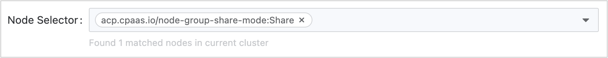

# Развертывания

## Понимание развертываний

Смотрите официальную документацию Kubernetes: [Развертывания](https://kubernetes.io/docs/concepts/workloads/controllers/deployment/)

> **Развертывание** — это ресурс более высокого уровня в Kubernetes, используемый для декларативного управления и обновления реплик Pod для ваших приложений. Он предоставляет надежный и гибкий способ определения того, как должно работать ваше приложение, включая количество поддерживаемых реплик и безопасное выполнение поэтапных обновлений.

**Развертывание** — это объект в API Kubernetes, который управляет Pod и ReplicaSet. Когда вы создаете развертывание, Kubernetes автоматически создает ReplicaSet, который затем отвечает за поддержание указанного количества реплик Pod.

**Используя развертывания, вы можете**:

- Декларативное управление: Определите желаемое состояние вашего приложения, и Kubernetes автоматически гарантирует, что фактическое состояние кластера соответствует желаемому состоянию.
- Контроль версий и откат: Отслеживайте каждую ревизию развертывания и легко откатывайтесь к предыдущей стабильной версии, если возникают проблемы.
- Обновления без простоев: Постепенно обновляйте ваше приложение, используя стратегию поэтапного обновления без прерывания обслуживания.
- Самовосстановление: Развертывания автоматически заменяют экземпляры Pod, если они аварийно завершились, были завершены или удалены с узла, обеспечивая, чтобы указанное количество Pods всегда было доступно.

**Как это работает**:

1. Вы определяете желаемое состояние вашего приложения через развертывание (например, какой образ использовать, сколько реплик запустить).
2. Развертывание создает ReplicaSet, чтобы гарантировать, что указанное количество Pods работает.
3. ReplicaSet создает и управляет фактическими экземплярами Pod.
4. Когда вы обновляете развертывание (например, изменяете версию образа), развертывание создает новый ReplicaSet и постепенно заменяет старые Pods новыми в соответствии с предопределенной стратегией поэтапного обновления, пока все новые Pods не начнут работать, затем оно удаляет старый ReplicaSet.

## Создание развертываний

### Создание развертываний с помощью CLI

#### Предварительные требования

- Убедитесь, что у вас настроен `kubectl` и он подключен к вашему кластеру.

#### Пример файла YAML

```yaml
# example-deployment.yaml
apiVersion: apps/v1
kind: Deployment
metadata:
  name: nginx-deployment # Имя развертывания
  labels:
    app: nginx   # Метки для идентификации и выбора
spec:
  replicas: 3    # Желаемое количество реплик Pod
  selector:
    matchLabels:
      app: nginx  # Селектор для соответствия Pods, управляемым этим развертыванием
  template:
    metadata:
      labels:
        app: nginx          # Метки Pod, должны соответствовать selector.matchLabels
    spec:
      containers:
      - name: nginx
        image: nginx:1.14.2 # Образ контейнера
        ports:
        - containerPort: 80 # Открытый порт контейнера
        resources:          # Ограничения и запросы ресурсов
          requests:
            cpu: 100m
            memory: 128Mi
          limits:
            cpu: 200m
            memory: 256Mi
```

#### Создание развертываний через YAML

```bash
# Шаг 1: Создание развертывания через yaml 
kubectl apply -f example-deployment.yaml 

# Шаг 2: Проверьте статус развертывания
kubectl get deployment example-deployment.yaml # Просмотр развертывания
kubectl get pod -l app=nginx # Просмотр Pods, созданных этим развертыванием
```

### Создание развертываний с помощью веб-консоли

#### Предварительные требования

Получите адрес образа. Источник образов может быть из репозитория образов, интегрированного администратором платформы через цепочку инструментов, или из репозиториев образов сторонних платформ.

- В первом случае администратор обычно назначает репозиторий образов вашему проекту, и вы можете использовать образы в нем. Если необходимый репозиторий образов не найден, пожалуйста, свяжитесь с администратором для его выделения.

- Если это репозиторий образов сторонней платформы, убедитесь, что образы могут быть извлечены непосредственно из него в текущем кластере.

<a id="updatepolicy" />

#### Процедура - Настройка основной информации

1. **Платформа контейнеров**, перейдите в **Нагрузки** > **Развертывания** в левой боковой панели.

2. Нажмите на **Создать развертывание**.

3. **Выберите** или **введите** образ и нажмите **Подтвердить**.

:::info
**Примечание**: При использовании образов из репозитория образов, интегрированного в веб-консоль, вы можете фильтровать образы по **Уже интегрированным**. **Имя интеграционного проекта**, например, образы (docker-registry-projectname), которые включают имя проекта projectname в этой веб-консоли и имя проекта containers в репозитории образов.
:::

4. В разделе **Основная информация** настройте декларативные параметры для рабочих нагрузок развертывания:

   | **Параметры**                 | **Описание**                                                                                                                                                                                                                                                                                                                                                                                                                                                                                                                                                                                                                                                                                                                                                                                                                                                                                                                                                                                                                                                                                                                                                                                                                                                                                                                                                                                                                                                                                                                         |
   | :----------------------------- | :-------------------------------------------------------------------------------------------------------------------------------------------------------------------------------------------------------------------------------------------------------------------------------------------------------------------------------------------------------------------------------------------------------------------------------------------------------------------------------------------------------------------------------------------------------------------------------------------------------------------------------------------------------------------------------------------------------------------------------------------------------------------------------------------------------------------------------------------------------------------------------------------------------------------------------------------------------------------------------------------------------------------------------------------------------------------------------------------------------------------------------------------------------------------------------------------------------------------------------------------------------------------------------------------------------------------------------------------------------------------------------------------------------------------------------------------------------------------------------------------------------------------------------------- |
   | **Реплики**                   | Определяет желаемое количество реплик Pod в развертывании (по умолчанию: `1`). Настройте в зависимости от требований нагрузки.                                                                                                                                                                                                                                                                                                                                                                                                                                                                                                                                                                                                                                                                                                                                                                                                                                                                                                                                                                                                                                                                                                                                                                                                                                                                                                                                                                                                                     |
   | **Дополнительно** > **Стратегия обновления** | Настройка стратегии `rollingUpdate` для развертываний без простоев: <br />  **Максимальный прирост** (`maxSurge`):  <ul><li>Максимальное количество Pods, которое может превышать желаемое количество реплик во время обновления. </li><li> Принимает абсолютные значения (например, `2`) или проценты (например, `20%`). </li><li> Расчет процента: `ceil(current_replicas × percentage)`. </li><li>Пример: 4.1 → `5`, когда рассчитывается из 10 реплик. </li></ul> **Максимальная недоступность** (`maxUnavailable`): <ul><li> Максимальное количество Pods, которые могут быть временно недоступны во время обновления.  </li><li>Процентные значения не могут превышать `100%`.  </li><li> Расчет процента: `floor(current_replicas × percentage)`.   </li><li> Пример: 4.9 → `4`, когда рассчитывается из 10 реплик.  </li></ul> **Примечания**: <br /> 1. **Значения по умолчанию**: `maxSurge=1`, `maxUnavailable=1`, если не установлены явно.  <br /> 2. **Не работающие Pods** (например, в состояниях `Pending`/`CrashLoopBackOff`) считаются недоступными.  <br /> 3. **Одновременные ограничения**: <ul><li> `maxSurge` и `maxUnavailable` не могут быть одновременно `0` или `0%`. </li><li>Если процентные значения приводят к `0` для обоих параметров, Kubernetes принудительно устанавливает `maxUnavailable=1`, чтобы обеспечить прогресс обновления.  </li></ul> **Пример**: <br /> Для развертывания с 10 репликами: <br /><ul><li> `maxSurge=2` → Всего Pods во время обновления: `10 + 2 = 12`. </li><li>`maxUnavailable=3` → Минимальное количество доступных Pods: `10 - 3 = 7`. </li><li> Это обеспечивает доступность, позволяя контролируемый разворот. </li></ul> |

<a id="configurepod" />

#### Процедура - Настройка Pod

**Примечание**: В кластерах с смешанной архитектурой, развертывающих образы единой архитектуры, убедитесь, что правильно настроены [Правила привязки узлов](#schuconf) для планирования Pod.

1. В разделе **Pod** настройте параметры времени выполнения контейнера и управления жизненным циклом:

   | **Параметры**         | **Описание**                                                                                                                                                                                                                                                                                         |
   | :--------------------- | :------------------------------------------------------------------------------------------------------------------------------------------------------------------------------------------------------------------------------------------------------------------------------------------------------ |
   | **Тома**            | Монтирование постоянных томов в контейнеры. Поддерживаемые типы томов включают `PVC`, `ConfigMap`, `Secret`,`emptyDir`, `hostPath` и т.д. Для деталей реализации смотрите [Руководство по монтированию томов](#pvmount).                                                                                               |
   | **Учетные данные образа**   | Требуется **только** при извлечении образов из сторонних реестров (через ввод URL образа вручную). <br /> **Примечание**: Образы из интегрированного реестра платформы автоматически наследуют связанные секреты.                                                                                               |
   | **Период завершения** | Продолжительность (по умолчанию: `30s`), разрешенная для Pod для завершения корректного завершения после получения сигнала завершения. <br /> - В течение этого периода Pod завершает текущие запросы и освобождает ресурсы. <br /> - Установка `0` принудительно удаляет (SIGKILL), что может вызвать прерывание запросов. |

<a id="schuconf" />

2. **Правила привязки узлов**
   | **Параметры**               | **Описание**                                                                                                                                                                                                                                                                                                                                                                                                                                                                                                                                                                                                                                                                                                                                                                                       |
   | :--------------------------- | :---------------------------------------------------------------------------------------------------------------------------------------------------------------------------------------------------------------------------------------------------------------------------------------------------------------------------------------------------------------------------------------------------------------------------------------------------------------------------------------------------------------------------------------------------------------------------------------------------------------------------------------------------------------------------------------------------------------------------------------------------------------------------------------------------- |
   | **Дополнительно** > **Селектор узлов** | Ограничьте Pods узлам с определенными метками (например, `kubernetes.io/os: linux`). <br />                                                                                                                                                                                                                                                                                                                                                                                                                                                                                                                                                                                                                                                               |
   | **Дополнительно** > **Привязанность**      | Определите детализированные правила планирования на основе существующих Pods: <br /> **Типы привязанности Pod**: <ul><li> **Привязанность между Pods**: Запланируйте новые Pods на узлы, хранящие определенные Pods (одинаковая топологическая домена). </li><li> **Анти-привязанность между Pods**: Предотвратите совместное размещение новых Pods с определенными Pods. </li></ul> **Режимы принуждения**:  <ul><li> **RequiredDuringSchedulingIgnoredDuringExecution**: Pods планируются *только* если правила соблюдены.  </li><li> **PreferredDuringSchedulingIgnoredDuringExecution**: Приоритизируйте узлы, соответствующие правилам, но допускайте исключения. </li></ul>**Поля конфигурации**:  <br /> <ul><li>`topologyKey`: Метка узла, определяющая топологические домены (по умолчанию: `kubernetes.io/hostname`).  </li><li>`labelSelector`: Фильтры целевых Pods с использованием запросов меток.  </li></ul> |

3. **Сетевая конфигурация**
   - Kube-OVN
     | **Параметры**        | **Описание**                                                                                                                                                                                                                    |
     | :-------------------- | :--------------------------------------------------------------------------------------------------------------------------------------------------------------------------------------------------------------------------------- |
     | **Ограничения пропускной способности**  | Обеспечьте QoS для сетевого трафика Pod:  <ul><li>**Ограничение скорости исходящего трафика**: Максимальная скорость исходящего трафика (например, `10Mbps`). </li><li>**Ограничение скорости входящего трафика**: Максимальная скорость входящего трафика.</li></ul>                                      |
     | **Подсеть**            | Назначьте IP-адреса из предопределенного пула подсетей. Если не указано, используется подсеть по умолчанию для пространства имен.                                                                                                                                     |
     | **Статический IP-адрес** | Привязка постоянных IP-адресов к Pods:  <ul><li>Несколько Pods в разных развертываниях могут претендовать на один и тот же IP, но только один Pod может использовать его одновременно.  </li><li>**Критично**: Количество статических IP должно быть ≥ количество реплик Pod. </li></ul> |

   - Calico
     | **Параметры**        | **Описание**                                                                                                                                                                         |
     | :-------------------- | :-------------------------------------------------------------------------------------------------------------------------------------------------------------------------------------- |
     | **Статический IP-адрес** | Назначьте фиксированные IP с строгой уникальностью:  <ul><li>Каждый IP может быть привязан **только к одному Pod** в кластере.  </li><li> **Критично**: Количество статических IP должно быть ≥ количество реплик Pod.</li></ul> |

<a id="configurecontainers" />

#### Процедура - Настройка контейнеров

1. В разделе **Контейнер** обратитесь к следующим инструкциям для настройки соответствующей информации.
   | **Параметры**                         | **Описание**                                                                                                                                                                                                                                                                                                                                                                                                                                                                                                                                                                                                                                                                                                                                                                                                                                                                                         |
   | :------------------------------------- | :------------------------------------------------------------------------------------------------------------------------------------------------------------------------------------------------------------------------------------------------------------------------------------------------------------------------------------------------------------------------------------------------------------------------------------------------------------------------------------------------------------------------------------------------------------------------------------------------------------------------------------------------------------------------------------------------------------------------------------------------------------------------------------------------------------------------------------------------------------------------------------------------------ |
   | **Запросы и ограничения ресурсов**         | <ul><li>**Запросы**: Минимальные CPU/память, необходимые для работы контейнера.</li><li>**Ограничения**: Максимальные CPU/память, разрешенные во время выполнения контейнера. Для определения единиц смотрите [Единицы ресурсов](/developer/overview/concepts/unit.mdx).</li></ul>**Коэффициент перерасхода пространства имен**:<ul><li>**Без коэффициента перерасхода**:<br />Если существуют квоты ресурсов пространства имен: Запросы/ограничения контейнера наследуют значения по умолчанию пространства имен (можно изменить).<br /> Нет квот пространства имен: Нет значений по умолчанию; пользовательский запрос.</li><li>**С коэффициентом перерасхода**:<br />Запросы автоматически рассчитываются как `Limits / Overcommit ratio` (неизменяемые).</li></ul> **Ограничения**:<ul><li>Запрос ≤ Ограничение ≤ Максимум квоты пространства имен.</li><li>Изменения коэффициента перерасхода требуют воссоздания pod для вступления в силу.</li><li>Коэффициент перерасхода отключает ручную настройку запроса.</li><li>Нет квот пространства имен → нет ограничений ресурсов контейнера.</li></ul> |
   | **Расширенные ресурсы**                 | Настройка доступных в кластере расширенных ресурсов (например, vGPU, pGPU).                                                                                                                                                                                                                                                                                                                                                                                                                                                                                                                                                                                                                                                                                                                                                                                                                                      |
   | **Монтирование тома**                       | Конфигурация постоянного хранилища. Смотрите [Инструкции по монтированию томов хранения](#pvmount).<br />**Операции**:<ul><li>Существующие тома pod: Нажмите **Добавить**</li><li>Нет томов pod: Нажмите **Добавить и смонтировать**</li></ul>**Параметры**:<ul><li>`mountPath`: Путь файловой системы контейнера (например, `/data`)</li><li>`subPath`: Относительный путь к файлу/каталогу внутри тома.<br /> Для `ConfigMap`/`Secret`: Выберите конкретный ключ</li><li>`readOnly`: Монтировать как только для чтения (по умолчанию: чтение-запись)</li></ul>Смотрите [Kubernetes Volumes](https://kubernetes.io/docs/concepts/storage/volumes/).                                                                                                                                                                                                                                                                                                                                   |
   | **Порт**                               | Открыть порты контейнера.<br />**Пример**: Открыть TCP порт `6379` с именем `redis`.<br />**Поля**:<ul><li>`protocol`: TCP/UDP</li><li>`Port`: Открытый порт (например, `6379`)</li><li>`name`: Идентификатор, соответствующий DNS (например, `redis`)</li></ul>                                                                                                                                                                                                                                                                                                                                                                                                                                                                                                                                                                                                                                                          |
   | **Команды и аргументы запуска**       | Переопределить значения по умолчанию ENTRYPOINT/CMD:<br />**Пример 1**: Выполнить `top -b`<br />- **Команда**: `["top", "-b"]`<br />- **ИЛИ** Команда: `["top"]`, Аргументы: `["-b"]`<br />**Пример 2**: Вывести `$MESSAGE`:<br />`/bin/sh -c "while true; do echo $(MESSAGE); sleep 10; done"`<br />Смотрите [Определение команд](https://kubernetes.io/docs/tasks/inject-data-application/define-command-argument-container/).                                                                                                                                                                                                                                                                                                                                                                                                                                                                                                         |
   | **Дополнительно** > **Переменные окружения**   | <ul><li>Статические значения: Прямые пары ключ-значение</li><li>Динамические значения: Ссылки на ключи ConfigMap/Secret, поля pod (`fieldRef`), метрики ресурсов (`resourceFieldRef`)</li></ul>**Примечание**: Переменные окружения переопределяют настройки образа/файла конфигурации.                                                                                                                                                                                                                                                                                                                                                                                                                                                                                                                                                                                                                                                      |
   | **Дополнительно** > **Ссылаемый ConfigMap**    | Внедрить весь ConfigMap/Secret в качестве переменных окружения. Поддерживаемые типы Secret: `Opaque`, `kubernetes.io/basic-auth`.                                                                                                                                                                                                                                                                                                                                                                                                                                                                                                                                                                                                                                                                                                                                                                                          |
   | **Дополнительно** > **Проверки состояния**           | <ul><li>**Проверка живучести**: Обнаружение состояния контейнера (перезапуск при сбое)</li><li>**Проверка готовности**: Обнаружение доступности сервиса (удаление из конечных точек при сбое)</li></ul>Смотрите [Параметры проверки состояния](/developer/building_application/functions/application_operation/healthcheck.mdx#healthcheckparameters).                                                                                                                                                                                                                                                                                                                                                                                                                                                                                                                                                                                     |
   | **Дополнительно** > **Файл журнала**                | Настройка путей журналов:<br />- По умолчанию: Сбор `stdout`<br />- Шаблоны файлов: например, `/var/log/*.log`<br />**Требования**:<ul><li>Драйвер хранилища `overlay2`: Поддерживается по умолчанию</li><li>`devicemapper`: Вручную смонтируйте EmptyDir в каталог журнала</li><li>Узлы Windows: Убедитесь, что родительский каталог смонтирован (например, `c:/a` для `c:/a/b/c/*.log`)</li></ul>                                                                                                                                                                                                                                                                                                                                                                                                                                                                                                                                               |
   | **Дополнительно** > **Исключить файл журнала**        | Исключить конкретные журналы из сбора (например, `/var/log/aaa.log`).                                                                                                                                                                                                                                                                                                                                                                                                                                                                                                                                                                                                                                                                                                                                                                                                                                       |
   | **Дополнительно** > **Выполнить перед остановкой** | Выполнить команды перед завершением контейнера.<br />**Пример**: `echo "stop"`<br />**Примечание**: Время выполнения команды должно быть короче, чем `terminationGracePeriodSeconds` pod.                                                                                                                                                                                                                                                                                                                                                                                                                                                                                                                                                                                                                                                                                                                        |

2. Нажмите **Добавить контейнер** (в правом верхнем углу) ИЛИ **Добавить контейнер инициализации**.

   Смотрите [Контейнеры инициализации](https://kubernetes.io/docs/concepts/workloads/pods/init-containers/).
   Контейнер инициализации:

   1. Запускается перед контейнерами приложения (последовательное выполнение).
   2. Освобождает ресурсы после завершения.
   3. Удаление разрешено, когда:
      - Pod имеет >1 контейнер приложения И ≥1 контейнер инициализации.
      - Не разрешено для Pods с одним контейнером приложения.

3. Нажмите **Создать**.

#### Справочная информация​

<a id="pvmount" />

##### Инструкции по монтированию томов хранения

| **Тип**                    | **Назначение**                                                                                                                                                                                                                                                                                           |
| :-------------------------- | :---------------------------------------------------------------------------------------------------------------------------------------------------------------------------------------------------------------------------------------------------------------------------------------------------- |
| **Запрос постоянного тома** | Привязывает существующий [PVC](/developer/building_application/functions/preparation_before_creating/add_pvc.mdx) для запроса постоянного хранилища.<br />**Примечание**: Только привязанные PVC (с ассоциированным PV) могут быть выбраны. Непривязанные PVC приведут к сбоям создания pod.                                          |
| **ConfigMap**               | Монтирует полные/частичные данные [ConfigMap](/developer/building_application/functions/preparation_before_creating/add_configmap.mdx) в виде файлов:<ul><li>Полный ConfigMap: Создает файлы с именами, соответствующими ключам, под монтируемым путем</li><li>Выбор подкаталога: Монтировать конкретный ключ (например, `my.cnf`)</li></ul>               |
| **Секрет**                  | Монтирует полные/частичные данные [Secret](/developer/building_application/functions/preparation_before_creating/add_secret.mdx) в виде файлов:<ul><li>Полный Secret: Создает файлы с именами, соответствующими ключам, под монтируемым путем</li><li>Выбор подкаталога: Монтировать конкретный ключ (например, `tls.crt`)</li></ul>                       |
| **Эфемерные тома**       | Временный том, предоставляемый кластером с функциями:<ul><li> Динамическое предоставление</li><li>Жизненный цикл, связанный с pod</li><li>Поддерживает декларативную конфигурацию</li></ul>**Случай использования**: Временное хранилище данных. Смотрите [PVC](/developer/building_application/functions/preparation_before_creating/add_pvc.mdx) |
| **Пустой каталог**         | Эфемерное хранилище, общее между контейнерами в одном pod:<br />- Создается на узле при запуске pod<br />- Удаляется с удалением pod<br />**Случай использования**: Обмен файлами между контейнерами, временное хранилище данных.                                                                                              |
| **Путь хоста**               | Монтирует каталог хоста (должен начинаться с `/`, например, `/volumepath`).                                                                                                                                                                                                                             |

#### Проверки состояния

- [Пример файла YAML для проверок состояния](/developer/building_application/functions/application_operation/healthcheck.mdx#healthcheckyamlexample)
- [Параметры конфигурации проверок состояния в веб-консоли](/developer/building_application/functions/application_operation/healthcheck.mdx#healthcheckparameters)

## Управление развертываниями

### Просмотр развертываний

Вы можете просмотреть развертывание, чтобы получить информацию о вашем приложении.

#### Просмотр развертывания с помощью веб-консоли

1. **Платформа контейнеров**, и перейдите в **Нагрузки** > **Развертывания**.
2. Найдите развертывание, которое вы хотите просмотреть.
3. Нажмите на имя развертывания, чтобы увидеть **Детали**, **Топологию**, **Журналы**, **События**, **Мониторинг** и т.д.

#### Просмотр развертывания с помощью CLI

- Проверьте, было ли создано развертывание.

```bash
 kubectl get deployments
```

- Получите детали вашего развертывания.

```bash
kubectl describe deployments
```

### Обновление развертываний

#### Обновление развертывания с помощью веб-консоли

1. **Платформа контейнеров**, и перейдите в **Нагрузки** > **Развертывания**.
2. Найдите развертывание, которое вы хотите обновить.
3. В выпадающем меню **Действия** выберите **Обновить**, чтобы просмотреть страницу редактирования развертывания.

#### Обновление развертывания с помощью CLI

Следуйте приведенным ниже шагам, чтобы обновить ваше развертывание:

1. Давайте обновим Pods nginx, чтобы использовать образ nginx:1.16.1.

```bash
kubectl set image deployment.v1.apps/nginx-deployment nginx=nginx:1.16.1
```

или используйте следующую команду:

```bash
kubectl set image deployment/nginx-deployment nginx=nginx:1.16.1
```

Кроме того, вы можете отредактировать развертывание и изменить `.spec.template.spec.containers[0].image` с `nginx:1.14.2` на `nginx:1.16.1`:

```bash
kubectl edit deployment/nginx-deployment
```

2. Чтобы увидеть статус развертывания, выполните:

```bash
kubectl rollout status deployment/nginx-deployment
```

- Выполните kubectl get rs, чтобы увидеть, что развертывание обновило Pods, создав новый ReplicaSet и увеличив его до 3 реплик, а также уменьшив старый ReplicaSet до 0 реплик.

```bash
kubectl get rs
```

- Выполнение get pods теперь должно показывать только новые Pods:

```bash
kubectl get pods
```

### Откат развертываний

Иногда вам может понадобиться откатить развертывание; например, когда развертывание нестабильно, например, зациклено на сбоях. По умолчанию вся история развертывания хранится в системе, чтобы вы могли откатиться в любое время (вы можете изменить это, изменив лимит истории ревизий).

#### Откат развертывания с помощью CLI

- Предположим, что вы сделали опечатку при обновлении развертывания, указав имя образа как `nginx:1.161` вместо `nginx:1.16.1`:

```bash
kubectl set image deployment/nginx-deployment nginx=nginx:1.161
```

- Развертывание застревает. Вы можете проверить это, проверив статус развертывания:

```bash
kubectl rollout status deployment/nginx-deployment
```

### Масштабирование развертываний

#### Масштабирование развертывания с помощью CLI

Вы можете масштабировать развертывание, используя следующую команду:

```bash
kubectl scale deployment/nginx-deployment --replicas=10
```

### Удаление развертываний

Удаление развертывания также приведет к удалению его управляемого ReplicaSet и всех связанных Pods.

#### Удаление развертываний с помощью веб-консоли

1. **Платформа контейнеров**, и перейдите в **Нагрузки** > **Развертывания**.
2. Найдите развертывание, которое вы хотите удалить.
3. В выпадающем меню **Действия** нажмите кнопку **Удалить** в столбце операций и подтвердите.

#### Удаление развертываний с помощью CLI

```bash
kubectl delete deployment <deployment-name>
```

## Устранение неполадок с помощью CLI

Когда развертывание сталкивается с проблемами, вот некоторые распространенные методы устранения неполадок.

### Проверьте статус развертывания

```bash
kubectl get deployment nginx-deployment
kubectl describe deployment nginx-deployment # Просмотр подробных событий и статуса
```

### Проверьте статус ReplicaSet

```bash
kubectl get rs -l app=nginx
kubectl describe rs <replicaset-name>
```

### Проверьте статус Pod

```bash
kubectl get pods -l app=nginx
kubectl describe pod <pod-name>
```

### Просмотр журналов

```bash
kubectl logs <pod-name> -c <container-name> # Просмотр журналов для конкретного контейнера
kubectl logs <pod-name> --previous         # Просмотр журналов для ранее завершенного контейнера
```

### Вход в Pod для отладки

```
kubectl exec -it <pod-name> -- /bin/bash # Вход в оболочку контейнера
```

### Проверьте конфигурацию проверок состояния

Убедитесь, что livenessProbe и readinessProbe настроены правильно, и что конечные точки проверки состояния вашего приложения отвечают должным образом. [Устранение неполадок с проверками](/developer/building_application/functions/application_operation/healthcheck.mdx#healthchecktroubleshooting)

### Проверьте ограничения ресурсов

Убедитесь, что запросы и ограничения ресурсов контейнера разумны и что контейнеры не завершаются из-за недостатка ресурсов.
