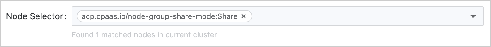

# Создание приложений из изображений

## Предварительные условия

Получите адрес изображения. Источник изображений может быть из репозитория изображений, интегрированного администратором платформы через инструментальную цепочку, или из репозиториев изображений сторонних платформ.

- В первом случае администратор обычно назначает репозиторий изображений для вашего проекта, и вы можете использовать изображения в нем. Если необходимый репозиторий изображений не найден, обращайтесь к администратору для выделения.

- Если это репозиторий изображений сторонней платформы, убедитесь, что изображения могут быть напрямую извлечены из него в текущем кластере.

## Процедура 1 - Рабочие нагрузки

1. **Платформа контейнеров**, перейдите в **Приложения** > **Приложения** на левой боковой панели.

2. Нажмите **Создать**.

3. Выберите **Создать из изображения** в качестве способа создания.

4. **Выберите** или **Введите** изображение, и нажмите **Подтвердить**.

:::info
**Примечание**: При использовании изображений из репозитория изображений, интегрированного в веб-консоль, вы можете фильтровать изображения по **Уже интегрировано**. **Имя проекта интеграции**, например, изображения (docker-registry-projectname), которое включает в себя название проекта projectname в этой веб-консоли и название проекта containers в репозитории изображений.
:::

6. Ознакомьтесь с приведенными ниже инструкциями для настройки связанных параметров.

<a id="updatepolicy" />

### Рабочая нагрузка 1 - Настройка основной информации

В разделе **Рабочая нагрузка** > **Основная информация** настройте декларативные параметры для рабочих нагрузок

| **Параметры**                    | **Описание**                                                                                                                                                                                                                                                                                                                                                                                                                                                                                                                            |
| :------------------------------- | :------------------------------------------------------------------------------------------------------------------------------------------------------------------------------------------------------------------------------------------------------------------------------------------------------------------------------------------------------------------------------------------------------------------------------------------------------------------------------------------------------------------------------------- |
| **Модель**                       | Выберите рабочую нагрузку по мере необходимости: <ul><li>**Deployment**: Для подробного описания параметров обратитесь к [Создание Deployment](../application_workloads/deployment_create.mdx).</li><li>**DaemonSet**: Для подробного описания параметров обратитесь к [Создание DaemonSet](../application_workloads/deamonset_create.mdx).</li><li>**StatefulSet**: Для подробного описания параметров обратитесь к [Создание StatefulSet](../application_workloads/statefulset_create.mdx).</li></ul>                                                                                                                                                                          |
| **Реплики**                      | Определяет желаемое количество реплик Pod в Deployment (по умолчанию: `1`). Настройте в зависимости от требований к рабочей нагрузке.                                                                                                                                                                                                                                                                                                                                                                                                        |
| **Дополнительно** > **Стратегия обновления** | Настройка стратегии `rollingUpdate` для развертывания без простоя:    **Максимальное увеличение** (`maxSurge`):  <ul><li>Максимальное количество Pod, которое может превышать желаемое количество реплик во время обновления. </li><li> Принимает абсолютные значения (например, `2`) или проценты (например, `20%`). </li><li> Расчет процента: `ceil(current_replicas × percentage)`. </li><li>Пример: 4.1 → `5`, когда рассчитывается из 10 реплик. </li></ul> **Максимально недоступные** (`maxUnavailable`): <ul><li> Максимальное количество Pod, которые могут быть временно недоступны во время обновления.  </li><li>Процентные значения не могут превышать `100%`.  </li><li> Расчет процента: `floor(current_replicas × percentage)`.   </li><li> Пример: 4.9 → `4`, когда рассчитывается из 10 реплик.  </li></ul> **Примечания**:   1. **Значения по умолчанию**: `maxSurge=1`, `maxUnavailable=1`, если не установлены явно.    2. **Неработающие Pod** (например, в состояниях `Pending`/`CrashLoopBackOff`) считаются недоступными.    3. **Одновременные ограничения**: <ul><li> `maxSurge` и `maxUnavailable` не могут оба быть `0` или `0%`. </li><li>Если процентные значения для обоих параметров приводят к `0`, Kubernetes принудительно устанавливает `maxUnavailable=1`, чтобы обеспечить прогресс обновления.  </li></ul> **Пример**:   Для Deployment с 10 репликами:  <ul><li> `maxSurge=2` → Общее количество Pod во время обновления: `10 + 2 = 12`. </li><li>`maxUnavailable=3` → Минимальное количество доступных Pod: `10 - 3 = 7`. </li><li> Это обеспечивает доступность, позволяя контролируемый вывод. </li></ul> |

### Рабочая нагрузка 2 - Настройка Pod

**Примечание**: В кластерах с смешанной архитектурой, развертывающих изображения с одной архитектурой, убедитесь, что настроены правильные [Правила аффинности узлов](#schuconf) для планирования Pod.

1. В разделе **Pod** настройте параметры времени выполнения контейнера и управления жизненным циклом:

   | **Параметры**                    | **Описание**                                                                                                                                                                                                                                                                                         |
   | :-------------------------------- | :------------------------------------------------------------------------------------------------------------------------------------------------------------------------------------------------------------------------------------------------------------------------------------------------------ |
   | **Тома**                          | Подключите постоянные тома к контейнерам. Поддерживаемые типы томов включают `PVC`, `ConfigMap`, `Secret`, `emptyDir`, `hostPath` и т. д. Для деталей реализации смотрите [Инструкции по подключению томов](#pvmount).                                                                                |
   | **Учетные данные изображения**    | Требуется **только** при извлечении изображений из сторонних реестров (через ручной ввод URL изображения).   **Примечание**: Изображения из интегрированного реестра платформы автоматически унаследуют связанные секреты.                                                                                               |
   | **Дополнительно** > **Период закрытия** | Период времени (по умолчанию: `30s`), допустимый для завершения явного завершения работы Pod после получения сигнала завершения.   - В течение этого времени Pod завершает входящие запросы и освобождает ресурсы.   - Установка `0` принудительно приводит к немедленному удалению (SIGKILL), что может привести к прерыванию запросов. |

<a id="schuconf" />

2. **Правила аффинности узлов**
   | **Параметры**               | **Описание**                                                                                                                                                                                                                                                                                                                                                                                                                                                                                                                                                                                                                                                                                                                                                                                       |
   | :--------------------------- | :---------------------------------------------------------------------------------------------------------------------------------------------------------------------------------------------------------------------------------------------------------------------------------------------------------------------------------------------------------------------------------------------------------------------------------------------------------------------------------------------------------------------------------------------------------------------------------------------------------------------------------------------------------------------------------------------------------------------------------------------------------------------------------------------------- |
   | **Дополнительно** > **Выбор узлов** | Ограничьте Pods для узлов с определёнными метками (например, `kubernetes.io/os: linux`).                                                                                                                                                                                                                                                                                                                                                                                                                                                                                                                                                                                  |
   | **Дополнительно** > **Аффинность**      | Определите тонкие правила планирования на основе существующих Pod:   **Типы аффинности Pod**: <ul><li> **Аффинность между Pod**: Запланируйте новые Pods на узлы, хранящие определённые Pods (одинаковая топологическая область). </li><li> **Анти-аффинность между Pod**: Предотвратите совместное размещение новых Pods с определёнными Pods. </li></ul> **Режимы принуждения**:  <ul><li> **RequiredDuringSchedulingIgnoredDuringExecution**: Pods планируются *только в том случае*, если правила выполнены.  </li><li> **PreferredDuringSchedulingIgnoredDuringExecution**: Приоритизируйте узлы, соответствующие правилам, но допускайте исключения. </li></ul>**Поля конфигурации**:    <ul><li>`topologyKey`: Метка узла, определяющая топологические домены (по умолчанию: `kubernetes.io/hostname`).  </li><li>`labelSelector`: Фильтры целевых Pods с использованием запросов по меткам.  </li></ul> |

3. **Настройка сети**
   - Kube-OVN
     | **Параметры**        | **Описание**                                                                                                                                                                                                                    |
     | :-------------------- | :--------------------------------------------------------------------------------------------------------------------------------------------------------------------------------------------------------------------------------- |
     | **Ограничения пропускной способности**  | Обеспечьте QoS для сетевого трафика Pod:  <ul><li>**Лимит скорости исходящего трафика**: Максимальная скорость исходящего трафика (например, `10Mbps`). </li><li>**Лимит скорости входящего трафика**: Максимальная скорость входящего трафика.</li></ul>                                      |
     | **Подсеть**            | Назначьте IP-адреса из предварительно определенного пула подсетей. Если не указано, используется стандартная подсеть пространства имен.                                                                                                                                     |
     | **Статический IP-адрес** | Привяжите постоянные IP-адреса к Pods:  <ul><li>Несколько Pods в разных развертываниях могут использовать один и тот же IP, но только один Pod может использовать его одновременно.  </li><li>**Критично**: Количество статических IP-адресов должно быть ≥ количество реплик Pod. </li></ul> |
   - Calico
     | **Параметры**        | **Описание**                                                                                                                                                                         |
     | :-------------------- | :-------------------------------------------------------------------------------------------------------------------------------------------------------------------------------------- |
     | **Статический IP-адрес** | Назначьте фиксированные IP-адреса с строгой уникальностью:  <ul><li>Каждый IP может быть привязан **только к одному Pod** в кластере.  </li><li> **Критично**: Количество статических IP-адресов должно быть ≥ количество реплик Pod.</li></ul> |

### Рабочая нагрузка 3 - Настройка контейнеров

1. В разделе **Контейнер** ознакомьтесь с приведенными ниже инструкциями для настройки соответствующей информации.
   | **Параметры**                         | **Описание**                                                                                                                                                                                                                                                                                                                                                                                                                                                                                                                                                                                                                                                                                                                                                                                                                                                                                         |
   | :------------------------------------- | :------------------------------------------------------------------------------------------------------------------------------------------------------------------------------------------------------------------------------------------------------------------------------------------------------------------------------------------------------------------------------------------------------------------------------------------------------------------------------------------------------------------------------------------------------------------------------------------------------------------------------------------------------------------------------------------------------------------------------------------------------------------------------------------------------------------------------------------------------------------------------------------------------ |
   | **Запросы ресурсов и лимиты**         | <ul><li>**Запросы**: Минимум CPU/памяти, необходимых для работы контейнера.</li><li>**Лимиты**: Максимум CPU/памяти, допустимый во время выполнения контейнера. Для определений единиц см. [Единицы ресурсов](/developer/overview/concepts/unit.mdx).</li></ul>**Коэффициент перевыполнения пространства имен**:<ul><li>**Без коэффициента перевыполнения**: Если существуют лимиты ресурсов пространства имен: Запросы/лимиты контейнера унаследуют стандартные значения пространства имен (подлежат изменению).  Без лимитов пространства имен: Без стандартных значений; собственный запрос.</li><li>**С коэффициентом перевыполнения**: Запросы автоматически рассчитываются как `Limits / Overcommit ratio` (неизменяемые).</li></ul> **Ограничения**:<ul><li>Запрос ≤ Лимит ≤ Максимальное значение квоты пространства имен.</li><li>Изменения коэффициента перевыполнения требуют повторного создания Pod для вступления в силу.</li><li>Коэффициент перевыполнения отключает ручную настройку запросов.</li><li>Без квот пространства имен → нет ограничений на ресурсы контейнера.</li></ul> |
   | **Дополнительные ресурсы**             | Настройте доступные в кластере дополнительные ресурсы (например, vGPU, pGPU).                                                                                                                                                                                                                                                                                                                                                                                                                                                                                                                                                                                                                                                                                                                                                                                                                                      |
   | **Подключение тома**                   | Конфигурация постоянного хранилища. См. [Инструкции по подключению томов](#pvmount). **Операции**:<ul><li>Существующие тома Pod: Щелкните **Добавить**</li><li>Нет томов Pod: Щелкните **Добавить и подключить**</li></ul>**Параметры**:<ul><li>`mountPath`: Путь в файловой системе контейнера (например, `/data`)</li><li>`subPath`: Относительный путь файла/каталога внутри тома.  Для `ConfigMap`/`Secret`: Выберите конкретный ключ</li><li>`readOnly`: Подключить как только для чтения (по умолчанию: чтение-запись)</li></ul>См. [Тома Kubernetes](https://kubernetes.io/docs/concepts/storage/volumes/).                                                                                                                                                                                                                                                                                                                                   |
   | **Порт**                               | Откройте порты контейнера. **Пример**: Откройте TCP-порт `6379` с именем `redis`. **Поля**:<ul><li>`protocol`: TCP/UDP</li><li>`Порт`: Открытый порт (например, `6379`)</li><li>`name`: Идентификатор, совместимый с DNS (например, `redis`)</li></ul>                                                                                                                                                                                                                                                                                                                                                                                                                                                                                                                                                                                                                                                          |
   | **Команды и аргументы запустки**       | Переопределите стандартный ENTRYPOINT/CMD: **Пример 1**: Выполнить `top -b` - **Команда**: `["top", "-b"]` - **ИЛИ** Команда: `["top"]`, Аргументы: `["-b"]` **Пример 2**: Вывести `$MESSAGE`: `/bin/sh -c "while true; do echo $(MESSAGE); sleep 10; done"` См. [Определение команд](https://kubernetes.io/docs/tasks/inject-data-application/define-command-argument-container/).                                                                                                                                                                                                                                                                                                                                                                                                                                                                                                         |
   | **Дополнительно** > **Переменныe среды**   | <ul><li>Статические значения: Прямые пары ключ-значение</li><li>Динамические значения: Ссылки на ключи ConfigMap/Secret, поля Pod (`fieldRef`), метрики ресурсов (`resourceFieldRef`)</li></ul>**Примечание**: Переменные среды заменяют настройки изображения/файла конфигурации.                                                                                                                                                                                                                                                                                                                                                                                                                                                                                                                                                                                                                                                      |
   | **Дополнительно** > **Ссылаемый ConfigMap**    | Внедрить весь ConfigMap/Secret в качестве переменных среды. Поддерживаемые типы секретов: `Opaque`, `kubernetes.io/basic-auth`.                                                                                                                                                                                                                                                                                                                                                                                                                                                                                                                                                                                                                                                                                                                                                                                          |
   | **Дополнительно** > **Проверки работоспособности**           | <ul><li>**Проверка жизнеспособности**: Обнаружение состояния контейнера (перезапуск в случае сбоя)</li><li>**Проверка готовности**: Обнаружение доступности службы (удаление из конечных точек в случае сбоя)</li></ul>См. [Параметры проверки состояния](#healthcheck).                                                                                                                                                                                                                                                                                                                                                                                                                                                                                                                                                                                                                                                                              |
   | **Дополнительно** > **Файл журнала**                | Настройте пути журналов: - По умолчанию: Сбор `stdout` - Шаблоны файлов: например, `/var/log/*.log` **Требования**:<ul><li>Драйвер хранения `overlay2`: Поддерживается по умолчанию</li><li>`devicemapper`: Вручную подключите EmptyDir к каталогу журнала</li><li>Windows-узлы: Убедитесь, что родительский каталог подключен (например, `c:/a` для `c:/a/b/c/*.log`)</li></ul>                                                                                                                                                                                                                                                                                                                                                                                                                                                                                                                                               |
   | **Дополнительно** > **Исключить файл журнала**        | Исключите конкретные журналы из сбора (например, `/var/log/aaa.log`).                                                                                                                                                                                                                                                                                                                                                                                                                                                                                                                                                                                                                                                                                                                                                                                                                                       |
   | **Дополнительно** > **Выполнить перед остановкой** | Выполните команды перед завершением контейнера. **Пример**: `echo "stop"` **Примечание**: Время выполнения команды должно быть короче, чем `terminationGracePeriodSeconds` Pod.                                                                                                                                                                                                                                                                                                                                                                                                                                                                                                                                                                                                                                                                                                                        |

2. Нажмите **Добавить контейнер** (в верхнем правом углу) ИЛИ **Добавить инициализирующий контейнер**.

   См. [Инициализирующие контейнеры](https://kubernetes.io/docs/concepts/workloads/pods/init-containers/).
   Инициализирующий контейнер:

   1. Запускается перед контейнерами приложения (последовательное выполнение).
   2. Освобождает ресурсы после завершения.
   3. Удаление разрешено, когда:
      - У Pod больше 1 контейнера приложения И ≥ 1 инициализирующий контейнер.
      - Не разрешено для Pod с единственным контейнером приложения.

3. Нажмите **Создать**.

## Процедура 2 - Службы

| **Параметры** | **Описание**                                                                                                                                                                                                                                                                                                                                                                                                                                                                                                                                                                                                                                                                                                                                        |
| :------------- | :----------------------------------------------------------------------------------------------------------------------------------------------------------------------------------------------------------------------------------------------------------------------------------------------------------------------------------------------------------------------------------------------------------------------------------------------------------------------------------------------------------------------------------------------------------------------------------------------------------------------------------------------------------------------------------------------------------------------------------------------------- |
| **Служба**    | Kubernetes **Служба**, предоставляет доступ к приложению, работающему в вашем кластере, за единым внешним конечным точкой, даже если рабочая нагрузка распределена по нескольким бэкендам. Для конкретных объяснений параметров см. [Создание служб](/developer/building_application/functions/operation_after_creating/network_communications/service/create_service.mdx).  **Примечание**: Префикс стандартного имени для внутренней маршрутизации, созданной в приложении, является названием компонента вычисления. Если тип компонента вычисления (режим развертывания) - StatefulSet, рекомендуется не изменять стандартное имя внутренней маршрутизации (имя рабочей нагрузки); в противном случае это может привести к проблемам с доступностью рабочей нагрузки. |

## Процедура 3 - Ingress

| **Параметры** | **Описание**                                                                                                                                                                                                                                                                                                                                                                                                                                                                                                                                                                                                                                                                                                                                                                                                                   |
| :------------- | :-------------------------------------------------------------------------------------------------------------------------------------------------------------------------------------------------------------------------------------------------------------------------------------------------------------------------------------------------------------------------------------------------------------------------------------------------------------------------------------------------------------------------------------------------------------------------------------------------------------------------------------------------------------------------------------------------------------------------------------------------------------------------------------------------------------------------------- |
| **Ingress**    | Kubernetes **Ingress**, сделает вашу HTTP (или HTTPS) сетевую службу доступной с помощью механизма конфигурации, который понимает веб-концепции, такие как URI, имена хостов, пути и многое другое. Концепция Ingress позволяет вам сопоставить трафик с различными бэкендами на основе правил, которые вы определяете через API Kubernetes. Для подробного описания параметров см. [Создание Ingress](/developer/building_application/functions/operation_after_creating/network_communications/ingress/create_ingress.mdx).  **Примечание**: **Служба**, используемая при создании **Ingress** в приложении, должна быть ресурсами, созданными в текущем приложении. Однако убедитесь, что **Служба** связана с рабочей нагрузкой в приложении; в противном случае обнаружение и доступ к рабочей нагрузке будут невозможны. |

7. Нажмите **Создать**.

## Операции по управлению приложениями

Чтобы изменить конфигурации приложения, используйте один из следующих методов:

1. Нажмите вертикальные многоточия (⋮) с правой стороны списка приложений.
2. Выберите **Действия** в правом верхнем углу страницы сведений о приложении.

| **Операция** | **Описание**                                                                                                                                                                                                                                                                                                                                                                                                                                                                                                                                                                                                                                                                                                                                                                                                                                                                                                                                                                                                                                                                                                                                                                                                                                                                                        |
| :------------ | :------------------------------------------------------------------------------------------------------------------------------------------------------------------------------------------------------------------------------------------------------------------------------------------------------------------------------------------------------------------------------------------------------------------------------------------------------------------------------------------------------------------------------------------------------------------------------------------------------------------------------------------------------------------------------------------------------------------------------------------------------------------------------------------------------------------------------------------------------------------------------------------------------------------------------------------------------------------------------------------------------------------------------------------------------------------------------------------------------------------------------------------------------------------------------------- |
| **Обновить**    | <ul><li>**Обновить**: Изменяет только целевую рабочую нагрузку с использованием ее определенной [стратегии обновления](#updatepolicy) (для примера показана стратегия развертывания). Сохраняет текущее количество реплик и конфигурацию развертывания. </li><li>**Принудительное обновление**: Запускает полное развертывание приложения с использованием стратегии обновления каждого компонента.  1. **Сценарии использования**: <ul><li>Пакетные изменения конфигурации, требующие немедленной пропаганды во всем кластере (например, обновления ConfigMap/Secret, упоминаемых как переменные среды). </li><li>Согласованные перезапуски компонентов для критической безопасности. </li></ul> 2. **Внимание**: <ul><li>Может вызвать временное ухудшение обслуживания во время массовых перезапусков. </li><li>Не рекомендуется для производственных сред без проверки непрерывности бизнеса.</li></ul></li><li>**Сетевые последствия**: <ul><li>Удаление правил Ingress: Внешний доступ остается доступным через `LB_IP:NodePort`, если:   1) Служба LoadBalancer использует стандартные порты.   2) Существующие маршруты ссылаются на компоненты приложения.  Полное прекращение внешнего доступа требует удаления службы.</li><li>Удаление службы: Необратимая потеря сетевого подключения к компонентам приложения. Связанные правила Ingress становятся недействительными, несмотря на сохранение объектов API.</li></ul></li></ul> |
| **Удалить**    | <ul><li>**Каскадное удаление**:   1. Удаляет все дочерние ресурсы, включая развертывания, службы и правила Ingress.   2. Запросы на постоянные тома (PVC) следуют политике удержания, определенной в классе хранения.</li><li>**Проверочный список перед удалением**:   1. Убедитесь, что нет активного трафика через связанные службы.   2. Подтвердите завершение резервного копирования данных для состояния компонентов.   3. Проверьте взаимосвязи зависимых ресурсов с помощью `kubectl describe ownerReferences`.</li></ul>                                                                                                                                                                                                                                                                                                                                                                                                                                                                                                                                                                                                                                                                                                                                                                                                         |

## Справочная информация​ 

<a id="pvmount" />

### Инструкции по подключению томов хранения

| **Тип**                    | **Назначение**                                                                                                                                                                                                                                                                                           |
| :-------------------------- | :---------------------------------------------------------------------------------------------------------------------------------------------------------------------------------------------------------------------------------------------------------------------------------------------------- |
| **Запрос постоянного тома** | Привязывает существующий [PVC](/developer/building_application/functions/preparation_before_creating/add_pvc.mdx) для запроса постоянного хранилища. **Примечание**: Только связанные PVC (с связанным PV) выбираются. Непривязанные PVC вызовут сбой в создании Pod.                                          |
| **ConfigMap**               | Подключает полные/частичные данные [ConfigMap](/developer/building_application/functions/preparation_before_creating/add_configmap.mdx) в качестве файлов:<ul><li>Полный ConfigMap: Создает файлы с именами ключей по пути подключения</li><li>Выбор по подкаталогу: Подключите конкретный ключ (например, `my.cnf`)</li></ul>               |
| **Секрет**                  | Подключает полные/частичные данные [Secret](/developer/building_application/functions/preparation_before_creating/add_secret.mdx) в качестве файлов:<ul><li>Полный секрет: Создает файлы с именами ключей по пути подключения</li><li>Выбор по подкаталогу: Подключите конкретный ключ (например, `tls.crt`)</li></ul>                       |
| **Эфемерные тома**       | Временный том, созданный кластером с функциями:<ul><li> Динамическое выделение</li><li>Срок службы, связанный с Pod</li><li>Поддерживает декларативную конфигурацию</li></ul>**Сценарий использования**: Временное хранение данных. См. [PVC](/developer/building_application/functions/preparation_before_creating/add_pvc.mdx) |
| **Пустой каталог**         | Эфемерное хранилище, общее между контейнерами в одном и том же pod: - Создан на узле, когда pod запускается - Удаляется вместе с pod **Сценарий использования**: Совместное использование файлов между контейнерами, временное хранение данных.                                                                                              |
| **Путь хоста**               | Подключает директорию хоста (должна начинаться с `/`, например, `/volumepath`).                                                                                                                                                                                                                             |

<a id="healthcheck" />

### Параметры проверки состояния

#### Общие параметры

| **Параметры**        | **Описание**                                                                                                                              |
| :-------------------- | :------------------------------------------------------------------------------------------------------------------------------------------- |
| **Первоначальная задержка**     | Период ожидания (в секундах) перед началом проверок. По умолчанию: `300`.                                                                               |
| **Период**            | Интервал проверки (1-120с). По умолчанию: `60`.                                                                                                      |
| **Тайм-аут**           | Длительность тайм-аута при проверке (1-300с). По умолчанию: `30`.                                                                                              |
| **Порог успеха** | Минимальное количество последовательных успешных проверок для обозначения как здорового. По умолчанию: `0`.                                                                                 |
| **Порог неудачи** | Максимальное количество последовательных неудач, чтобы инициировать действие: - `0`: Отключает действия на основе неудач - По умолчанию: `5` неудач → перезапуск контейнера. |

#### Параметры, специфичные для протокола

| **Параметр**    | **Применимые протоколы** | **Описание**                                                                                                                                              |
| :--------------- | :----------------------- | :----------------------------------------------------------------------------------------------------------------------------------------------------------- |
| **Протокол**     | HTTP/HTTPS               | Протокол проверки состояния                                                                                                                                        |
| **Порт**         | HTTP/HTTPS/TCP           | Целевой порт контейнера для проверки.                                                                                                                           |
| **Путь**         | HTTP/HTTPS               | Путь конечной точки (например, `/healthz`).                                                                                                                            |
| **HTTP-заголовки** | HTTP/HTTPS               | Пользовательские заголовки (добавьте пары ключ-значение).                                                                                                                        |
| **Команда**      | EXEC                     | Команда проверки, выполняемая контейнером (например, `sh -c "curl -I localhost:8080 \| grep OK"`). **Примечание**: Экранируйте специальные символы и протестируйте жизнеспособность команды. |
