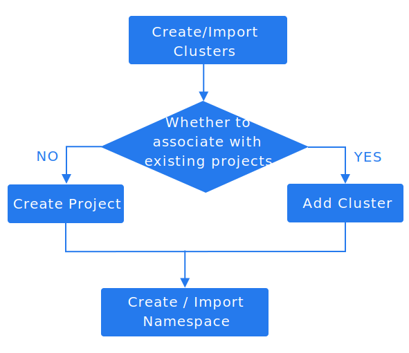

# Импорт пространств имен

## Предварительные условия

- Пространство имен не связано с каким-либо проектом на платформе.

- Пространства имен могут быть импортированы только в проекты, связанные с их целевым кластером. Если на платформе не существует проектов, связанных с целевым кластером, необходимо сначала создать проект, связанный с этим кластером.

## Обзор

**Возможности управления пространством имен**:

- **Импорт пространств имен между кластерами**
  - Импорт пространств имен в проект позволяет централизованно управлять пространствами имен Kubernetes на всех кластерах, развернутых на платформе. Это позволяет администраторам объединять управление ресурсами и мониторинг в распределенных средах.

- **Разъединение пространства имен**
  - Функция Разъединения пространства имен позволяет удалить связь пространства имен с текущим проектом, сбрасывая его ассоциацию для переназначения или очистки.

Импорт пространства имен в проект предоставляет ему аналогичные возможности, как у пространств имен, созданных нативно на платформе. Это включает доступ к политикам уровня проектов (например, квоты ресурсов), унифицированный мониторинг и контроль управления.

**Примечание**:

- Пространство имен может быть связано только с одним проектом в любой момент времени.
- Если пространство имен уже связано с проектом, его нельзя импортировать в другой проект или переназначить без предварительного разъединения с первоначальным проектом.

## Сценарии использования

Распространенные сценарии использования включают:

- После подключения нового кластера к платформе вы можете связать его существующие пространства имен Kubernetes с проектом с помощью функции Импорт пространства имен. Выберите целевой проект и кластер для импорта пространств имен. Это действие предоставляет проекту управление пространствами имен, включая квоты ресурсов, мониторинг и соблюдение политик.

- Пространство имен, разъединенное с проектом, может быть повторно связано с другим проектом с помощью функции Импорт пространства имен для централизованного управления.

- Пространства имен, не связанные с каким-либо проектом (например, созданные с помощью скриптов на уровне кластера), должны быть связаны с целевым проектом через функцию Импорт пространства имен, чтобы обеспечить управление на уровне платформы, включая видимость и централизованное управление.

## Процедура

1. В представлении **Управление проектом** нажмите на ***Имя проекта***, в котором находится пространство имен для импорта.

2. В левой панели навигации нажмите **Пространства имен** > **Пространства имен**.

3. Нажмите кнопку **Выпадающий список** рядом с **Создать пространство имен**, затем нажмите **Импортировать пространство имен**.

4. Ознакомьтесь с описанием параметров [Создать пространство имен](./create_namespace) для настройки соответствующих параметров.

5. Нажмите **Импортировать**.
