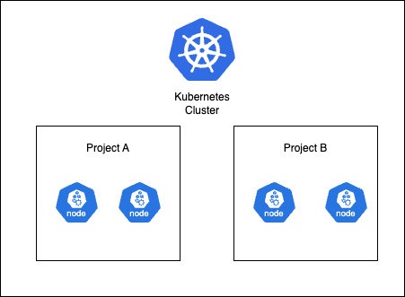

# Архитектура

Стратегия изоляции узлов реализована на основе основного компонента кластера платформы контейнеров, обеспечивая возможность изоляции узлов между проектами путем распределения узлов на каждом кластере рабочих нагрузок. Когда контейнеры создаются в проекте, они принудительно назначаются на узлы, выделенные для этого конкретного проекта.
