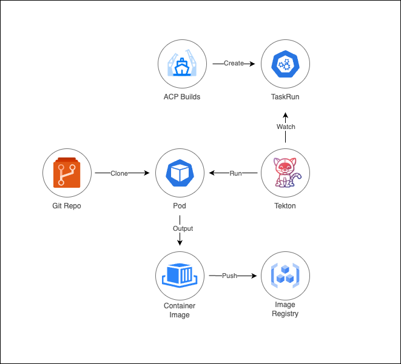

# Архитектура

Функция Source to Image (S2I) реализуется через оператор **Alauda Container Platform Builds**, который позволяет автоматизировать создание контейнерных изображений из исходного кода Git-репозитория и последующую отправку в назначенный реестр изображений. Основные компоненты включают:

- Оператор **Alauda Container Platform Builds**: Управляет полным жизненным циклом сборки и оркестрирует конвейеры Tekton.
- Конвейеры **Tekton**: Выполняют рабочие процессы S2I с помощью ресурсов `TaskRun`, родных для Kubernetes.
