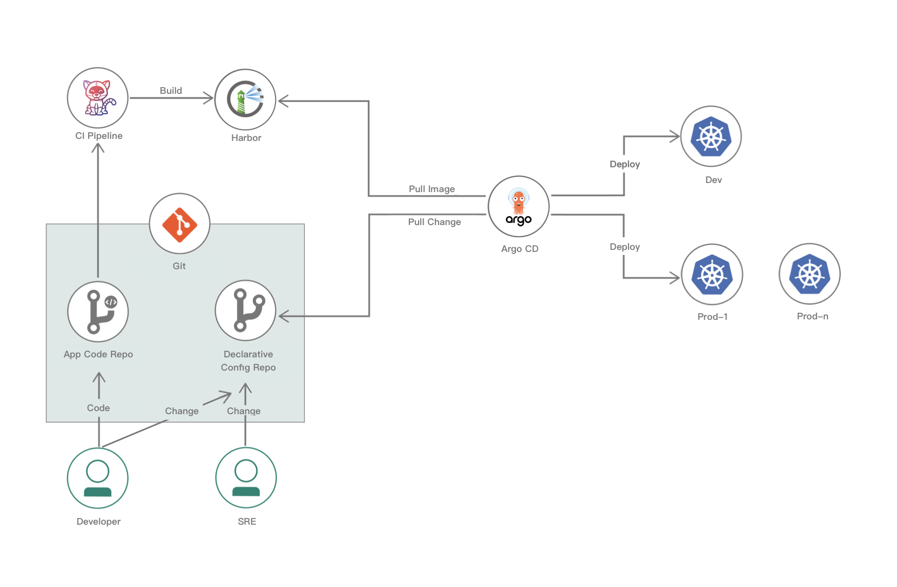
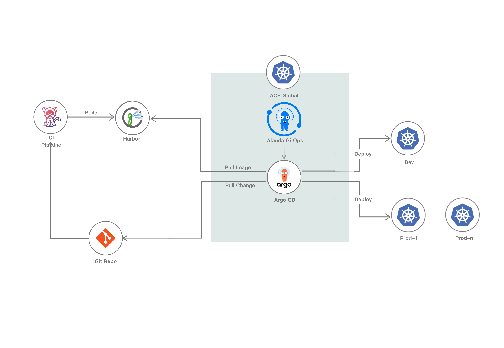

# Архитектура

## GitOps и Argo CD

GitOps — это современная теория для непрерывной доставки и операций, в то время как Argo CD является мощным инструментом, который реализует GitOps, отслеживая конфигурационные файлы в репозитории Git и автоматически синхронизируя их с целевой средой. Этот подход улучшает скорость, надежность и безопасность доставки программного обеспечения, интегрируя весь процесс доставки в систему управления версиями Git.

**GitOps на платформе Alauda Container**, построенный на Argo CD, использует репозиторий Git в качестве единственного доверенного источника для хранения конфигурации приложений, инфраструктуры и других файлов для быстрой и точной передачи и развертывания в одном или нескольких кластерах Kubernetes.

## Архитектура GitOps

Основные отличия между GitOps и традиционными методами управления приложениями:

- Вместо того чтобы напрямую манипулировать рабочей средой, GitOps контролирует её, поддерживая репозиторий конфигурации приложений в Git.
- Argo CD постоянно получает данные из репозитория и исправляет несоответствия между рабочей средой и репозиторием конфигурации приложений, обеспечивая соответствие среды ожиданиям, предотвращая расхождения в конфигурации и позволяя быстро восстанавливаться в случае сбоя.

## Архитектура GitOps на платформе Alauda Container

**GitOps на платформе Alauda Container** установлен как плагин кластера на `global` кластере и использует Argo CD для распределения приложений и предоставления инфраструктуры по нескольким бизнес-кластерам.

