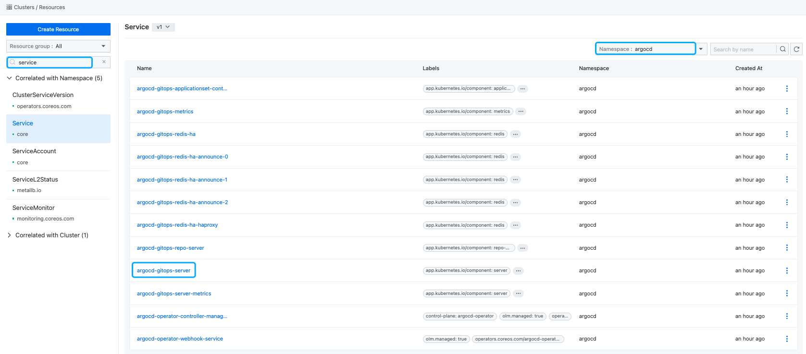

# Как получить информацию для доступа к Argo CD

> В этой статье описывается, как получить информацию для доступа к Argo CD, включая плагин Argo CD GitOps кластера ACP, установленный в веб-консоли, и установленный через оператор Argo CD.

## Сценарии использования

- Получив информацию для доступа к Argo CD, вы сможете управлять всеми встроенными ресурсами Argo CD через панель управления Argo CD.

## Как получить информацию для доступа к Argo CD для плагина кластера GitOps, установленного в веб-консоли?

### Предварительные условия

- [Установка ACP GitOps](../install_gitops/install_gitops_plugin.mdx)
- (Опционально) Установлен плагин CLI, и включен переключатель `web-cli`
- У вас есть права администратора

### Процедура

:::info
Рекомендуется включить следующие настройки при установке плагина кластера ACP GitOps:

- Включите переключатель **Native Argo CD UI**.
- Включите переключатель **Single Sign-On**.
  :::

> Следуйте этим шагам, чтобы использовать функции:

1. Войдите в систему и перейдите на страницу **Управление платформой**.

2. Нажмите на **Marketplace**, чтобы открыть страницу списка **Плагинов кластера**.

3. Найдите плагин **GitOps**, нажмите на **GitOps**, и в открывшемся окне отобразятся детали **GitOps Cluster Plugin**.

Если он не включен: вернитесь на страницу списка плагинов кластера, найдите плагин GitOps, нажмите кнопку действий, выберите Обновить и включите переключатель Argo CD Native UI. Если он включен: просто нажмите на адрес доступа, чтобы открыть панель управления Argo CD.

4. Argo CD Native UI
   - Если не включен: перейдите на страницу списка **Плагинов кластера**, найдите плагин **GitOps**, нажмите кнопку **Обновить** и включите переключатель **Argo CD Native UI**.
   - Если включен: просто нажмите на **Адрес доступа**, чтобы открыть панель управления Argo CD.

5. **Single Sign-On**
   - Если включен: войдите в панель управления Argo CD с использованием учетной записи платформы.
   - Если не включен: учетная запись по умолчанию `admin`, и вам необходимо получить пароль, выполнив следующую команду в **Kubectl** [Получить пароль Argo CD](#argocd-password-cli).

## Как получить информацию для доступа к Argo CD от оператора Argo CD?

### Предварительные условия

- [Установка Argo CD](../install_gitops/install_argocd_operator.mdx)
- (Опционально) Установлен плагин CLI, и включен переключатель `web-cli`
- У вас есть права администратора

### Процедура

#### Получение URL-адреса панели управления Argo CD

1. Войдите в систему и перейдите на страницу **Управление платформой**.

2. Выберите **Управление кластером**, чтобы перейти на страницу **Управление ресурсами**.

3. В **Группе ресурсов** найдите `Service`, выберите пространство имен ***argocd*** (пространство имен, в котором создан экземпляр argocd). Пространство имен по умолчанию для Argo CD, установленного в веб-консоли, - это ***argocd***.

4. В правом **Списке ресурсов** найдите `argocd-gitops-server`, нажмите кнопку ***Actions*** и выберите **Обновить**, чтобы открыть YAML-детали argocd-gitops-server, детали представлены на изображении ниже.



5. Измените `type` на `NodePort` и запишите `nodePort`, затем нажмите кнопку **Обновить**.

6. В левом боковом меню выберите **Управление кластером**, чтобы перейти на страницу **Список кластеров**.

7. Выберите кластер, в котором установлен `argocd operator`, перейдите на страницу **Детали кластера** и выберите **Узлы**.

8. Получите IP-адрес ***любого узла управляющей плоскости***.

9. Доступ к панели управления Argo CD по адресу `http://{IP узла управляющей плоскости}:{nodePort}`.

#### Получить пароль Argo CD

Выполните следующую команду в **Kubectl**, чтобы получить пароль:

```bash
kubectl get secret -n argocd argocd-gitops-cluster -o template --template='{{index .data "admin.password"}}'|base64 -d
```

### Обновление пароля учетной записи администратора Argo CD<a id="argocd-update-password-cli" />

Пароль учетной записи по умолчанию `admin`, автоматически созданный при установке Argo CD через **ACP GitOps** или **оператор Argo CD**, не может быть изменен через интерфейс **панели управления Argo CD**. Вы можете изменить его, выполнив следующую команду в инструменте CLI. Здесь `newpassword` — это новый пароль, который вы хотите установить.

```bash
kubectl patch -n argocd secrets argocd-gitops-cluster -p '{"stringData":{"admin.password":"<newpassword>"}}'
```
