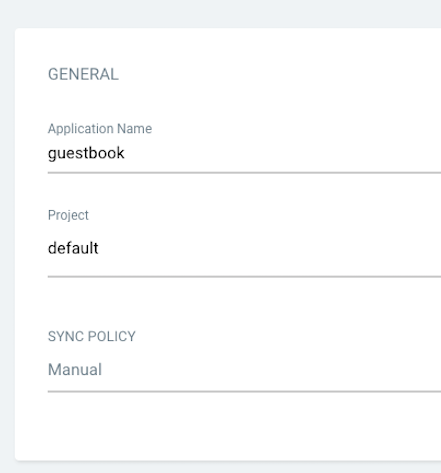

# Создание приложения Argo CD через интерфейс Argo CD

## Предварительные требования

- Установите (выберите один из методов):
  - [Установка ACP GitOps](../install_gitops/install_gitops_plugin.mdx)
  - [Установка Argo CD](../install_gitops/install_argocd_operator.mdx)
- Доступ к учетным данным (URL, имя пользователя, пароль) для интерфейса Argo CD был получен [Как получить информацию для доступа к Argo CD](./argocd_info.mdx)

## Процедура

> Следуйте этим шагам для использования функций:

1. Введите URL-адрес доступа к интерфейсу Argo CD в вашем браузере.

> Администраторы могут напрямую получить доступ к **Argo CD Native UI** через детали плагина `global` кластера: найдите плагин кластера GitOps и щелкните на адрес доступа.

2. Авторизуйтесь с использованием ваших учетных данных Argo CD и выполните вход.

3. Нажмите кнопку **+ НОВОЕ ПРИЛОЖЕНИЕ**, как показано ниже:

> Настройте приложение в соответствии с следующими шагами:

**Конфигурация основной информации**

- **Имя приложения**: Введите `guestbook`
- **Проект**: Выберите `default`
- **Политика синхронизации**: Оставьте `Ручная` (рекомендуется для начальной конфигурации)

**Конфигурация исходного репозитория**

- **URL репозитория**: Установите `https://github.com/argoproj/argocd-example-apps.git`
- **Ревизия**: Используйте значение по умолчанию `HEAD`
- **Путь**: Укажите `guestbook` (каталог, содержащий манифесты Kubernetes)

**Конфигурация целевого кластера**

- **Clusternew**: Установите `https://kubernetes.default.svc` (доступ в рамках кластера) или выберите конкретное имя кластера
- **Namespace**: Установите `default` (или укажите целевое пространство имен)

4. Создать **Приложение**
   После завершения конфигураций нажмите кнопку **Создать** в верхнем правом углу, чтобы инициализировать создание приложения гостевой книги.
