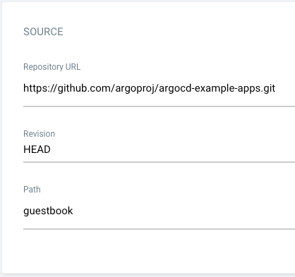
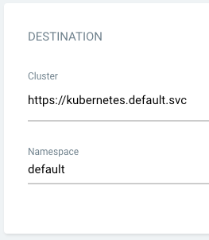

# Создание приложения Argo CD через панель Argo CD

## Предварительные требования

- Установите (выберите один из методов):
  - [Установка ACP GitOps](../install_gitops/install_gitops_plugin.mdx)
  - [Установка Argo CD](../install_gitops/install_argocd_opeator.mdx)
- Получите учетные данные доступа (URL, имя пользователя, пароль) для панели Argo CD [Как получить информацию для доступа к Argo CD](./argocd_info.mdx)

## Процедура

> Следуйте этим шагам, чтобы воспользоваться функциями:

1. Введите URL доступа к панели Argo CD в ваш браузер, чтобы открыть интерфейс.

> Администраторы могут напрямую получить доступ к **Argo CD Native UI** через детали плагина кластера `global`: найдите плагин кластера GitOps и кликните на адрес доступа.

2. Аутентифицируйтесь с помощью ваших учетных данных Argo CD и выполните вход.

3. Нажмите кнопку **+ НОВОЕ ПРИЛОЖЕНИЕ** (NEW APP), как показано ниже:

> Настройте приложение в соответствии со следующими шагами:

**Конфигурация основной информации**

- **Имя приложения**: Введите `guestbook`
- **Проект**: Выберите `default`
- **Политика синхронизации**: Установите `Вручную` (рекомендуется для начальной конфигурации)

**Конфигурация исходного репозитория**

- **URL репозитория**: Установите на `https://github.com/argoproj/argocd-example-apps.git`
- **Ревизия**: Используйте по умолчанию `HEAD`
- **Путь**: Укажите `guestbook` (каталог, содержащий манифесты Kubernetes)

**Конфигурация целевого кластера**

- **Кластер**: Установите на `https://kubernetes.default.svc` (доступ внутри кластера) или выберите конкретное имя кластера
- **Пространство имен**: Установите на `default` (или укажите целевое пространство имен)

4. Создайте **Приложение**
   После завершения конфигурации нажмите кнопку **Создать** в правом верхнем углу, чтобы инициализировать создание приложения guestbook.
