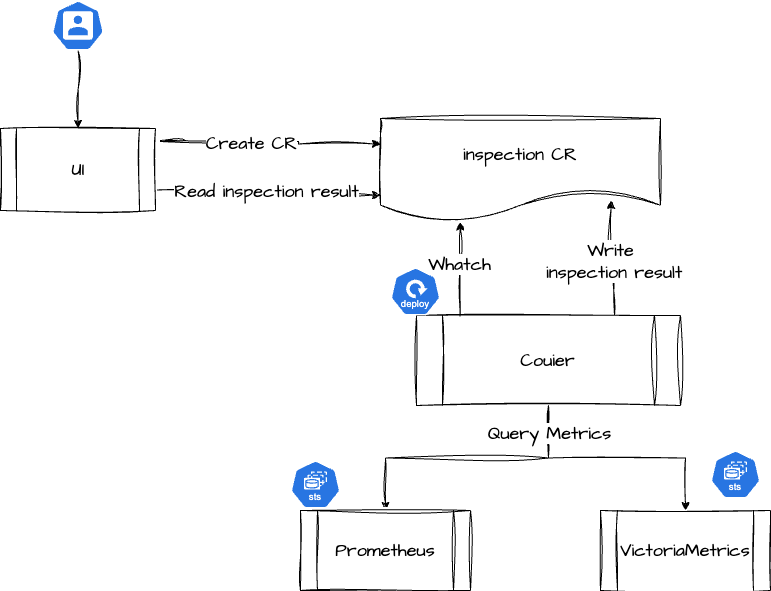
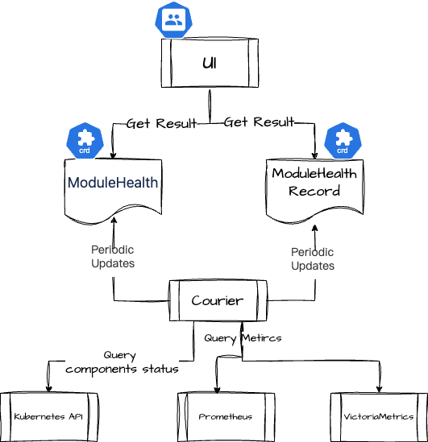

# Архитектура

## Проверка

Модуль проверки предоставляется совместно компонентом платформы Courier и компонентом мониторинга, включая следующие бизнес-процессы:

- Создание задачи проверки: Платформа отправляет CR типа проверки в кластер `global`.
- Выполнение задачи проверки: Компонент Courier отслеживает создание CR типа проверки и запрашивает у компонентов мониторинга каждого кластера различные метрические данные, относящиеся к проверке.
- Запись результатов проверки: После завершения оценки каждого элемента проверки компонент Courier запишет результаты проверки обратно в соответствующий CR проверки.
- Просмотр результатов проверки: Пользователи могут проверять статус и результаты задач проверки через платформу, где данные будут получены из соответствующего CR проверки.

## Состояние здоровья компонентов

Состояние здоровья компонентов предоставляется совместно компонентом платформы Courier и компонентом мониторинга, включая следующие бизнес-процессы:

- Предварительно определенный список мониторинга компонентов: Платформа предварительно определила два типа CRD в кластере `global`, чтобы определить список компонентов, которые необходимо мониторить, и методы мониторинга:
  - ModuleHealth: Определяет компоненты, которые необходимо мониторить, и методы мониторинга.
  - ModuleHealthRecord: Определяет результаты мониторинга соответствующих компонентов в каждом кластере.
- Регулярное мониторинг состояния компонентов: Courier будет следить за ModuleHealth, проверять заданные функции, а затем записывать результаты проверки в ресурсы CR ModuleHealth и ModuleHealthRecord.
- Определение состояния компонентов: Courier запросит данные из Kubernetes и компонентов мониторинга, чтобы определить фактическое состояние компонентов и любые существующие проблемы.
  - Kubernetes: Проверяет, установлен ли компонент и нормальное ли количество реплик компонента.
  - Prometheus / VictoriaMetrics: На основе метрик, предоставляемых каждым компонентом, запрашивает и определяет, может ли компонент предоставлять услуги нормально.
- Просмотр состояния здоровья компонентов: Пользователи могут проверять состояние здоровья каждого компонента через платформу, где данные будут получены из соответствующих ресурсов CR ModuleHealth и ModuleHealthRecord.
