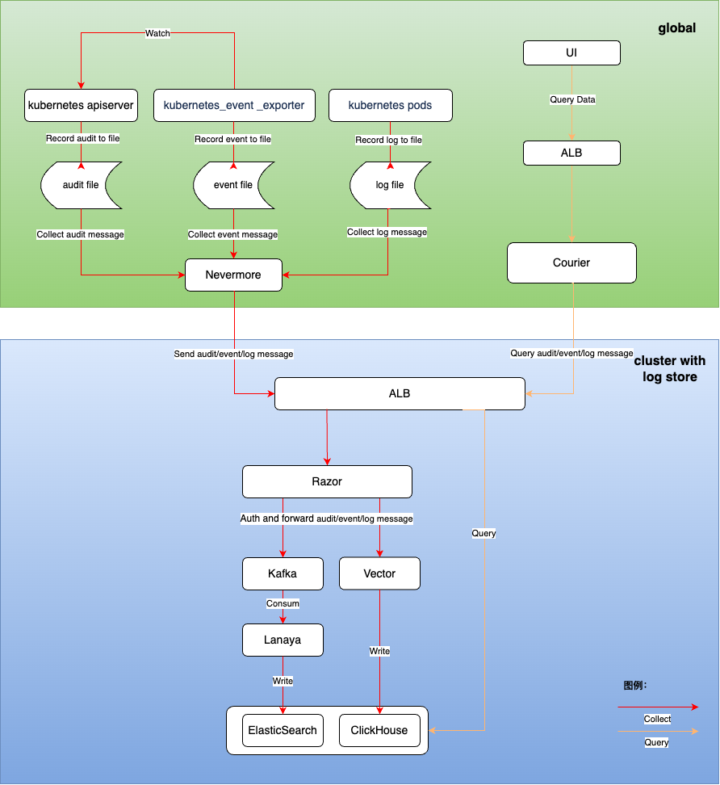

# Архитектура модуля логирования

## Общее описание архитектуры

Система логирования состоит из следующих основных функциональных модулей:

1. Сбор логов
   - Основан на компоненте с открытым исходным кодом filebeat
   - Сбор логов: поддерживает сбор стандартных выходных логов, логов файлов, событий Kubernetes и аудитов.

2. Хранение логов
   - Предоставляются два различных решения для хранения логов, основанных на компонентах с открытым исходным кодом Clickhouse и ElasticSearch.
   - Хранение логов: поддерживает долговременное хранение логов.
   - Управление временем хранения логов: поддерживает управление временем хранения логов на уровне проекта.

3. Визуализация логов
   - Обеспечивает удобные и надежные возможности для запроса логов, экспорта логов и анализа логов.

## Сбор логов

### Метод установки компонентов

nevermore устанавливается как daemonset в пространстве имен cpaas-system каждого кластера. Этот компонент состоит из 4 контейнеров:

| Название              | Функция                                                    |
| --------------------- | ----------------------------------------------------------- |
| audit                 | Собиратель данных аудита                                   |
| event                 | Собиратель данных событий                                   |
| log                   | Собиратель данных логов (включая стандартные выходные и файловые логи) |
| node-problem-detector | Собиратель аномальной информации о узлах                  |

### Процесс сбора данных

После того как nevermore собирает информацию о ходе аудита/событиях/логах, он отправляет данные в кластер хранения логов, пройдя аутентификацию с помощью Razor, прежде чем в конечном итоге они будут сохранены в ElasticSearch или ClickHouse.

## Потребление и хранение логов

### Razor

Razor отвечает за аутентификацию, получение и пересылку логовых сообщений.

- После того как Razor получает запросы, отправленные nevermore из различных рабочих кластеров, он сначала аутентифицирует их с помощью токена в запросе. Если аутентификация не удалась, запрос отклоняется.
- Если установленный компонент хранения логов - ElasticSearch, он записывает соответствующие логи в кластер Kafka.
- Если установленный компонент хранения логов - Clickhouse, он передает соответствующие логи в Vector, которые в конечном итоге записываются в Clickhouse.

### Lanaya

Lanaya отвечает за потребление и пересылку логовых данных в цепочке хранения логов ElasticSearch.

- Lanaya подписывается на темы в Kafka. После получения сообщений из подписки она распаковывает сообщения.
- После распаковки она предварительно обрабатывает сообщения, добавляя необходимые поля, трансформируя поля и разбивая данные.
- Наконец, она сохраняет сообщения в соответствующий индекс ElasticSearch на основе времени и типа сообщения.

### Vector

Vector отвечает за обработку и пересылку логовых данных в цепочке хранения логов Clickhouse, в конечном итоге сохраняя логи в соответствующей таблице Clickhouse.

## Визуализация логов

1. Пользователи могут запрашивать URL-адреса запросов аудита/событий/логов через интерфейс продукта для отображения:

- Запрос логов /platform/logging.alauda.io/v1
- Запрос событий /platform/events.alauda.io/v1
- Запрос аудита /platform/audits.alauda.io/v1

2. Запросы обрабатываются компонентом API высокого уровня Courier, который запрашивает данные логов из кластеров хранения логов ElasticSearch или Clickhouse и возвращает их на страницу.
