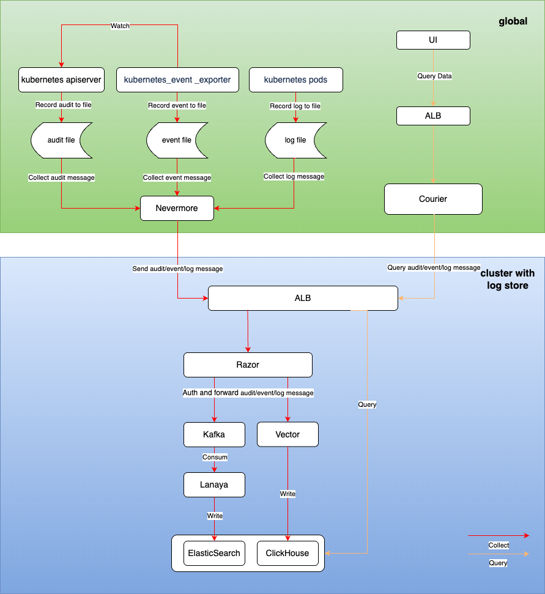

# Архитектура модуля журналирования

## Описание общей архитектуры

Система журналирования состоит из следующих основных функциональных модулей:

1. Сбор журналов
   - Реализован на основе компонента с открытым исходным кодом filebeat
   - Сбор журналов: Поддерживает сбор стандартных выходных журналов, файловых журналов, событий Kubernetes и аудита.

2. Хранение журналов
   - Предоставляются два различных решения для хранения журналов на основе компонентов с открытым исходным кодом Clickhouse и ElasticSearch.
   - Хранение журналов: Поддерживает долгосрочное хранение файлов журналов.
   - Управление временем хранения журналов: Поддерживает управление длительностью хранения журналов на уровне проекта.

3. Визуализация журналов
   - Обеспечивает удобные и надежные возможности для запроса журналов, экспорта журналов и анализа журналов.

## Сбор журналов

### Метод установки компонента

nevermore устанавливается как daemonset в пространстве имен cpaas-system каждого кластера. Этот компонент состоит из 4 контейнеров:

| Название              | Функция                                                    |
| --------------------- | ----------------------------------------------------------- |
| audit                 | Собирает данные аудита                                      |
| event                 | Собирает данные событий                                      |
| log                   | Собирает данные журналов (включая стандартный вывод и файловые журналы) |
| node-problem-detector | Собирает информацию о ненормальном состоянии узлов          |

### Процесс сбора данных

После того как nevermore собирает информацию аудита/событий/журналов, он отправляет данные в кластер хранения журналов, проходя аутентификацию через Razor перед окончательным хранением в ElasticSearch или ClickHouse.

## Потребление и хранилище журналов

### Razor

Razor отвечает за аутентификацию и получение и пересылку сообщений журналов.

- После того как Razor получает запросы от nevermore из различных рабочих кластеров, он сначала выполняет аутентификацию с использованием токена в запросе. Если аутентификация не удалась, запрос отклоняется.
- Если установленный компонент хранения журналов - это ElasticSearch, соответствующие журналы записываются в кластер Kafka.
- Если установленный компонент хранения журналов - это Clickhouse, соответствующие журналы передаются в Vector, который в конечном итоге записывает их в Clickhouse.

### Lanaya

Lanaya отвечает за потребление и пересылку данных журналов в звене хранения журналов ElasticSearch.

- Lanaya подписывается на темы в Kafka. После получения сообщений из подписки она распаковывает сообщения.
- После распаковки она предварительно обрабатывает сообщения, добавляя необходимые поля, преобразуя поля и разбивая данные.
- Наконец, она хранит сообщения в соответствующем индексе ElasticSearch на основе времени и типа сообщения.

### Vector

Vector отвечает за обработку и пересылку данных журналов в звене хранения журналов Clickhouse, в конечном итоге сохраняя журналы в соответствующей таблице в Clickhouse.

## Визуализация журналов

1. Пользователи могут запрашивать URL-адреса аудита/событий/журналов из интерфейса пользовательского интерфейса продукта для отображения:

- Запрос журналов /platform/logging.alauda.io/v1
- Запрос событий /platform/events.alauda.io/v1
- Запрос аудита /platform/audits.alauda.io/v1

2. Запросы обрабатываются компонентом расширенного API Courier, который запрашивает данные журналов из кластеров хранения журналов ElasticSearch или Clickhouse и возвращает их на страницу.
