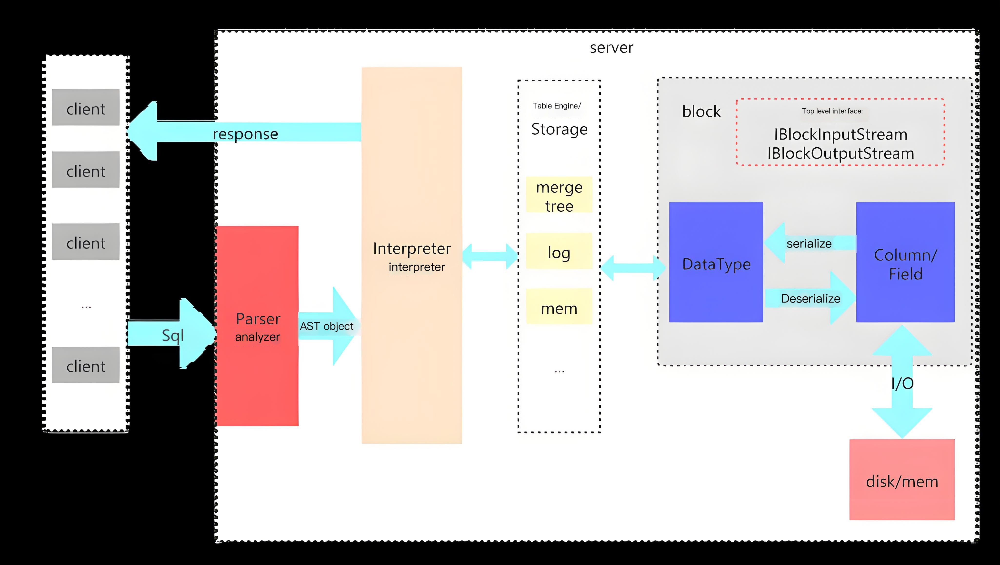

# Руководство по выбору компонентов журнала

При установке мониторинга кластера платформа предоставляет два компонента для хранения журналов на ваш выбор: ElasticSearch и Clickhouse. Эта статья подробно описывает функции и применимые сценарии этих двух компонентов, чтобы помочь вам сделать наиболее подходящий выбор.

:::warning

- Вы можете выбрать только один из компонентов хранения журналов для установки кластера: ElasticSearch или Clickhouse.
- Любой компонент хранения журналов кластера может быть выбран для сбора журналов для интерфейса со складом данных.
- Текущая версия продукта DevOps не поддерживает архивирование записей выполнения конвейера Jenkins с использованием Clickhouse. Если вам необходимо использовать функции конвейера Jenkins, пожалуйста, осторожно выбирайте хранилище журналов ACP с плагином Clickhouse.
- Текущая версия службы ServiceMesh не поддерживает интеграцию с Clickhouse. Если вам необходимо использовать функции сервисной сетки, пожалуйста, осторожно выбирайте хранилище журналов ACP с плагином Clickhouse.
- Текущая версия хранилища журналов ACP с плагином Clickhouse не поддерживает кластеры рабочих нагрузок с одноуровневым или двухуровневым стеком IPv6.

:::

## Сравнение архитектуры

### Архитектура ElasticSearch

ElasticSearch является открытым распределенным поисковым движком, основанным на Lucene, который предназначен для быстрого полнотекстового поиска и анализа. Его преимущества включают:

- Высокопроизводительный поиск: Поддерживает поиск в реальном времени и может быстро обрабатывать огромные объемы данных.
- Гибкие возможности запросов: Предлагает мощный язык запросов DSL, поддерживая сложные запросы.
- Масштабируемость: Легко горизонтально масштабируется по мере необходимости, подходит для приложений любого размера.
- Разнообразная поддержка данных: Способен обрабатывать как структурированные, так и неструктурированные данные, широко применим.

### Архитектура Clickhouse

Clickhouse – это высокопроизводительная колоночная база данных, предназначенная для онлайн-аналитической обработки (OLAP). Его преимущества включают:

- Быстрая обработка данных: Поддерживает быструю обработку запросов и анализа благодаря колоночному хранению и сжатию данных.
- Анализ в реальном времени: Способен обрабатывать потоки данных в реальном времени, подходящий для сценариев анализа данных в реальном времени.
- Высокая пропускная способность: Оптимизирован для выполнения больших объемов записи и запросов данных, что делает его очень подходящим для сценариев больших данных.
- Гибкая поддержка SQL: Совместим со стандартом SQL, легко начать использование, снижая порог вхождения.

## Сравнение функций

|                        | Clickhouse | Elasticsearch | Объяснение                                                                                                                                                                                                                                                  |
| ---------------------- | ---------- | ------------- | ------------------------------------------------------------------------------------------------------------------------------------------------------------------------------------------------------------------------------------------------------------ |
| **Высокая доступность**  | Поддерживается  | Поддерживается     |                                                                                                                                                                                                                                                              |
| **Масштабируемость**        | Поддерживается  | Поддерживается     |                                                                                                                                                                                                                                                              |
| **Опыт запросов**   | Слабый       | Сильный        | Elasticsearch предлагает более мощные возможности поиска на основе языка Lucene, в то время как Clickhouse поддерживает только SQL-запросы, что ограничивает его возможности поиска.                                                                                             |
| **Использование ресурсов**     | Низкое        | Высокое          | Для тех же требований по производительности Clickhouse требует меньше ресурсов, чем Elasticsearch. Например, для поддержки 20000 журналов в секунду Elasticsearch требуется 3 es-мастера и 7 es-узлов (2c4g+8c16g), тогда как Clickhouse требует только 3 2c4g реплики. |
| **Производительность**        | Высокая       | Низкая           | При тех же ресурсных условиях объем журналов, поддерживаемый Clickhouse, значительно превышает объем, поддерживаемый Elasticsearch.                                                                                                                                                |
| **Активность сообщества** | Средняя     | Высокая          | Сообщество Elasticsearch активно и имеет богатую документацию, в то время как сообщество Clickhouse растет и улучшается.                                                                                                                                        |

## Рекомендации по выбору

- Если вы привыкли использовать Elasticsearch и сильно зависите от языка Lucene, рекомендуется продолжать использовать хранилище журналов ACP с плагином ElasticSearch.

- Если вы зависите от функций конвейера Jenkins или сервисной сетки платформы, рекомендуется продолжать использовать хранилище журналов ACP с плагином ElasticSearch.

- Если у вас высокие требования к производительности и потреблению ресурсов компонента журнала, но есть только базовые потребности в запросах журнала, рекомендуется выбрать хранилище журналов ACP с плагином Clickhouse.
