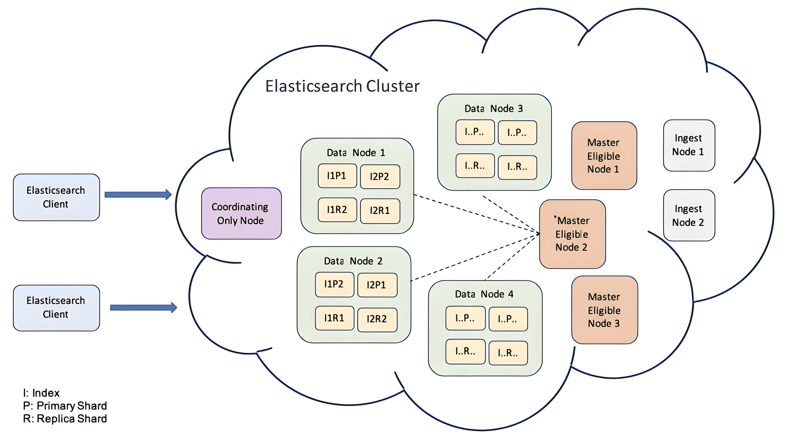

# Руководство по выбору компонента журналирования

При установке мониторинга кластера платформа предоставляет два компонента для хранения логов на ваш выбор: ElasticSearch и Clickhouse. В этой статье подробно описаны особенности и применимые сценарии этих двух компонентов, чтобы помочь вам сделать наиболее подходящий выбор.

:::warning

- Вы можете выбрать только один из компонентов хранения логов ElasticSearch или Clickhouse для установки.
- Любой компонент хранения логов кластера может быть выбран для сбора логов для взаимодействия с данными хранения.
- Текущая версия продукта DevOps не поддерживает архивирование записей выполнения Jenkins pipeline с использованием Clickhouse. Если вам необходимо использовать функциональные возможности Jenkins pipeline, пожалуйста, осторожно выбирайте ACP Log Storage с плагином Clickhouse.
- Текущая версия сервисной сетки ServiceMesh не поддерживает интеграцию с Clickhouse. Если вам необходимо использовать функции сервисной сетки, пожалуйста, осторожно выбирайте ACP Log Storage с плагином Clickhouse.
- Текущая версия ACP Log Storage с плагином Clickhouse не поддерживает кластеры с односторонним стеком IPv6 или кластеры с двойным стеком IPv6.

:::

## Сравнение архитектур

### Архитектура ElasticSearch

ElasticSearch — это распределенный поисковый движок с открытым исходным кодом, построенный на базе Lucene, предназначенный для быстрого полнотекстового поиска и анализа. Его преимущества включают:

- Высокая производительность поиска: поддерживает поиск в реальном времени и может быстро обрабатывать большие объемы данных.
- Гибкие возможности запроса: предлагает мощный язык запросов DSL, поддерживающий сложные требования к запросам.
- Масштабируемость: легко горизонтально масштабируем по мере необходимости, подходит для приложений любого размера.
- Разнообразная поддержка данных: способен обрабатывать как структурированные, так и неструктурированные данные, широко применим.

### Архитектура Clickhouse

Clickhouse — это высокопроизводительная колонная база данных, предназначенная для онлайн-аналитической обработки (OLAP). Его преимущества включают:

- Быстрая обработка данных: поддерживает быстрые запросы и анализ за счет колонного хранения и сжатия данных.
- Анализ в реальном времени: способен обрабатывать потоки данных в реальном времени, подходит для сценариев анализа данных в реальном времени.
- Высокая производительность: оптимизирован для обработки записи и запросов больших объемов данных, что делает его очень подходящим для сценариев больших данных.
- Гибкая поддержка SQL: совместим со стандартным SQL, легко начать работу, снижая порог использования.

## Сравнение функций

|                        | Clickhouse | Elasticsearch | Объяснение                                                                                                                                                                                                                                                  |
| ---------------------- | ---------- | ------------- | ------------------------------------------------------------------------------------------------------------------------------------------------------------------------------------------------------------------------------------------------------------ |
| **Высокая доступность**  | Поддерживается  | Поддерживается     |                                                                                                                                                                                                                                                              |
| **Масштабируемость**        | Поддерживается  | Поддерживается     |                                                                                                                                                                                                                                                              |
| **Опыт работы с запросами**   | Слабый       | Сильный        | Elasticsearch предлагает более надежные возможности поиска на основе языка Lucene, в то время как Clickhouse поддерживает только SQL-запросы, ограничивая свои возможности поиска.                                                                                             |
| **Использование ресурсов**     | Низкое        | Высокое          | Для тех же требований по производительности Clickhouse требует меньше ресурсов, чем Elasticsearch. Например, чтобы поддерживать 20 000 логов в секунду, Elasticsearch требуется 3 es-masters и 7 es-nodes (2c4g+8c16g), в то время как Clickhouse требует только 3 2c4g реплики. |
| **Производительность**        | Высокая       | Низкая           | При одинаковых условиях ресурсов объем логов, поддерживаемый Clickhouse, значительно превышает объем, поддерживаемый Elasticsearch.                                                                                                                                                |
| **Активность сообщества** | Средняя     | Высокая          | Сообщество Elasticsearch активно с богатой документацией, в то время как Clickhouse представляет собой развивающееся и улучшающееся сообщество.                                                                                                                                        |

## Рекомендации по выбору

- Если вы привыкли использовать Elasticsearch и имеете высокую зависимость от языка Lucene, рекомендуется продолжать использовать ACP Log Storage с плагином ElasticSearch.

- Если вы полагаетесь на функционал Jenkins pipeline или сервисной сетки платформы, рекомендуется продолжать использовать ACP Log Storage с плагином ElasticSearch.

- Если у вас высокие требования к производительности и потреблению ресурсов компонента журнала, но существуют лишь базовые потребности в запросах к логам, рекомендуется выбрать использование ACP Log Storage с плагином Clickhouse.
