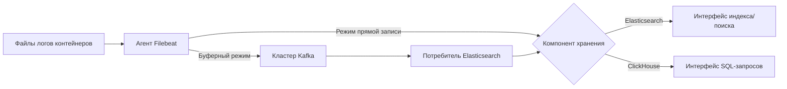

# Концепции

## Компоненты с открытым исходным кодом

### Filebeat

**Позиционирование**: Легковесный сборщик логов  
**Описание**: Компонент для сбора логов с открытым исходным кодом, устанавливаемый на узлах контейнеров, отвечающий за мониторинг файлов логов в реальном времени по заданным путям. Он собирает данные логов через входные модули, обрабатывает их и передает логи в Kafka или напрямую доставляет их в компоненты хранения через выходные модули. Он поддерживает такие возможности, как агрегация многострочных логов и фильтрация полей для предварительной обработки.

### Elasticsearch

**Позиционирование**: Распределенный движок поиска и аналитики  
**Описание**: Движок полнотекстового поиска на основе Lucene, хранящий данные логов в формате JSON-документов и обеспечивающий возможности поиска почти в реальном времени. Он поддерживает динамическое отображение для автоматического распознавания типов полей и достигает высокой скорости поиска по ключевым словам с помощью обратной индексации, что подходит для поиска логов и мониторинга оповещений.

### ClickHouse

**Позиционирование**: Колонковая аналитическая база данных  
**Описание**: Высокопроизводительная колонковая база данных для OLAP-сценариев, реализующая хранение данных логов на уровне PB с использованием движка MergeTree. Она поддерживает высокоскоростные агрегирующие запросы, временное разбиение и стратегии TTL для данных, что делает ее подходящей для анализа логов и статистической отчетности в сценариях пакетной обработки.

### Kafka

**Позиционирование**: Распределенная очередь сообщений  
**Описание**: Служит промежуточным программным обеспечением для сообщений в системе логовой цепи, обеспечивая возможности буферизации логов с высокой пропускной способностью. Когда кластеры Elasticsearch испытывают узкие места в обработке, он получает данные логов, отправленные Filebeat через Topics, что облегчает уменьшение пиковых нагрузок и асинхронное потребление, обеспечивая стабильность сбора логов.

## Основные функциональные концепции

### Цепочка сбора логов

**Описание**: Полная связь от генерации данных логов до их хранения, состоящая из четырех этапов: `Сбор -> Передача -> Буферизация -> Хранение`. Она поддерживает два режима работы:

- **Режим прямой записи**: Filebeat → Elasticsearch/ClickHouse
- **Буферный режим**: Filebeat → Kafka → Elasticsearch

### Индекс

**Описание**: Логическая единица разбиения данных в Elasticsearch, аналогичная структуре таблиц в базах данных. Она поддерживает создание индексированных данных на основе времени (например, logstash-2023.10.01) и автоматическое управление хранилищем с горячими, теплыми и холодными уровнями через управление жизненным циклом индексов (ILM).

### Шарды и реплики

**Описание**:

- **Шард**: Физическая единица хранения, получаемая в результате горизонтального разбиения индекса в Elasticsearch, поддерживающая распределенную масштабируемость.
- **Реплика**: Копия каждого шарда, обеспечивающая высокую доступность данных и балансировку нагрузки при запросах.

### Колонковое хранилище

**Описание**: Основной механизм хранения ClickHouse, где данные сжимаются и хранятся по колонкам, что значительно снижает потребление I/O. Он поддерживает следующие функции:

- Векторизированный движок выполнения запросов
- Разбиение и шардирование данных
- Материализованные представления для предагрегации

## Ключевые технические термины

### Цепочка обработки (Ingest Pipeline)

**Описание**: Цепочка предварительной обработки данных в Elasticsearch, способная выполнять операции ETL, такие как переименование полей, парсинг Grok и условную логику перед записью данных.

### Группа потребителей (Consumer Group)

**Описание**: Механизм параллельного потребления в Kafka, где несколько экземпляров в одной группе потребителей могут параллельно обрабатывать сообщения из различных партиций, обеспечивая упорядоченность обработки сообщений.

### TTL (Время жизни)

**Описание**: Стратегия жизненного цикла данных, поддерживающая два метода реализации:

- Elasticsearch: Автоматически удаляет истекшие индексы через политику ILM.
- ClickHouse: Автоматически удаляет партиции таблиц через выражения TTL.

### Фактор репликации

**Описание**: Конфигурация избыточности данных на уровне Kafka Topic, определяющая количество реплик сообщений между различными брокерами, что повышает надежность данных.

## Модель потока данных

